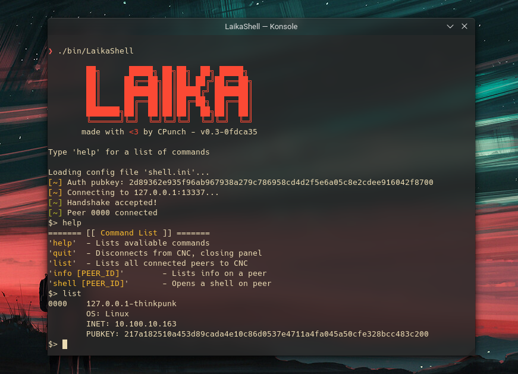

Laika is a small RAT, written in modern C. It comprises of 4 main parts, the LaikaCNC server which is to be deployed on a VPS, the LaikaBot client which has
persistence features and runs on Linux & Windows, the LaikaShell which connects the the LaikaCNC server and issues commands, and lastly the LaikaLib which handles
things like socket boilerplate and a small packet protocol implementation. I learned a lot with this project, and overall I'm fairly satisfied with the state it's in right now.

# The 'good'

## Inlined obfuscation

While this isn't the most technically impressive form of obfuscation (see a post I wrote about it [here](/pages/obfuscation-in-c/)), I definitely feel
like I executed this part fairly well. The workflow of generating the obfuscated data auto-magically using CMake really ties the entire workflow together
and makes it feel almost transparent.

## CMake configuration

Laika has a pretty cool CMake configuration interface. It's documented in the README, allowing you to turn on/off the aforementioned obfuscation, set CNC public/private keypairs, CNC IP & port, and other misc. features. This kind of easy configuration is really only possible because I forced myself to learn CMake.

## Systems programming

I learned a lot not only about the sockets API (and even writing my own polling handler which switches between poll() for windows/NT and epoll() for linux),
but also a lot about the Win32 API. Anyone looking to get into systems programing, always always **always** read the man pages or documentation!! I cannot stress this enough, they will *always* have the most up-to-date examples and information regarding various POSIX standard functions. The windows MSDN docs are definitely less helpful than they should be but *always* check there first!

## Pretty shell interface

I mean, cmon... look at it!



The colors look good, the peer connected/disconnected notifications don't interrupt your typing. It's overall a pretty solid interface.

# The 'bad'

## Inconsistent use of coding style

This is one that I've really struggled with. While Laika is definitely cleaner and more consistent than other projects I've done in the past,
identifiers have a 'loose' meaning, for example in the 'LaikaShell' target, most functions start with 'shell'. Eg.

```c
typedef struct sShell_cmdDef {
    const char *cmd;
    const char *help;
    const char *syntax;
    shellCmdCallback callback;
} tShell_cmdDef;

extern tShell_cmdDef shellS_cmds[];

void shellS_initCmds(void);
void shellS_cleanupCmds(void);

void shellS_runCmd(tShell_client *client, char *cmd);
```

While various other targets in the codebase (namely LaikaBot & LaikaCNC) stick with the LaikaLib target of naming identifiers, using 'laika*'. Eg.

```c
struct sLaika_bot;
struct sLaika_shell {
    uint32_t id;
};

struct sLaika_shell *laikaB_newShell(struct sLaika_bot *bot, int cols, int rows, uint32_t id);
void laikaB_freeShell(struct sLaika_bot *bot, struct sLaika_shell *shell);
```

## Improper use of git branches

This is something I haven't improved on in a while. Since most of my projects a solo-developed (me, myself, and I) I tend to ignore the proper usage of
development branches. The 'main' branch is the stable, dev & prod branch all at once. While I have some CI to test for things like compilation, this should
be split into at least a 'dev' and 'main' branch. 'main' being the stable & production branch of the repository.

## Untouched features

There are various un-used features of Laika that never got fully implemented. For example, if you look at lpackets.h & lcontent.c/lcontent.h you can see a whole file transfer protocol that is completely unused! This is mostly a burnout problem, but again, my mismanagement of git branches means these unused features are just sitting in the main/prod/stable/dev branch. Use git branches!!! 

## Ugly CMake stuff

If you look at the CMakeLists.txt for each build target, you'll see some unused codepaths, or some hacky work-arounds. This is mostly because of missing CMake features but if I'm being honest, it's probably due to laziness and not reaching out to others for ideas/'correct' ways of doing something. For example, to check for debug builds this hacky solution ''''''works'''''''

```CMake
string(TOLOWER ${CMAKE_BUILD_TYPE} RAWCMAKEBUILDTYPE)
message(STATUS "CMAKE_BUILD_TYPE: " ${RAWCMAKEBUILDTYPE})
if(RAWCMAKEBUILDTYPE STREQUAL "debug")
    # we're debug
endif ()
```
