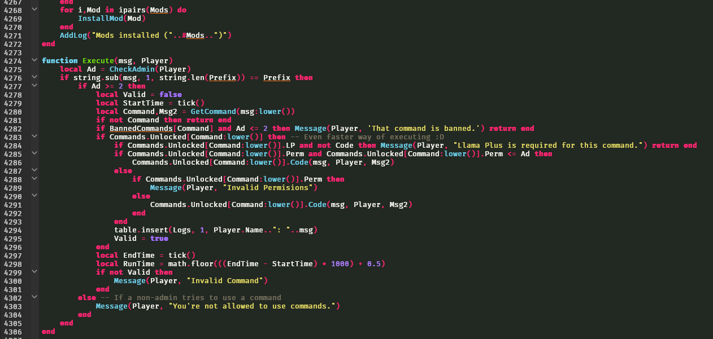

While I will be talking specifically about software development, the methods and self-care from my experiences should be fairly universal especially if you're working for yourself. I've been programming since I was 11 years old, my first language was Lua. Since I started at a relatively young age it was never 'work' for me, It was more like a fun hobby with which I could express myself and create things (mostly games).


> I got super into admin commands when I was 13 though, ignore the repeated table index. I was 13...

I never forced myself to 'work' really, it was just something I really enjoyed doing. It ended up becoming a daily thing where after school I would blow off my homework (to my mother's dismay) and spend hours making various games and scripts. This naturally became a problem when in late highschool I began to hate working on projects, jumping from project to project and never finishing anything. This eventually forced me to become a bit more organized in how I be productive.

So, here's some tips I've found that were helpful for staying productive and not resenting your projects in no particular order.
> PS: I've added to and since revised this entry. I am constantly navigating this battle through trial and error and I'll try to keep this entry updated on what has worked for me.

## Plan it out

Seriously, write down what you hope to accomplish today. Make sure to be realistic in what you have time for, if your goal is to 'write a compiler' break it down into small steps. For that day, you could say your goal is to 'start tokenizer, implement basic tokens.' For an example, this is my day's plan:

```md
- Finish burnout journal entry
- Implement basic constant support for pyuxncle
- Call Cameron and ask about his day
```

It's also nice to have some non-work related goals, like calling a friend or your significant other. This keeps you not entirely work-focused.

## Don't overwork!

If your plan is to do something small on a project, don't work past that point! This keeps your mind focused on finishing the task you had planed and keeps you interested in your project! Overworking on a project has lead me to burnout countless times. If you keep a small steady pace, you will keep your enjoyment and motivation on the project for much longer.

## Take breaks

If you're stumped when trying to plan out your day, take a break! It is completely fine to be unproductive! If you've found that you're no longer motivated to work on your project, find another way to have a feeling of accomplishment for that day. Take a walk, read a book at a coffee shop, go hang with friends, anything you feel that would make you feel fulfilled for the day.

## Let 'bad days' be bad *days*

You're going to slip up. It's inevitable. The trick is to notice when you're slipping up and change course as soon as possible. For me, my bad days would start to spiral into a bad week, then into a bad month. It's incredibly demotivating watching yourself slip into old habits and lose all of the progress you've worked towards. This is where you'll realize that the only thing preventing you from a complete collapse is yourself. You have to care enough about yourself to notice these changes and push yourself to change course.

Of course, these tips may not help if you're a wageslave and your job is to write code. But these are self-learned lessons that have helped me, and no one's situation is the same. Find what works for you and stick with it. Having a routine is probably the most important part.