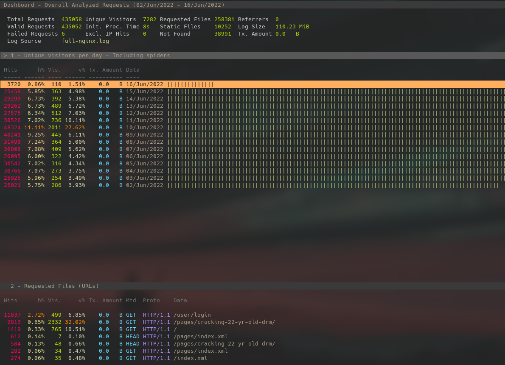
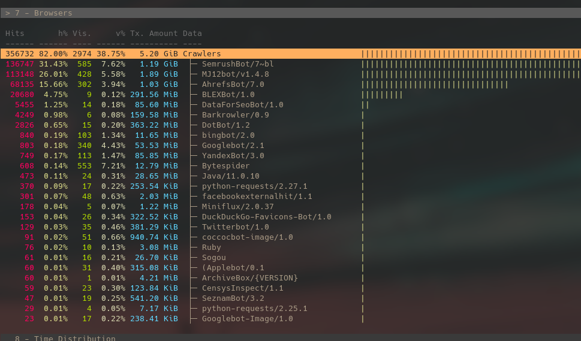

In an effort to be more transparent on the very little information I collect from my readers, I've written this post to share the info I do use (literally the default log files from Nginx.)

Recently I shared my "[Cracking 22 year-old DRM](https://www.reddit.com/r/ReverseEngineering/comments/v8tl42/cracking_22_yearold_drm/)" post on Reddit. I don't use Reddit very often but every now and then I'll lurk r/ReverseEngineering since it's usually full of pretty interesting posts. Anyways, after noticing a couple people had responded to the post, I was curious how many people actually read that post. However, as you might have noticed my blog is fairly strict when it comes to respecting privacy (at least from my end). Since the move to Hugo, this site has never and will never share analytics and traffic with third-party sources like Google & Friends.

## So, what do I collect?

[GoAccess](https://goaccess.io) is a local analytics tool to be run directly on the server hosting your site and works by parsing log files. This removes the 'third-party' aspect of analytics. Rest assured my logs are not shared with anyone, let alone being sold to advertisers. My Nginx logs are only kept to provide me info on which posts are doing well and where a majority of my readers come from. No invasive ads, no privacy-infringing analytics tools like Google Analytics, no Javascript, ***No Bullshit***. I even provide a [self-hosted onion mirror](http://opnpnk6eutjiqy4ndpyvwxd5pncj2g2cmz6fkocr5uh3omnn4utvspad.onion) for the readers who would rather have an even more private browsing experience, no judgement!

That being said, here is a list of information available via my Nginx logs. If you feel uncomfortable with these default logs produced from Nginx, feel free to [contact me](mailto:openpunk@proton.me) and make sure to include your IP so I can look at exactly which posts you've read and make you even more paranoid :D (I live in your walls)

- web pages & paths accessed
- standard HTTP header info, like browser info (engine & version), light OS info ('some Windows version, some Linux kernel, some other Unix-based OS') & local time
- Rough geolocation (Country, State & rough town/city) via GeoIP
> All of these are available & linked via the public IP you used to connect to my server. (Although I don't read the logs directly, and GoAccess somewhat pseudo-anonymizes these together meaning I don't look directly at which IP accessed which pages, only that a certain page has had X unique visitors).

## What's your body count?

Of course I don't feel comfortable sharing the ***direct*** logs, I'd still love to share some statistics you might find interesting. Let's open my Nginx logs in GoAccess.

```sh
$ zcat -f /var/log/nginx/access.log* | goaccess --log-format=COMBINED
```



Looks like I've had roughly 7.2k unique visitors since the 2nd of June. Most of the traffic happened on the 10th when I shared that post on Reddit. What is pretty funny is that roughly 40% of those 'unique visitors' are web crawlers.



That still leaves roughly 4k unique readers, together we could throw a pretty wild party.

Some other interesting statistics about my visitors:
- Around 5% of my visitors use Linux
- Of *all* visitors (including bots), 28% use Chrome(ium), 15% Firefox, 11% Safari, 1% Edge
- The Tor Onion mirror made up a total of .5% of all traffic (someone actually used it?)
