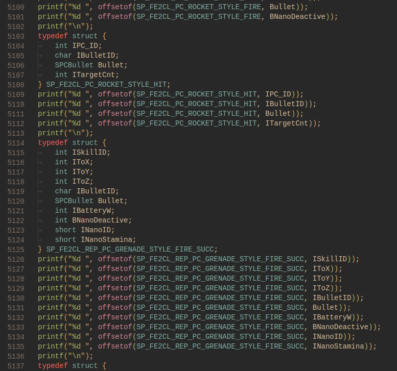
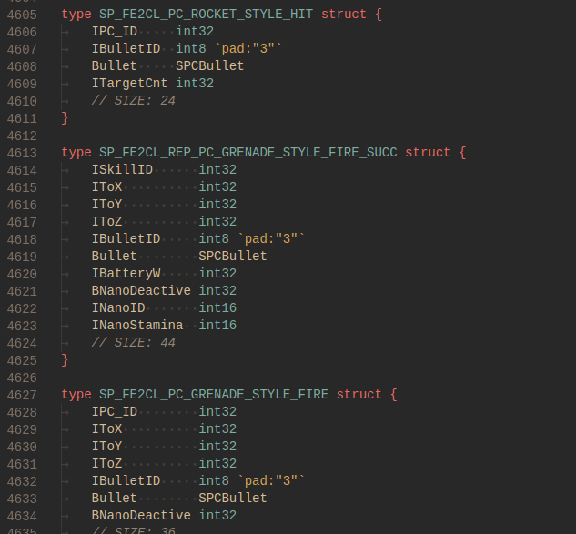

A couple weeks ago I got stuck on an idea. 'What if FusionFall Packet Protocol, but in Go?' I naively thought this was an easy thing. Just define the structures in Go and copy the bytes to the structure, no biggie! Oh boy was I wrong. Not only is there no way to specify the pack alignment for structure members, it was also just downright wrong to assume that Go would let you write directly to structures without jumping through some hoops. I was demotivated and blocked. Until an idea hit me.

Go's `reflect` package lets you walk through structure fields one at a time, getting info of the field's Name, Type, and Value. Not only that, but you can also read [structure field tags](https://www.digitalocean.com/community/tutorials/how-to-use-struct-tags-in-go). Let's look at an example structure dumped from a FusionFall Client (checkout [this post](/pages/fusionfall-openfusion/) if you forgot how I did that)

```C#
[StructLayout(LayoutKind.Sequential, CharSet = CharSet.Unicode, Pack = 4, Size = 468)]
public struct sP_CL2LS_REQ_LOGIN
{
	[MarshalAs(UnmanagedType.ByValTStr, SizeConst = 33)]
	public string szID;

	[MarshalAs(UnmanagedType.ByValTStr, SizeConst = 33)]
	public string szPassword;

	[MarshalAs(UnmanagedType.I4)]
	public int iClientVerA;

	[MarshalAs(UnmanagedType.I4)]
	public int iClientVerB;

	[MarshalAs(UnmanagedType.I4)]
	public int iClientVerC;

	[MarshalAs(UnmanagedType.I4)]
	public int iLoginType;

	[MarshalAs(UnmanagedType.ByValArray, SizeConst = 64)]
	public byte[] szCookie_TEGid;

	[MarshalAs(UnmanagedType.ByValArray, SizeConst = 255)]
	public byte[] szCookie_authid;
}
```

If you forgot, the FusionFall client sends this raw structure over-the-wire (albeit xor'd and with some minor byte swapping), but the data on the wire after 'decrypting' the packet body is this raw structure. We can grab the alignments of each struct member by writing a small C program to compute and output the member offsets (abusing the offsetof() macro), and end up with this:

```C
#include <stdio.h>
#include <stddef.h>

#pragma pack(push)
#pragma pack(4)
typedef struct {
	short SzID[33];
	short SzPassword[33];
	int IClientVerA;
	int IClientVerB;
	int IClientVerC;
	int ILoginType;
	char SzCookie_TEGid[64];
	char SzCookie_authid[255];
} SP_CL2LS_REQ_LOGIN;
#pragma pack(pop)

int main() {
    printf("%d ", offsetof(SP_CL2LS_REQ_LOGIN, SzID));
    printf("%d ", offsetof(SP_CL2LS_REQ_LOGIN, SzPassword));
    printf("%d ", offsetof(SP_CL2LS_REQ_LOGIN, IClientVerA));
    printf("%d ", offsetof(SP_CL2LS_REQ_LOGIN, IClientVerB));
    printf("%d ", offsetof(SP_CL2LS_REQ_LOGIN, IClientVerC));
    printf("%d ", offsetof(SP_CL2LS_REQ_LOGIN, ILoginType));
    printf("%d ", offsetof(SP_CL2LS_REQ_LOGIN, SzCookie_TEGid));
    printf("%d ", offsetof(SP_CL2LS_REQ_LOGIN, SzCookie_authid));
    printf("\n");
    return 0;
}
```
> `0 66 132 136 140 144 148 212`

We can do some quick maths (since we know the size of each field member) to calculate where padding bytes are introduced. It turns out for this structure, there's 1 trailing padding byte at the end (212 + 255 (the size of SzCookie_authid) = 467. 468 (the size of the structure we got from the C# definition) - 467 = 1 trailing padding byte). Using this, lets write a simple Go structure that annotates where padding bytes should be inserted via tags:

```go
type SP_CL2LS_REQ_LOGIN struct {
	SzID            string `size:"33"`
	SzPassword      string `size:"33"`
	IClientVerA     int32
	IClientVerB     int32
	IClientVerC     int32
	ILoginType      int32
	SzCookie_TEGid  [64]byte
	SzCookie_authid [255]byte `pad:"1"`
	// SIZE: 468
}
```

I'll spare you the [implementation details](https://github.com/CPunch/gopenfusion/blob/main/protocol/packet.go), but I can use structure definitions like this to deserialize each packet. Now that we know the idea works, lets automate it! I ended up writing a python script to scrape structure definitions from the decompiled client, and transpile them to our 'custom' structure format with our padding tags. This script works off of the same method I described above, it actually compiles a small C program to grab the field offsets and padding bytes and uses that to generate the Go structure. If interested, the script is [here](https://github.com/CPunch/gopenfusion/blob/main/tools/genstructs.py). The python script also does some manual rearranging of structure definitions, so that they're defined in the proper order since some structures are used as fields in other structures.

The resulting generated C Program looks something like this:


The program is compiled and ran, it's output is collected and used to compute the padding bytes. Finally the resultant Go structures can be emitted.


We now have proper structure definitions for every packet the client sends, sick!