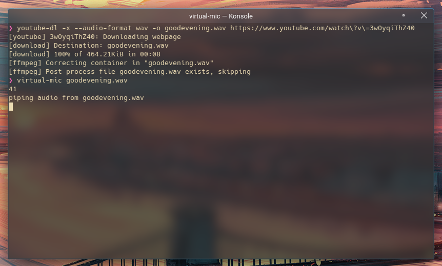

Title really says it all. I wanted something that 'just works' and takes minimal setup and ideally uses packages and software I already had installed. I ended up writing a tiny bash script that takes one argument, a sound file to play. The script looks like:

```sh
#!/bin/bash
AUDIO_SOURCE=$1
VIRTUAL_MIC=~/virtmic

# sanity check the argument lol
if test -z "$AUDIO_SOURCE"
then
    echo "Usage: `basename "$0"` [audio file]"
    exit 1
fi

# create and set the virtual audio device
pactl load-module module-pipe-source source_name=virtmic file=$VIRTUAL_MIC format=s16le rate=16000 channels=1
pactl set-default-source virtmic

# we sleep here to give discord a chance to switch over to the new audio device (this should be done automatically)
echo "piping audio from $AUDIO_SOURCE"
sleep 5

# pipe the audio
ffmpeg -re -i $AUDIO_SOURCE -f s16le -ar 16000 -ac 1 - > $VIRTUAL_MIC

# unload the audio device, pulseaudio will switch back over to the previous audio device (your mic :D)
pactl unload-module module-pipe-source
```
> I moved the script to `/usr/local/bin/virtual-mic`

You'll need both ffmpeg and of course pulseaudio, but those are the only two dependencies. Surprisingly this works extremely well! Combine this with something like `youtube-dl` and you end up with a really easy to use soundboard which can play any audio :D

