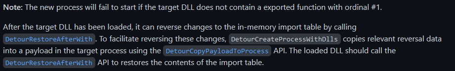
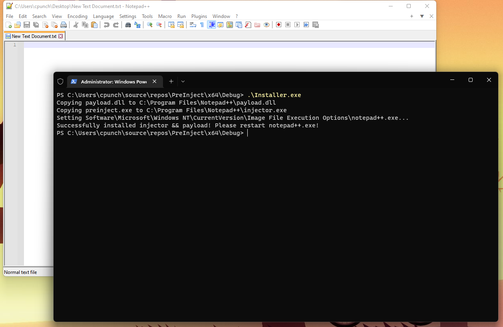
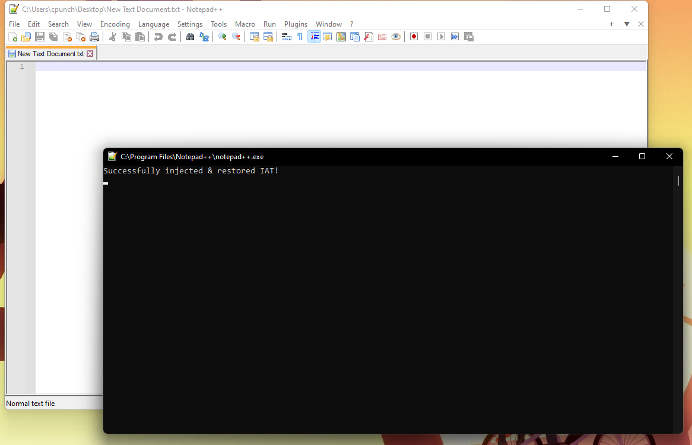

Recently I faced a rather intimidating problem while working on a project. The problem was fairly simple from an objective point of view: "How do I load a DLL into a process on startup?" Now you might be wondering, "Why not just patch the IAT (import address table) on the executable and force it to load your payload DLL??" Yes! That was my exact thoughts too, however for reasons I'll explain it wasn't that simple.

## Patching the IAT

The program I was trying to inject is actually launched by a separate program. This launcher validates files, libraries & of course, our target executable. So my plans got a bit foiled after patching the executable and realizing the launcher just replaces my patched executable with a fresh copy from the internet.

My question has now become: "How do I get a DLL to be loaded in a process on startup *without* patching the file on-disk?"

## Our cool trick

Now this method I'm about to talk about has been known for quite a while. In fact, [MalwareBytes actually has a pretty nice blog about it](https://blog.malwarebytes.com/101/2015/12/an-introduction-to-image-file-execution-options/). It boils down to a few steps:

- Set a registry key/value (`Software\Microsoft\Windows NT\CurrentVersion\Image File Execution Options\[TARGET_EXE]\debugger = injector.exe`)
- injector.exe is ran instead of our original program, we load the original program and patch the IAT in-memory, making our payload DLL load first.
- payload DLL does whatever payload it needs and restores the original IAT.

## Installer

We don't necessarily *need* an installer to set the registry values, in fact just opening RegEdit and setting it manually is much easier. However I kind of wanted to write one that moves the payload and injector to the same working directory as the target executable (again, because *other project*.) For this example I'm using [Notepad++](https://notepad-plus-plus.org) as our target executable.

The tiny installer looks like:

```cpp
#include <Windows.h>
#include <tlhelp32.h>
#include <psapi.h>
#include <fstream>
#include <iostream>

#define TARGET_PAYLOAD_DLL "payload.dll"
#define TARGET_INJECTOR "preinject.exe"
#define TARGET_EXE "notepad++.exe"
#define REGISTRY_ENTRY "Software\\Microsoft\\Windows NT\\CurrentVersion\\Image File Execution Options\\" TARGET_EXE
#define _ERROR(str) do {  std::cout << "[FATAL]: " << str << " winerr: " << GetLastError() << std::endl; int _unused = getchar(); exit(1); } while(0);

HKEY openReg(HKEY key, LPCSTR subKey)
{
    HKEY hKey;

    if (RegCreateKeyExA(key, subKey, 0, NULL, REG_OPTION_NON_VOLATILE, KEY_ALL_ACCESS, NULL, &hKey, NULL) != ERROR_SUCCESS)
        _ERROR("Failed to open registry key!");

    return hKey;
}

void writeReg(HKEY key, LPCSTR val, LPSTR data, DWORD sz)
{
    if (RegSetValueExA(key, val, 0, REG_SZ, (LPBYTE)data, sz) != ERROR_SUCCESS)
        _ERROR("Failed to write registry!");
}

// thanks stackoverflow lol
HANDLE getProcessByName(const TCHAR* name)
{
    PROCESSENTRY32 entry;
    entry.dwSize = sizeof(PROCESSENTRY32);

    HANDLE snapshot = CreateToolhelp32Snapshot(TH32CS_SNAPPROCESS, NULL);

    if (Process32First(snapshot, &entry) == TRUE)
    {
        while (Process32Next(snapshot, &entry) == TRUE)
        {
            if (lstrcmp(entry.szExeFile, name) == 0)
            {
                HANDLE hProcess = OpenProcess(PROCESS_ALL_ACCESS, FALSE, entry.th32ProcessID);
                CloseHandle(snapshot);
                return hProcess;
            }
        }
    }

    CloseHandle(snapshot);
    return INVALID_HANDLE_VALUE;
}

std::string getExecutablePath()
{
    CHAR path[MAX_PATH];
    HANDLE hProcess = getProcessByName(TEXT(TARGET_EXE));

    if (hProcess == INVALID_HANDLE_VALUE)
        _ERROR("Failed to grab handle to process, is " TARGET_EXE " running?");

    if (GetModuleFileNameExA(hProcess, NULL, path, MAX_PATH) == 0)
        _ERROR("Failed to grab path to process!");

    // close handle
    CloseHandle(hProcess);

    // get directory (ugly but idc it's an example)
    std::string str(path);
    size_t indx = str.find(TARGET_EXE, 0);
    return str.replace(indx, indx + strlen(TARGET_EXE), "");
}

int main(int argc, const char *argv[])
{
    std::ifstream payloadDLL(TARGET_PAYLOAD_DLL), injector(TARGET_INJECTOR);
    std::string newPayloadPath, newInjectorPath;
    bool install = true;

    newPayloadPath = getExecutablePath();
    newPayloadPath += "payload.dll";

    newInjectorPath = getExecutablePath();
    newInjectorPath += "injector.exe";

    // check for uninstall flag
    if (argc > 1 && strcmp(argv[1], "-u") == 0)
        install = false;

    if (install) {
        if (!payloadDLL.is_open() || !injector.is_open())
            _ERROR("Failed to find payload && injector!");

        // copy files
        std::cout << "Copying " TARGET_PAYLOAD_DLL " to " << newPayloadPath << std::endl;
        if (!CopyFileA(TARGET_PAYLOAD_DLL, newPayloadPath.c_str(), false))
            _ERROR("Failed to copy " TARGET_PAYLOAD_DLL "!");

        std::cout << "Copying " TARGET_INJECTOR " to " << newInjectorPath << std::endl;
        if (!CopyFileA(TARGET_INJECTOR, newInjectorPath.c_str(), false))
            _ERROR("Failed to copy " TARGET_INJECTOR "!");

        // set registry
        std::cout << "Setting HKEY_LOCAL_MACHINE\\" REGISTRY_ENTRY << "..." << std::endl;
        HKEY reg = openReg(HKEY_LOCAL_MACHINE, REGISTRY_ENTRY);
        writeReg(reg, "debugger", (LPSTR)newInjectorPath.c_str(), (DWORD)newInjectorPath.length());
        RegCloseKey(reg);

        std::cout << "Successfully installed injector && payload! Please restart " TARGET_EXE "!" << std::endl;
    } else {
        // end process
        std::cout << "Killing " TARGET_EXE "..." << std::endl;
        HANDLE hProcess = getProcessByName(TEXT(TARGET_EXE));
        TerminateProcess(hProcess, 1);
        CloseHandle(hProcess);
        Sleep(1000);

        // delete reg key
        std::cout << "Deleting " REGISTRY_ENTRY << "..." << std::endl;
        if (RegDeleteKeyA(HKEY_LOCAL_MACHINE, REGISTRY_ENTRY) != ERROR_SUCCESS)
            _ERROR("Failed to delete registry key! Is it installed? Are we elevated?");

        std::cout << "Deleting HKEY_LOCAL_MACHINE\\" << newPayloadPath << "..." << std::endl;
        // remove payload && injector
        if (!DeleteFileA(newPayloadPath.c_str()))
            _ERROR("Failed to delete payload.dll!");

        std::cout << "Deleting " << newInjectorPath << "..." << std::endl;
        if (!DeleteFileA(newInjectorPath.c_str()))
            _ERROR("Failed to delete injector.exe!");

        std::cout << "Successfully uninstalled injector && payload from " TARGET_EXE "!" << std::endl;
    }
    return 0;
}
```
> run `installer.exe -u` to uninstall everything.

## Injector

This is the program that Windows starts up as a 'debugger' instead of the original executable. Remember, we want to start up the target executable (in our case, Notepad++) with our payload in it's IAT. Luckily for use [MS Detours](https://github.com/Microsoft/Detours/wiki/DetourCreateProcessWithDlls) provides this functionality out-of-the-box with it's `DetourCreateProcessWithDlls` API! We'll also need to remember that Windows is treating this program as a debugger, so we'll need to keep the process alive and keep processing debug events for the lifetime of Notepad++.

This looks something like:
```cpp
#include <Windows.h>
#include <detours.h>

#include <string>

#define _ERROR(str) do { MessageBoxA(NULL, str, "ERROR", NULL); exit(1); } while(0);

std::string getDir()
{
    CHAR path[MAX_PATH];

    // grab file path
    if (GetModuleFileNameA(GetModuleHandleA(NULL), path, MAX_PATH) == 0)
        _ERROR("Failed to grab file location!");

    // get directory
    std::string str(path);
    size_t indx = str.find("injector.exe", 0);
    return str.replace(indx, indx + strlen("injector.exe"), "");
}

int WINAPI WinMain(HINSTANCE hInstance, HINSTANCE hPrevInstance, PSTR cmdLine, INT nCmdShow)
{
    // zero-initalize these
    PROCESS_INFORMATION pi{};
    STARTUPINFOA si{};
    DEBUG_EVENT dbg_evt{};
    std::string payloadPath;
    char currDir[MAX_PATH]{};

    // grab payload path
    payloadPath = getDir();
    payloadPath += "payload.dll";

    // grab current working directory
    GetCurrentDirectoryA(MAX_PATH, currDir);

    // start original process with our payload dll in the IAT
    LPCSTR detour_path[1] = { payloadPath.c_str() };
    if (!DetourCreateProcessWithDllsA(NULL,
                        cmdLine,
                        NULL, NULL,
                        FALSE, DEBUG_ONLY_THIS_PROCESS,
                        NULL, currDir, &si, &pi, 1, 
                        detour_path, NULL))
        _ERROR("Failed to launch patched executable!");

    // we have to handle debug events.
    // pass debug events until the EXIT_PROCESS_DEBUG_EVENT is passed
    while (WaitForDebugEvent(&dbg_evt, INFINITE) && dbg_evt.dwDebugEventCode != EXIT_PROCESS_DEBUG_EVENT)
        ContinueDebugEvent(dbg_evt.dwProcessId, dbg_evt.dwThreadId, DBG_EXCEPTION_HANDLED);

    return 0;
}
```

## Demo payload

Now our payload really only has 2 constraints. The Detours docs say:



So we'll need to export at least 1 function, and make sure to call `DetourRestoreAfterWith()` to restore the IAT. Seems simple enough, our example payload looks something like:

```cpp
#include "pch.h"
#include <Windows.h>
#include <iostream>
#include <detours.h>

// detours requires at least once export.
void __declspec(dllexport) _stub()
{
    // stubbed
}

void CreateConsole()
{
    FILE* conDummy;
    if (!AllocConsole()) {
        MessageBoxA(NULL, "Failed to allocate console!", "ERROR", NULL);
        return;
    }

    // connect our std fd (std::cout, std::cerr, std::cin) to our console
    freopen_s(&conDummy, "CONOUT$", "w", stdout);
    freopen_s(&conDummy, "CONOUT$", "w", stderr);
    freopen_s(&conDummy, "CONIN$", "r", stdin);
}

BOOL APIENTRY DllMain( HMODULE hModule,
                       DWORD  ul_reason_for_call,
                       LPVOID lpReserved
                     )
{
    switch (ul_reason_for_call)
    {
    case DLL_PROCESS_ATTACH:
        CreateConsole();
        DetourRestoreAfterWith(); // restore IAT
        std::cout << "Successfully injected & restored IAT!" << std::endl;
        break;
    case DLL_THREAD_ATTACH:
    case DLL_THREAD_DETACH:
    case DLL_PROCESS_DETACH:
        break;
    }
    return TRUE;
}
```

## Ohhh yeah it's all coming together

Firstly, let's open up Notepad++ and run our installer.


> Make sure to run installer.exe as Administrator

And after restarting Notepad++, we see...



Nice! Our 'debugger' `inject.exe` was executed, loaded Notepad++ and patched the IAT in-memory to load our `payload.dll`, which then restored the original IAT!

And finally, uninstalling our project is as simple as:

```sh
> .\Installer.exe -u
Killing notepad++.exe...
Deleting Software\Microsoft\Windows NT\CurrentVersion\Image File Execution Options\notepad++.exe...
Deleting C:\Program Files\Notepad++\payload.dll...
Deleting C:\Program Files\Notepad++\injector.exe...
Successfully uninstalled injector && payload from notepad++.exe!
```