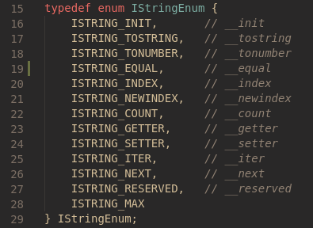
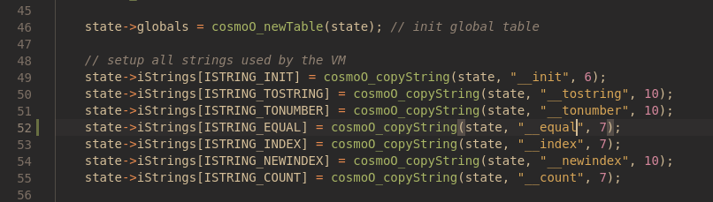
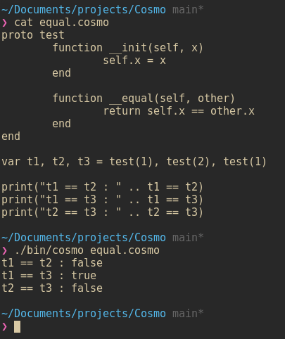
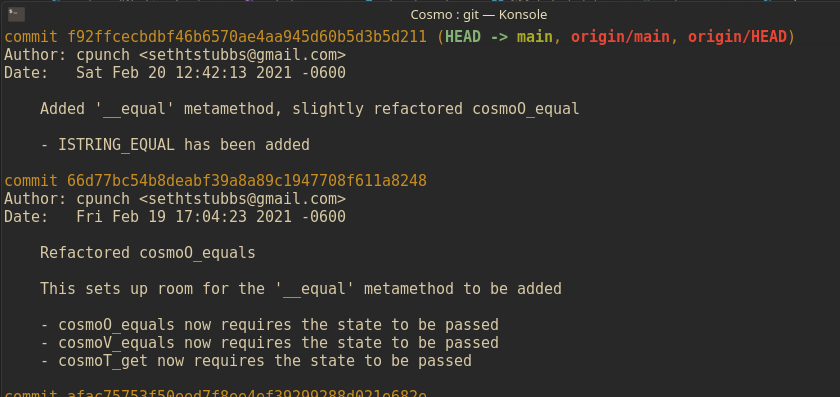
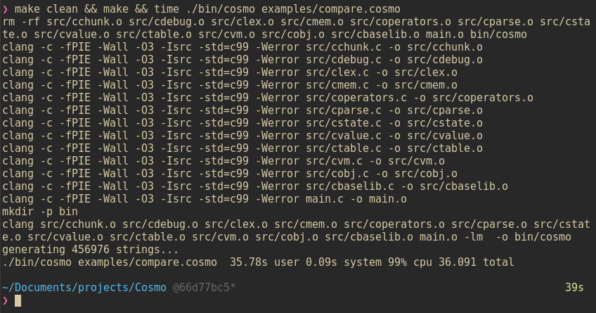
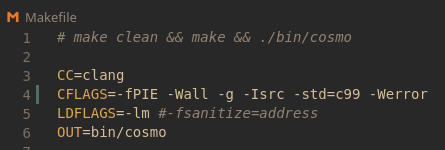
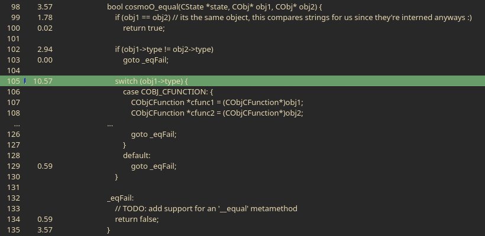
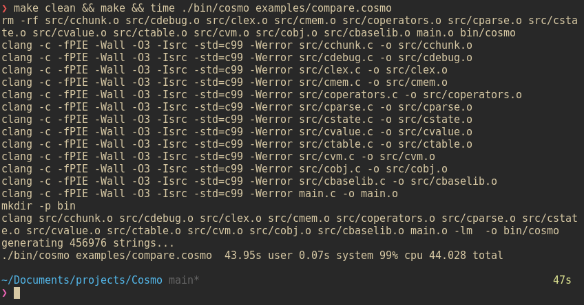
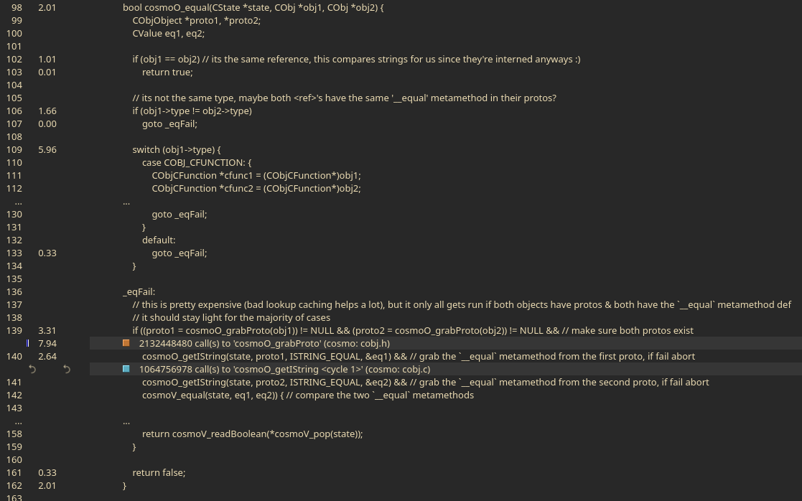
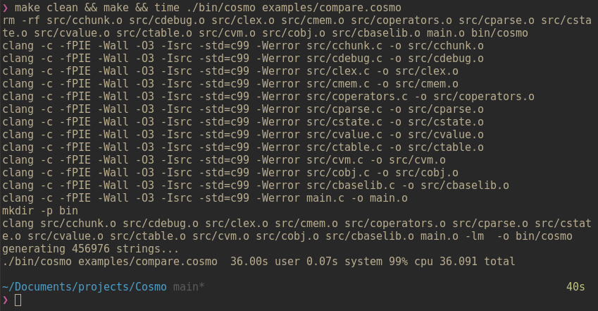

I've been spending a lot of time recently on my own scripting language called "Cosmo." Cosmo is an easily embeddable scripting language loosely based off of Lua. It's definitely a student project though so don't get your hopes up. While this does smash python in benchmarks its not quite as fast as Lua, let alone Lua-JIT. Anyways, in this post I wanted to walk through my rough workflow for working on Cosmo. Hopefully sharing some inside knowledge about how Cosmo is designed and works under the hood can give you ideas in your own projects :) For more information on the syntax of Cosmo, read the [docs](https://github.com/CPunch/Cosmo/tree/main/docs) or look at the [examples](https://github.com/CPunch/Cosmo/tree/main/examples).

## Adding the `__equal` metamethod

Here's my end goal for this post: add a new metamethod '__equal' which allows objects to have a custom compare operation and make sure it doesn't impact performance. Let's start by adding the new `IStringEnum` in cstate.h



Now, IStrings are actually allocated for every state and put into a lookup table for easy access. So we'll have to modify cosmoV_newState() in cstate.c to allocate our new IString and populate the `state->IString[ISTRING_EQUAL]`. This looks like:



Now, to actually connect the metamethod to the `==` operator, we'll just modify cosmoO_equals. Now this function assumes that both datatypes are a `<ref>` since it's called by cosmoV_equals which compares the CValues types (and handles primitive type comparisons). On the [previous commit](https://github.com/CPunch/Cosmo/commit/66d77bc54b8deabf39a8a89c1947708f611a8248) I refactored cosmoO_equals to make room for our `__equal` metamethod handler. Here's what it currently looks like: 

```c
bool cosmoO_equal(CState *state, CObj* obj1, CObj* obj2) {
    if (obj1 == obj2) // its the same object, this compares strings for us since they're interned anyways :)
        return true;

    if (obj1->type != obj2->type)
        goto _eqFail;

    switch (obj1->type) {
        case COBJ_CFUNCTION: {
            CObjCFunction *cfunc1 = (CObjCFunction*)obj1;
            CObjCFunction *cfunc2 = (CObjCFunction*)obj2;
            if (cfunc1->cfunc == cfunc2->cfunc)
                return true;
            goto _eqFail;
        }
        case COBJ_METHOD: {
            CObjMethod *method1 = (CObjMethod*)obj1;
            CObjMethod *method2 = (CObjMethod*)obj2;
            if (cosmoV_equal(state, method1->func, method2->func))
                return true;
            goto _eqFail;
        }
        case COBJ_CLOSURE: {
            CObjClosure *closure1 = (CObjClosure*)obj1;
            CObjClosure *closure2 = (CObjClosure*)obj2;
            // we just compare the function pointer
            if (closure1->function == closure2->function)
                return true;
            goto _eqFail;
        }
        default:
            goto _eqFail;
    }

_eqFail:
    // TODO: add support for an '__equal' metamethod
    return false;
}
```

The first thing I'll do is add our variables needed to the top of the function. 

```c
bool cosmoO_equal(CState *state, CObj *obj1, CObj *obj2) {
    CObjObject *proto1, *proto2;
    CValue eq1, eq2;

    if (obj1 == obj2) // its the same reference, this compares strings for us since they're interned anyways :)
        return true;
```

Now we can actually handle the `_eqFail` label. Now we only want to call the `__equal` metamethod if 
- both `obj1` and `obj2` have a proto object
- both `obj1` and `obj2` have a `__equal` metamethod defined
- it's the *same* metamethod

In practice this looks like

```c
_eqFail:
    if ((proto1 = cosmoO_grabProto(obj1)) != NULL && (proto2 = cosmoO_grabProto(obj2)) != NULL && // make sure both protos exist
        cosmoO_getIString(state, proto1, ISTRING_EQUAL, &eq1) && // grab the `__equal` metamethod from the first proto, if fail abort
        cosmoO_getIString(state, proto2, ISTRING_EQUAL, &eq2) && // grab the `__equal` metamethod from the second proto, if fail abort
        cosmoV_equal(state, eq1, eq2)) { // compare the two `__equal` metamethods

        // now finally, call the `__equal` metamethod (<object>, <object>)
        cosmoV_pushValue(state, eq1);
        cosmoV_pushRef(state, obj1);
        cosmoV_pushRef(state, obj2);
        if (cosmoV_call(state, 2, 1) != COSMOVM_OK)
            return false;

        // check return value and make sure it's a boolean
        if (!IS_BOOLEAN(*cosmoV_getTop(state, 0))) {
            cosmoV_error(state, "__equal expected to return <boolean>, got %s!", cosmoV_typeStr(*cosmoV_pop(state)));
            return false;
        }

        // return the result
        return cosmoV_readBoolean(*cosmoV_pop(state));
    }
```

I went ahead and added the body of that if statement, it just takes care of calling the metamethod, checking that the result is a `<boolean>` and returning the value as a C type `bool`.

So, that might look a whole lot more intense than before, but remember [short-circuiting](https://softwareengineering.stackexchange.com/questions/201896/what-is-short-circuiting-in-c-like-languages) exists! This is why that if statement is so large; if one of the protos doesn't exists it stops evaluating the rest of the statement. Same with cosmoO_getIString, if that returns false (aka ISTRING_EQUAL isn't defined) it stops! Now lets compile and test our changes to make sure it runs as expected.

```sh
$ make clean && make
```
> I run make clean to force everything to be recompiled since I changed a header file, which can be included in sooo many different files.



And boom! It works! Looks like it's good to commit :)

```sh
$ git add src && git commit -m "Added '__equal' metamethod, slightly refactored cosmoO_equal" -m "- ISTRING_EQUAL has been added" && git push
```
> I didn't actually do this all in one step, I'm just shortening it for the post :p

## Profiling & comparing our changes

Now lets compare the prior commit's performance to this to make sure that we haven't just severely crippled performance. So I'll just look at my `git log` and checkout the previous commit.



So lets go ahead and checkout the previous commit

```sh
$ git checkout HEAD^1
```
> `HEAD^1` tells git to go to the previous commit from the HEAD commit

For our stress test, I wrote a script that populates a table with ~456976 strings (26 ^ 4), it generates every 4 letter word and populates the table using it. The script looks like:

```cosmo
var strtable = []
var strLen = 4 // length of all strings to generate
var AByte = "A":byte() // grabs the ascii value of 'A'

proto stringBuilder 
    function __init(self, length)
        self.len = length
    end

    // we are the iterator object lol
    function __iter(self)
        self.x = 0
        return self
    end

    function __next(self)
        var x = self.x++

        // if we've generated all the possible strings, return nil ending the loop
        if x >= 26 ^ self.len then
            return nil
        end

        // generate the string
        var str = ""
        for (var i = 0; i < self.len; i++) do
            str = string.char(AByte + (x % 26)) .. str
 
            x = math.floor(x / 26)
        end

        return str
    end
end

// generate a bunch of strings & populate the table
print("generating " .. 26 ^ strLen .. " strings...")
for str in stringBuilder(strLen) do
    strtable[str] = true
end
```

Now if you're asking yourself: "What? I thought we were testing the comparison of strings?" You're absolutely right! This stress test is a perfect candidate for that. If you're unsure how tables work in Cosmo, internally they're hashtables. Looking at the implementation we'll find: 

```C
// mask should always be (capacity - 1)
static CTableEntry *findEntry(CState *state, CTableEntry *entries, int mask, CValue key) {
    uint32_t hash = getValueHash(&key);
    uint32_t indx = hash & mask; // since we know the capacity will *always* be a power of 2, we can use bitwise & to perform a MUCH faster mod operation
    CTableEntry *tomb = NULL;

    // keep looking for an open slot in the entries array
    while (true) {
        CTableEntry *entry = &entries[indx];

        if (IS_NIL(entry->key)) {
            // check if it's an empty bucket or a tombstone
            if (IS_NIL(entry->val)) {
                // it's empty! if we found a tombstone, return that so it'll be reused
                return tomb != NULL ? tomb : entry;
            } else {
                // its a tombstone!
                tomb = entry;
            }
        } else if (cosmoV_equal(state, entry->key, key)) {
            return entry;
        }

        indx = (indx + 1) & mask; // fast mod here too
    }
}
```

While looking through each index, we eventually have to call cosmoV_equals to compare the found key with our key, this is why this makes our stress script a good test for this! Each time we insert a new key/value pair into our table, findEntry() is called and in turn cosmoV_equal is called sometimes numerous times! Anyways ON WITH THE TEST!

First I'm going to run the test normally (without profiling) just to see how long it would take to populate a table with 456976 different string keys on my machine.

```sh
$ make clean && make && time ./bin/cosmo examples/compare.cosmo
```


> My ZSH theme is PowerLevel10k if you were wondering

Okay so the stress took about ~36 seconds to run, not bad! Next I'm going to edit the makefile to include debug symbols and then profile the build using valgrind. We'll use these results to compare with our cosmoO_equals patch afterwards to see what we can improve upon.



```sh
$ make clean && make && valgrind --tool=callgrind ./bin/cosmo examples/compare.cosmo
```
> Took 28 minutes to complete the profile, valgrind is slowww


> I used KCachegrind, but really any valgrind visualizer would work

Now if you look right after the line number, it'll tell you in how much "relative cost" that particular statement cost in percentage of the whole execution. So in our first test, the most expensive statement in cosmoO_equals was the switch statement at about 10% of our execution. Lets go ahead and switch back to our HEAD commit and run the stress test on that version

```sh
$ git checkout -
```



Oh yikes 44 seconds, thats almost 8 seconds longer! Looks like our new function is more expensive than I thought, so lets go ahead and profile and see what's eating up our cycles. SO again, patching that makefile to include debug information and running valgrind, kcachegrind shows us


> This run took 44 minutes to run LOL

## Improving our changes

Ah, so it looks like I overlooked that `<string>` values have a proto object defined in the base library. To fix this, let's prevent that whole fail branch from being ran on strings anyways since we don't define a custom `__equal` metamethod for strings. To do this we can just expand our switch statement based on type to just return false, this will look something like:

```C
switch (obj1->type) {
    case COBJ_STRING: {
        /* 
            we already compared the pointers at the top of the function, this prevents the `__equal` metamethod
            from being checked. If you plan on using `__equal` with strings just remove this case!
        */
        return false;
    }
    case COBJ_CFUNCTION: {
```

Remember that at the top of cosmoO_equals the two `obj1` and `obj2` pointers are compared and if they're the same, we return true! So if they're both strings afterwards we know that they're not the same since we don't have an `__equal` metamethod defined for them anyways. Now yes, this does prevent someone from adding an `__equal` metamethod to the `<string>` proto, but thats a very rare use case that I don't expect anyone to use. The performance of our strings in Cosmo is extremely important, the whole language is built on top of them! Let's see how well this improves performance!



We're back to 36 seconds! I'll go ahead and commit that change and also add that stress script to the examples directory. Until next time!