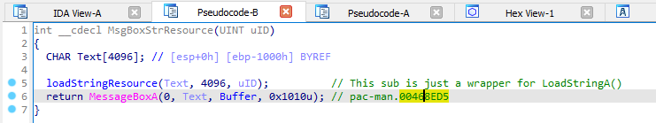
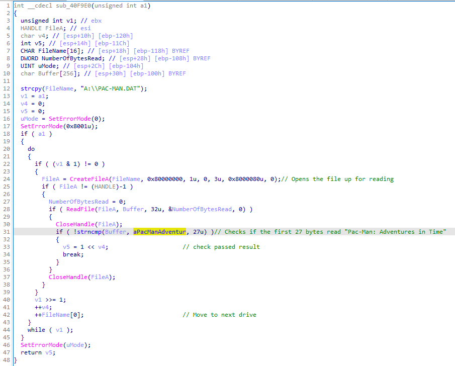
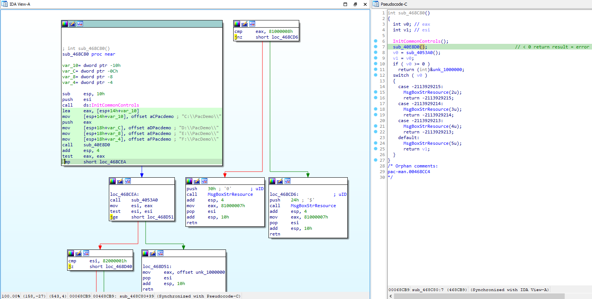

[Pac-Man: Adventures in Time](https://archive.org/details/pac-man-adventures-in-time) is a game from the year 2000. A quite exciting year, after narrowly surviving the Y2K fallout, Hasbro Entertainment published the newest installment of the Pac-Man franchise, Pac-Man: Adventures in Time. It's reception was quite good actually, scoring a whopping 79/100 from Metacritic. It featured a fairly simple DRM mechanism which helped it from software pirates for it's duration of sale. Most likely because pirates didn't really care enough about the game lol.

## DRM? What DRM?

After installing the game, if you try running it on a modern system you'll be greeted with this message:

Hm. Back in 2000 games were primarily still sold in bigbox stores, physically. This DRM's main goal was to prevent users from copying the installed game files and distributing them to non-disk owners. 22 years later it still somewhat accomplishes this goal. Keyword ***somewhat***.

Of course being 22 years after it's release, we have trivial ways to get around this. One of which is simply mounting the distributed .ISO file on a virtual disk drive. Windows provides this natively just by opening it with file explorer.

Oh. I guess my VM is having issues, so let's try another method. (Not to mention, this wouldn't work with wine.)

## Oh, that DRM

Let's attach [OllyDbg](https://www.ollydbg.de/) and pause execution after we get that message box.

Looks like MessageBoxA is called from a subroutine at `0x00468ED5`. Call stack from there looks something like:

- `pac-man.00468ED5` (Our MessageBoxA call)
- `pac-man.00468CC4`
- `pac-man.004683C4`
- `pac-man.<ModuleEntryPoint>+0C9`

As much as some others are great at reading raw x86 assembly, I am *not*. Let's open the Pacman executable up in IDA Pro and look at each call under it's pseudo-code. Let's start with our MessageBoxA call.

> Note: I've renamed the subs and added comments to better explain what's happening.

Pretty straight forward, this sub simply loads a string resource from the executable and makes a messagebox. They probably did it this way so that translations would be easier to implement, but nothing here about DRM. Let's move on to the subroutine at `0x00468CC4`.

Huh, this looks promising. That `sub_40E8D0` seems important. If it returns a negative number it takes the codepath leading to our messagebox. Let's take a look.

> Note: again, I renamed a few things. Specifically that 'checkDRM' sub. If we had debugging symbols this would be even easier lol.

Ah, so that subroutine that I've conveniently renamed `checkDRM` must have something to do with checking the DRM. If it fails (returns 0), it returns the error result that makes the DRM messagebox popup. Let's take an even closer look.

> I know it says 'sub_40F8D0` but it's the same subroutine.

So the CD Drive that pac-man was last used in is stored in the registry at `Software\Hasbro Interactive\Pac-Man Adventures in Time\1.00.000\P\CDLoc`. It's then loaded and passed to that subroutine I renamed to `checkDriveSecret`. Taking a look at that shows how simple this DRM boils down to.

> Again, 'sub_40F9E0` is 'checkDriveSecret'

This subroutine loops over our available drives, looking for a file in the root named 'PAC-MAN.DAT', and checks that it's contents reads `Pac-Man: Adventures in Time`. Thats it. Old DRMs like this are extremely simple in design, and heavily relied on the fact that most users *don't know what it's doing*. This obscurity kept the game from being shared over the net fairly successfully.

## Now, let's break it >:)

Now, we don't want to completely *remove* the DRM, that would take too much time and we don't really know for sure if any of those subroutines setup anything else besides the DRM. We can do something even simpler, just remove the check for that messagebox. If we go back to the subroutine at `0x00468CC4`, let's take another look.

If we change that `jge` instruction I highlighted to a `jmp`, even if the `sub_40E8D0` returns a negative number, we'll always go to the 'drm passed' code block. Patching that instructions is as simple as:

Our pseudo-code shows us that the result from `sub_40E8D0` is simply ignored. Let's save our patches and try running pac-man again.

It worked! The result of `sub_40E8D0` is ignored and the game starts normally, allowing us to even play through wine :D

## Conclusion

Looking at how old games work is really fun, mostly because they're much easier to understand compared to modern software with their vftables and other annoyances. This game also has a proprietary file format for it's game data. It would be fun to take a look at that later!
