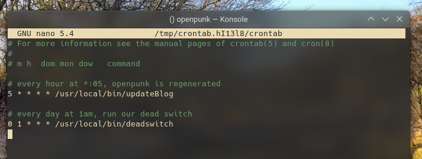
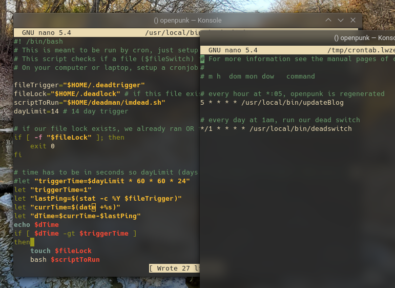
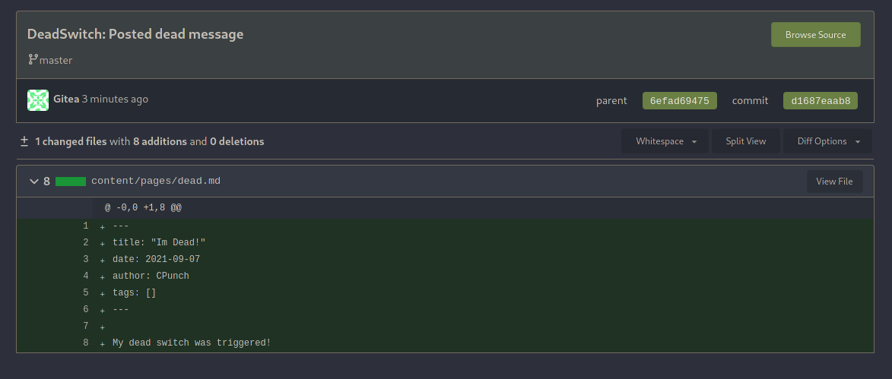



## You're going to die

Okay... maybe not right now but who knows? It's unavoidable. No matter what diet you try or whether you know Rust™ or not, eventually the curtains will close and your show will end. Preparing for one's death might seem like a jinx, but the truth is anything could happen. It's sure gonna suck when you die getting mugged tomorrow, so let's make it suck less. In honor of this Halloween season I would like to cheat death and create a dead man's hugo post; specifically a hugo post that would be posted 2 weeks or so after my death. This will also let me ~~brag about~~ shed some light into how I've setup my OpenPunk workflow. Let's get started!

## Some background

OpenPunk (the blog that you're reading right now!) is statically generated from [this repository.](https://git.openpunk.com/OpenPunk/openpunk) There's a cronjob on my server that force pulls from the latest master branch and regenerates the hugo blog every hour or so. If you’re ever curious how long ago the current build of OpenPunk you’re reading was generated from, just check the datetime at the bottom of the page. The generated html is then served through apache and is also mirrored on a tor mirror. (`opnpnk6eutjiqy4ndpyvwxd5pncj2g2cmz6fkocr5uh3omnn4utvspad.onion` btw) To make a new post, I commit the markdown & images in the content/pages directory to the repository, and within an hour my live site will be updated. It's a very simple and elegant solution that works quite well with my workflow, I write posts locally and when I feel they are finished I simply commit and push.

## Your trigger

[Dead man's Switches](https://en.wikipedia.org/wiki/Dead_man%27s_switch) are quite marvelous devices, in the event an operator or user becomes incapacitated these switches can be rigged up to stop trains & other machinery before critical failure. In our case our switch is completely digital, posting a hugo post in the event you become 'incapacitated'. There'll be no lever to pull or pedal to press, it's quite simple but takes some setup. Our basic plan is:

- Have a cronjob on our laptop that creates a file on our vps over ssh every hour or so
- Have a cronjob on our VPS that checks the last modified timestamp on the file and checks if it hasn't been modified in a certain time interval
- If the timestamp is older than our specified time interval (ie, we haven't gotten a 'ping') activate the switch

Let's go ahead and setup our local cronjob to run on our laptop. First let's write a script to do our 'ping' to the vps

```bash
#!/usr/bin/bash

ssh root@openpunk.com 'touch /root/.deadtrigger'
```

Obviously you would replace 'root@openpunk.com' with your own VPS and user. You should also have key login enabled on your VPS so ssh won't prompt the script for the password. I went ahead and saved that script to `/usr/local/bin/pingDeadSwitch`. After that we can setup our crontab with 

```shell
crontab -e
```

And our crontab should look like:

```shell
2 * * * * /usr/local/bin/pingDeadSwitch
```


or something similar, this configuration runs the script 2 minutes after every hour.

## Your switch

Now that we have our "trigger" setup, we'll need our VPS to actually detect if our trigger hasn't been modified in 14 days. Why 14 days? Well in the event that I lose my laptop (it gets stolen, burns in a fire or I just accidentally murdered my arch install) I'd like to give myself a few days to setup my trigger again. We'll also need a way to temporarily suspend the switch. If I know in advance that I'll be away from my computer for a bit I should be able to easily suspend the switch until I know I'll be back.

Let's start by writing our script to be run by cron every day. On my VPS I'll copy this script to `/usr/local/bin/deadswitch` (and of course mark it executable with `chmod`)

```bash
#!/bin/bash
# This is meant to be run by cron, just setup a cronjob to run this script every day or so
# This script checks if a file ($fileSwitch) is last modified > $dayLimit days ago & if so a script is run
# On your computer or laptop, setup a cronjob to run an ssh command to modify $fileSwitch every couple hours or so.

fileTrigger="$HOME/.deadtrigger"
fileLock="$HOME/.deadlock" # if this file exists, the deadmans switch will be disabled. This file is also automatically created when the switch is pulled
scriptToRun="$HOME/deadman/imdead.sh"
dayLimit=14 # 14 day trigger

# if our file lock exists, we already ran OR the switch has been suspended
if [ -f "$fileLock" ]; then
    exit 0
fi

# time has to be in seconds so dayLimit (days) * 24 (hours in a day) * 60 (mins in an hour) * 60 (seconds in a min)
let "triggerTime=$dayLimit * 24 * 60 * 60"
let "lastPing=$(stat -c %Y $fileTrigger)"
let "currTime=$(date +%s)"
let "dTime=$currTime-$lastPing"
if [ $dTime -gt $triggerTime ]
then 
    touch $fileLock
    bash $scriptToRun
fi
```

The script is pretty simple and self explanatory. If our file lock exists, exit out. If the delta time from being modified is over 14 days, run our deadman's payload and create the file lock. Let's go ahead and add this script to our VPS's crontab.

```shell
crontab -e
```


> You can also see my cronjob for generating the OpenPunk site

If your goal was just to use this switch, you can stop reading now. Just make your payload script at `$HOME/deadman/imdead.sh` and it'll run if your laptop doesn't talk to your VPS in over 14 days. However, my end goal is to add a post to OpenPunk, so everything that follows will be related to that specific payload.

## Your (my) payload

Remember, our end goal is to pull a Houdini and talk from the grave. We'll need to write a payload that commits a new post to our master branch. Let's start by writing our post template.

```yml
---
title: "Im Dead!"
date: {{DATE}}
author: CPunch
tags: []
---

My dead switch was triggered!
```

I'll save that to `$HOME/deadman/dead.md`. Notice the `{{DATE}}`, we'll use `sed` to replace that with the current days date. This will make sure that the post actually appears as the most recent. Next, let's write the actual payload to run when our switch is activated.

```bash
#!/bin/bash

cd $HOME/deadman

postTemplate='dead.md'
pageName='openpunk/content/pages/dead.md'
currDate=$(date '+%Y-%m-%d')

git clone git@git.openpunk.com:OpenPunk/openpunk.git
cp $postTemplate $pageName

# replace our {{DATE}} with the current date
sed -i 's/{{DATE}}/'$currDate'/g' $pageName

# commit & push the post
cd openpunk
git add .
git commit -m "DeadSwitch: Posted dead message"
git push
```

And I'll save that to `$HOME/deadman/imdead.sh`. If your repo is hosted elsewhere, you'll need to add ssh keys to be able to commit to the external repository.

# Testing everything

Alright, so everything is in place now. But how can we make sure that it actually works? It would be unfortunate if we died and our deadswitch broke. We can test that everything works by changing the `$triggerTime` in our deadswitch script to 1 and make our cronjob run every minute.



And look! It works! Our templated post got posted :)



Now, I just reset everything and delete `.deadlock`. So next time you get hit by a bus, rest easy because there'll be a meme or two posted to your blog in 2 weeks :D