If you remember my old site before I switched to a static site, I wrote a couple of posts about FusionFall Retro. Unfortunately, that project has since been shutdown. A couple of months ago in the spirit of FFR (and because it got brought up in conversation) I started to become curious about *how* they actually made the server. This kick started my journey into the depths of the FusionFall client. In this post I'm going to explain how I wrote the base for OpenFusion (and JUST the base, seriously, I only mean how OpenFusion accepts connections and sends packets to/from the FF client.)

## How do we get the client?

FusionFall was an old MMO by Cartoon Network. It ran on a custom Unity Web Player engine until it was shutdown in late 2013. ~~Funnily enough, their old CDN is actually *still up to this day*!~~ It hosts client versions from early 2010 to late 2011. Their CDN format looks like this:

```
http://ht.cdn.turner.com/ff/big/{$BUILD}/{$ASSET}
```

~~So for example, to grab the main.unity3d for the january 4th 2010 build, we can simply goto [http://ht.cdn.turner.com/ff/big/beta-20100104/main.unity3d](https://archive.org/download/fusionfallbetabuilds/beta-20100104/main.unity3d). Wow, thats convenient.~~

> NOTE: Their CDN was taken down mid September of 2021, luckily though there are still archives of all the public builds over at [archive.org](https://archive.org/download/fusionfallbetabuilds)!

If you've noticed, that main.unity3d file is just a unity web player file. We can't actually run the client without the Web Plugin installed. There's tons of ways to go about this, from using the [Pale Moon](https://www.palemoon.org/) browser & FF's old UnityWebPlayer installed. But I'm just going to cut to the chase and give you an old electron client I made that will set everything up for our main.unity3d file to run through a matching Unity Web Player version. Which you can download [here](FusionFallPlayer.zip).

## Configuration

If you've noticed in the electron client I've provided, there's a lot of non-php files with the .php extension. It turns out the FusionFall client actually makes GET requests to find out where to connect to the login server, and where to look for assets (which I just provided the CDN).

Here's a list of the important requests the beta-20100104 client makes:
- /assetInfo.php
    - Defines the base URL from which assets are requested from
- /loginInfo.php
    - Defines the ip & port the loginserver is hosted on

Both of these files can be found at resources/app/files. I already took care of assetInfo.php for you and just linked the corresponding CDN link, and loginInfo.php is set to look at 127.0.0.1 on port 8001. Basically the electron client (which is just an old version of chromium) is pointed to resources/app/files/, so when the main.unity3d file makes the GET request through the browser the electron client just reads our files instead :)

## Reading the C# assemblies

main.unity3d files have their own format. Luckily though there have been many tools made to extract the assets. In fact, after googling "extract UnityWeb assets" I found [QuickBMS](https://aluigi.altervista.org/quickbms.htm), which explains that we can just use QuickBMS and a [corresponding script](https://aluigi.altervista.org/bms/unity3d_webplayer.bms) to extract the assets from the file. So after running:

```bash
$ quickbms unity3d_webplayer.bms main.unity3d
```

We'll end up with these files

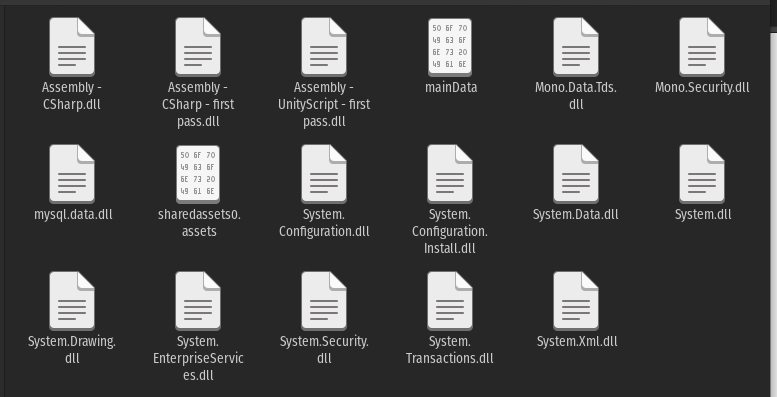

Now it's just a matter of feeding the assembly to DNSpy or in my case ILSpy. 

```bash
$ ilspycmd Assembly\ -\ CSharp.dll > out.cs
```

## Weird obfuscation

Let's take a look at csSocketManager, it's in charge of obfuscating packets before sending to the server and de-obfuscating packets from the server. You'll notice there's an EKey and an FEKey. I'm only going to be talking about the EKey today but the FEKey is used when switching from the login server to the shard server (the actual game server.) In the constructor you can actually see the default key that's set.

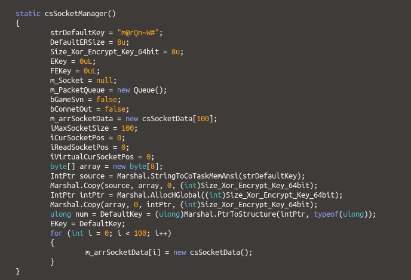

They use Marshal to convert the string into an array of bytes and then into a long int (8 bytes long.) We can actually see what this key is used for over in Encrypt_Data()

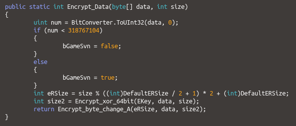

First, Encrypt_Data() calls Encrypt_xor_64bit() with the default key, the data, and the size of the data. Encrypt_xor_64bit() looks like

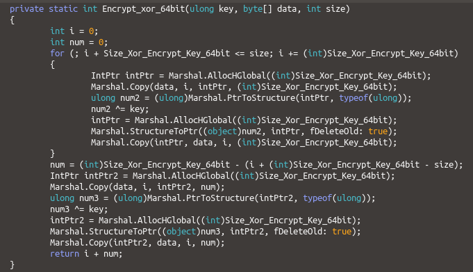

It looks like a mess, but basically the default key is xor'd over the data and the size of the xor'd data is returned. After Encrypt_xor_64bit() is called, Encrypt_Data() calls Encrypt_byte_change_A() which looks like

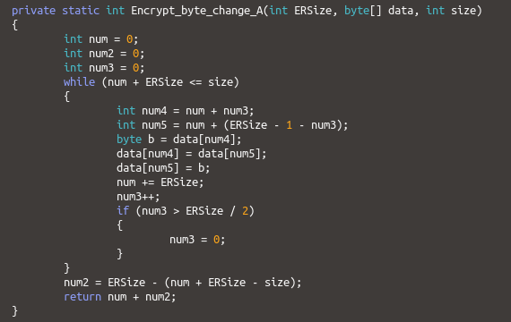

Encrypt_byte_change_A() swaps some bytes around in an easily reversible way and returns the amount of bytes swapped.

If I were to rewrite the above methods in C++, it would look like so

```cpp
namespace CNSocketObfuscation {
    static constexpr const char* defaultKey = "m@rQn~W#";
    static const unsigned int keyLength = 8;

    // literally C/P from the client and converted to C++ (does some byte swapping /shrug)
    int Encrypt_byte_change_A(int ERSize, uint8_t* data, int size) {
        int num = 0;
        int num2 = 0;
        int num3 = 0;

        while (num + ERSize <= size) {
            int num4 = num + num3;
            int num5 = num + (ERSize - 1 - num3);

            uint8_t b = data[num4];
            data[num4] = data[num5];
            data[num5] = b;
            num += ERSize;
            num3++;
            if (num3 > ERSize / 2) {
                num3 = 0;
            }
        }

        num2 = ERSize - (num + ERSize - size);
        return num + num2;
    }

    int xorData(uint8_t* buffer, uint8_t* key, int size) {
        // xor every 8 bytes with 8 byte key
        for (int i = 0; i < size; i++) {
            buffer[i] ^= key[i % keyLength];
        }

        return size;
    }

    int encryptData(uint8_t* buffer, uint8_t* key, int size) {
        int eRSize = size % (keyLength / 2 + 1) * 2 + keyLength; // C/P from client
        int size2 = xorData(buffer, key, size);
        return Encrypt_byte_change_A(eRSize, buffer, size2);
    }

    // we'll get back to these :eyes:
    int decryptData(uint8_t* buffer, uint8_t* key, int size);
    uint64_t createNewKey(uint64_t uTime, int32_t iv1, int32_t iv2);
}
```

Decrypting data is just as simple, just call the methods in reverse order

```cpp
int decryptData(uint8_t* buffer, uint8_t* key, int size) {
    int eRSize = size % (keyLength / 2 + 1) * 2 + keyLength; // size % of 18????
    int size2 = Encrypt_byte_change_A(eRSize, buffer, size);
    return xorData(buffer, key, size2);
}
```

## Packet structure

So once the data has been de-obfuscated, how is it parsed? Well, after checking what calls Decrypt_Data I find this method in cnNetworkManager.

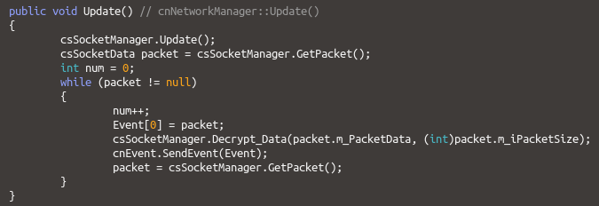

First thing this method calls is csSocketManager.GetPacket(), which is a pretty simple method


Basically from a queue of waiting packets to be processed it'll return one. This queue is populated by csSocket.Update() which explains how part of the packets are laid out.

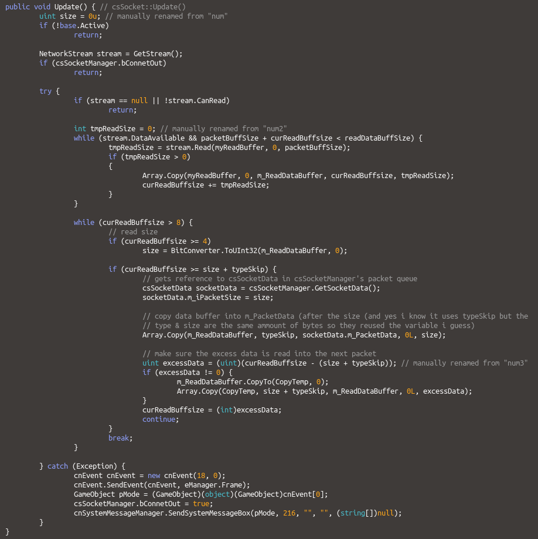
> I've taken the liberty of going ahead and annotating the decompiled source of this method. Basically this method populates csSockManager's queue of packets.

So before the data is even de-obfuscated a size is read and used to grab the rest of the packet. Packets start with a 4 byte long integer in little endian which tells us the size of the rest of the packet. So going back to cnNetworkManager.Update(), after the packet is grabbed, it's de-obfuscated with csSocketManager.Decrypt_Data() and passed to a cnEvent. This cnEvent is defined as 

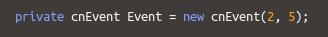

cnEvents are used internally as a communication between managers. Looking at the constructor and the SendEvent() method we find

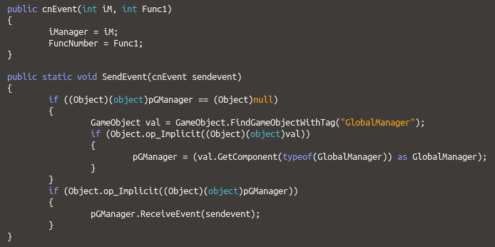
> SendEvent() finds the GlobalManager (or creates it if it doesn't exist) and calls ReceiveEvent() with the specified event

and looking into GameManager we find 

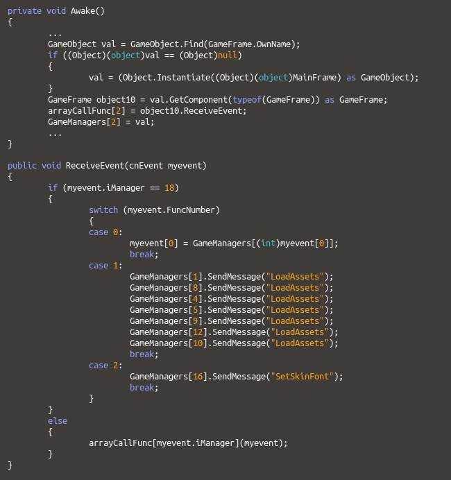
> I omitted a lot of useless code here so you can easily see what's important.

SO, when cnEvent.SendEvent() is called, it calls GameManager.ReceiveEvent() which calls the corresponding defined manager's function. We know that 2 is defined as the GameFrame.ReceiveEvent(), so looking at GameFrame.ReceiveEvent() we find

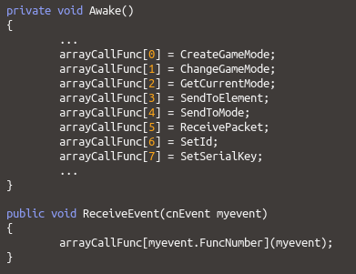
> Again, I omitted a lot of out of context code so you can easily see what's important

Now, I know what you're thinking, "wow, thats a lot of code just to call a single function in another class." Yes. I 100% agree, but this is what they did and I didn't want to just say "so basically packets are read here" because part of the process is sifting through a LOT of junk code. Anyways, when cnEvent.SendEvent() is called with the cnEvent(2, 5) constructor GameFrame.ReceivePacket() is called and the event is passed; which looks like


> This method handles every single incoming packet from the server and sends it to it's corresponding manager class. This is a HUGE method.

OK, we're finally getting somewhere, the event is unpacked and csSocketData.GetPacketType() is called and depending on the packet type returned, each packet is handled. So what we really need to know right now is how are packet types encoded? Well we can just look at csSocketData.GetPacketType()

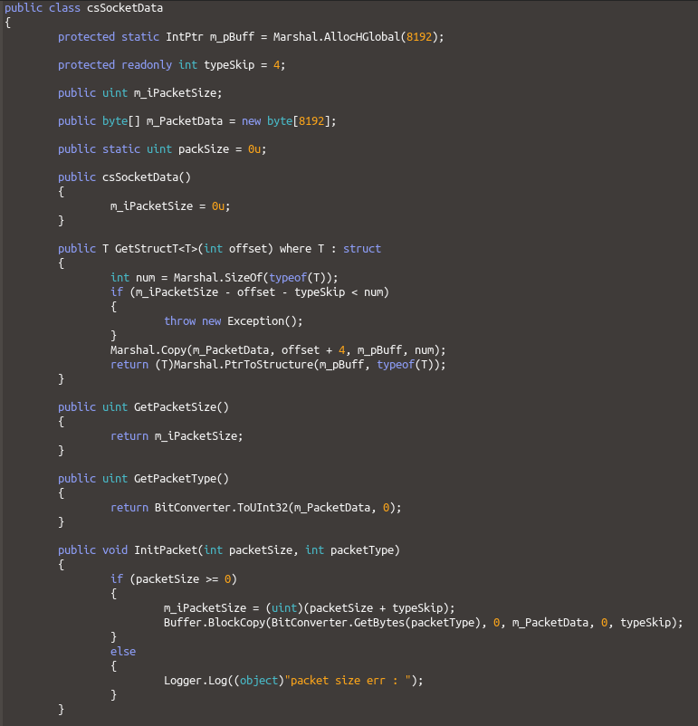

Ah, so after being de-obfuscated theres a 4 byte unsigned int that represents the packet type id and then a structure right after.

## Receiving from the client

So after writing some socket boilerplate code (which you can read in [main() on the repository](https://github.com/CPunch/FusionFallPacketPOC/blob/816a696b4fb0f5bb4ccd942ab2b157705d4cf044/src/main.cpp#L188)) we can finally try reading some packets.

```cpp
void readPacket(SOCKET sock, uint32_t id, void *buff) {
    std::cout << "[READ] ID: " << id << std::endl;
}

void receivePacket(SOCKET sock) {
    uint8_t buff[4096];

    // first thing we do is read the packet size into our tmp buffer
    int size = read(sock, (buffer_t*)buff, sizeof(uint32_t));

    // now read the packet size (this includes the type)
    uint32_t packetSize = *((uint32_t*)buff);

    // now read the rest of the packet && deobfuscate it with the default key
    // (we'll also overwrite the packetSize in the buffer but thats fine bc we already read it)
    size = read(sock, (buffer_t*)buff, packetSize);
    CNSocketObfuscation::decryptData(buff, (uint8_t*)CNSocketObfuscation::defaultKey, packetSize);

    // now read the packet ID and send the pointer to the struct would be and pass it to readPacket()
    readPacket(sock, *((uint32_t*)buff), buff + sizeof(uint32_t));
}
```

After compiling and running our server, we can run our client (with loginInfo.php set to 127.0.0.1:8001) and we'll see a login screen. After entering in our very important login details and clicking login our server will politely say

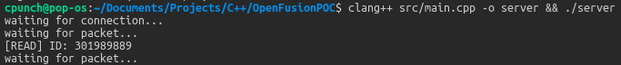

And Ctrl+F'ing our decompiled source with the corresponding packet type ID shows us

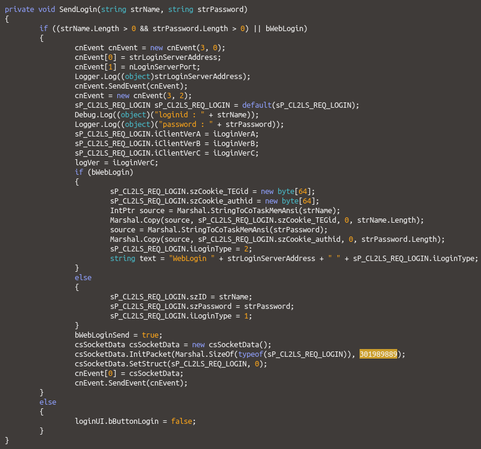

Neat! So it sends a structure with all the login data to the server, that structure is defined as 

```csharp
[StructLayout(LayoutKind.Sequential, CharSet = CharSet.Unicode, Pack = 4, Size = 468)]
public struct sP_CL2LS_REQ_LOGIN
{
	[MarshalAs(UnmanagedType.ByValTStr, SizeConst = 33)]
	public string szID;

	[MarshalAs(UnmanagedType.ByValTStr, SizeConst = 33)]
	public string szPassword;

	[MarshalAs(UnmanagedType.I4)]
	public int iClientVerA;

	[MarshalAs(UnmanagedType.I4)]
	public int iClientVerB;

	[MarshalAs(UnmanagedType.I4)]
	public int iClientVerC;

	[MarshalAs(UnmanagedType.I4)]
	public int iLoginType;

	[MarshalAs(UnmanagedType.ByValArray, SizeConst = 64)]
	public byte[] szCookie_TEGid;

	[MarshalAs(UnmanagedType.ByValArray, SizeConst = 255)]
	public byte[] szCookie_authid;
}
```

Rewriting that struct in C++ (abusing the pack preprocessor) we'll get

```cpp
#pragma pack(push)
#pragma pack(4)
struct sP_CL2LS_REQ_LOGIN {
	char16_t szID[33];
	char16_t szPassword[33];
	int32_t iClientVerA;
	int32_t iClientVerB;
	int32_t iClientVerC;
	int32_t iLoginType;
	uint8_t szCookie_TEGid[64];
	uint8_t szCookie_authid[255];
};
#pragma pack(pop)
```

To read those Unicode strings I'll just use the deprecated codecvt api.

```cpp
std::string U16toU8(char16_t* src) {
    try {
        std::wstring_convert<std::codecvt_utf8_utf16<char16_t>,char16_t> convert;
        return convert.to_bytes(src);
    } catch(const std::exception& e) {
        return "";
    }
}
```

So updating readPacket() to print out login info will be

```cpp
void readPacket(SOCKET sock, uint32_t id, void *buff) {
    switch (id) {
        case 301989889: { // sP_CL2LS_REQ_LOGIN
            sP_CL2LS_REQ_LOGIN *loginInfo = (sP_CL2LS_REQ_LOGIN*)buff;
            std::cout << "[READ] Got login request:" << std::endl
                << "Client Ver: " << loginInfo->iClientVerA << "." << loginInfo->iClientVerB << "." << loginInfo->iClientVerC << std::endl
                << "Login type: " << loginInfo->iLoginType << std::endl
                << "ID: " << U16toU8(loginInfo->szID) << std::endl
                << "Password: " << U16toU8(loginInfo->szPassword) << std::endl;
            break;
        }
        default:
            std::cout << "[READ] UNKNOWN ID: " << id << std::endl;
    }
}
```

and our login request is now a bit more readable

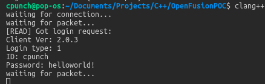

## Talking with the client

Now that we can read packets from the client, the last thing to cover really is sending packets to the client. To do this, we'll just have to do the reverse of what we did when reading packets. Allocate a buffer big enough to hold the size, type and struct, obfuscate the body (type & struct) and send. This method will look like

```cpp
void sendPacket(SOCKET sock, uint32_t id, void *buff, size_t size) {
    size_t fullSize = size + (sizeof(uint32_t) * 2); // * 2 for the size & id
    size_t bodySize = size + sizeof(uint32_t);
    uint8_t fullPacket[fullSize]; // allocate enough for the struct & the packet type id

    uint8_t *bodyPacket = fullPacket + sizeof(uint32_t); // skips the location of where the size is

    // set the first 4 bytes of our actual packet (excluding the size) to our packet type
    memcpy(bodyPacket, (void*)(&id), sizeof(uint32_t));

    // set the rest of the packet to our struct
    memcpy(bodyPacket + sizeof(uint32_t), buff, size);

    // encrypt the body
    CNSocketObfuscation::encryptData((uint8_t*)bodyPacket, (uint8_t*)CNSocketObfuscation::defaultKey, bodySize); // encrypts the body of the packet

    // finally, set the size & send to the socket
    memcpy(fullPacket, (void*)&bodySize, sizeof(uint32_t));
    write(sock, fullPacket, fullSize);
}
```

After sending the login request packet, the client expects a response from the server. For our demo I'll just have our server send a login failed response to every login attempt. First lets find out what structure is needed for that packet. Just Ctrl+F'ing for "login_fail" gave us this struct.

```csharp
[StructLayout(LayoutKind.Sequential, CharSet = CharSet.Unicode, Pack = 4, Size = 72)]
public struct sP_LS2CL_REP_LOGIN_FAIL
{
	[MarshalAs(UnmanagedType.I4)]
	public int iErrorCode;

	[MarshalAs(UnmanagedType.ByValTStr, SizeConst = 33)]
	public string szID;
}
```

and in C++ looks like

```cpp
#pragma pack(4)
struct sP_LS2CL_REP_LOGIN_FAIL {
	int32_t iErrorCode;
	char16_t szID[33];
};
```

Looking for references to this struct we'll also find the packet type id and what each error code corresponds too.

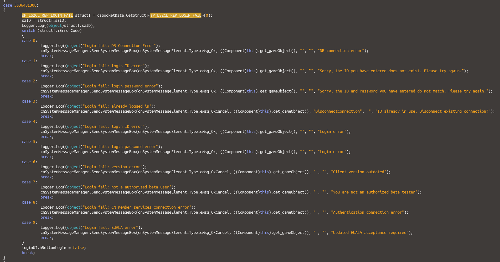

We'll ignore the szID field since it's not important. So after we receive a sP_CL2LS_REQ_LOGIN, we just need to respond with the sP_LS2CL_REP_LOGIN_FAIL packet. After updating our readPacket() function, it looks like

```cpp
void readPacket(SOCKET sock, uint32_t id, void *buff) {
    switch (id) {
        case 301989889: { // sP_CL2LS_REQ_LOGIN
            sP_CL2LS_REQ_LOGIN *loginInfo = (sP_CL2LS_REQ_LOGIN*)buff;
            std::cout << "[READ] Got login request:" << std::endl
                << "Client Ver: " << loginInfo->iClientVerA << "." << loginInfo->iClientVerB << "." << loginInfo->iClientVerC << std::endl
                << "Login type: " << loginInfo->iLoginType << std::endl
                << "ID: " << U16toU8(loginInfo->szID) << std::endl
                << "Password: " << U16toU8(loginInfo->szPassword) << std::endl;

            sP_LS2CL_REP_LOGIN_FAIL fail;
            memset((void*)&fail, 0, sizeof(sP_LS2CL_REP_LOGIN_FAIL)); // zeros out the data

            fail.iErrorCode = 6; // client version outdated
            sendPacket(sock, 553648130, (void*)&fail, sizeof(sP_LS2CL_REP_LOGIN_FAIL)); // send the packet!
            break;
        }
        default:
            std::cout << "[READ] UNKNOWN ID: " << id << std::endl;
    }
}
```

After compiling and running again, once we try logging in from our client, we're greeted with

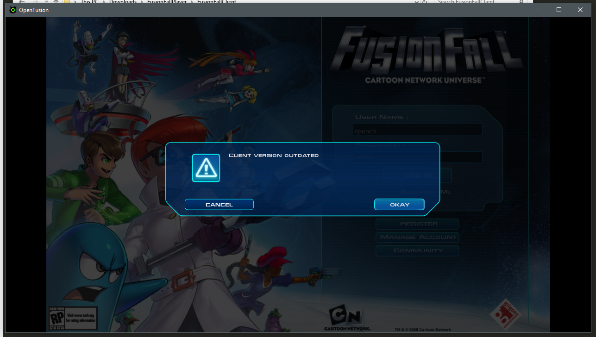

And boom! We've successfully received and sent packets to and from the FusionFall client! I purposely ignored the key switching and such, documentation on that will probably be written on the OpenFusion wiki. Until next time!