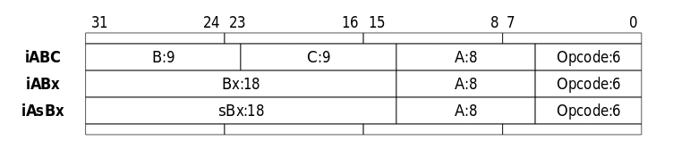

So recently I've been getting back into Lua, my first scripting language. I've already done a series about manipulating the LuaVM, (which you can read [here](/pages/manipulating-lua-vms-1)) but this time I was interested in the LuaVM bytecode, specifically the Lua 5.1 bytecode. If you don't know what bytecode is or even how Lua works, here's a basic rundown:
- LuaC is the Lua Compiler. Its job is to turn our human readable script into Lua Bytecode ready to be executed by the LVM (LuaVM) 
- This bytecode is everything the LVM needs to run!
    - Constants
    - Locals
    - Protos (The functions)
    - and even Debug information and line info

Now I know what you're thinking "Who cares! Why would I need to know this!" Well, being able to parse bytecode can enable us to do many things! To name a few:
- We could easily edit pre-compiled Lua Scripts embedded in a game.
- Read Lua Bytecode disassembly.
- Help un-obfuscate scripts.

Unfortunately the Lua bytecode has no real standard and changes from version to version. Meaning, our Lua 5.1 Bytecode parser won't be able to read Lua 5.3 Bytecode. Another unfortunate thing is that there is NO official documentation for Lua Bytecode since there is no real standard. Luckily however some really cool guy who made [ChunkSpy](http://chunkspy.luaforge.net/) also wrote some super cool paper about the Lua 5.1 Bytecode!! You can read his amazing paper [here](http://luaforge.net/docman/83/98/ANoFrillsIntroToLua51VMInstructions.pdf)! He talks about some really important stuff like how the instructions are encoded, and the Lua chunk header.

To start off I'm going to make a basic lua script and use luac to compile it.

```lua
print("hello world")
```

I know, I know, I should be scripting for NASA. But the simplicity of this will help us tiptoe into the deep end of the Lua Bytecode later on.

To compile this script, save it as "epic.lua" and call luac like so:

```bash
$ luac -o epic.luac epic.lua
```

You won't see much but your script was just compiled into Lua bytecode! if you want you can even try to read the compiled script.


Hmm a lot of weird symbols. Those symbols before 'epic.luaA' is part of our chunk header, the ones after are our instructions. You can see our 'hello world' and 'print' is readable. Lua stores these as constants and are human readable,,, for the most part.


Anyways lets actually talk about parsing this bytecode. All LVM Bytecode starts with a header. This just lets us know how to correctly parse the bytecode and what version it is. It's read as the following in this order:
- First 4 bytes are hex 0x1b and 'Lua' - 4 Bytes
- Lua revision - 1 Byte
- Lua format - 1 Byte
- Endian flag - 1 Byte
- int size - 1 Byte
- size_t size - 1 Byte
- instruction size - 1 Byte
- lua_Number size - 1 Byte
- integral flag - 1 Byte

or you can just reference the paper lol:


Knowing this, here's some pseudocode for reading the header:

```python
class LuaCompiler:
    def __init__(self):
        self.chunks = []
        self.chunk = {}
        self.index = 0

    def get_byte(self):
        b = self.bytecode[self.index]
        self.index = self.index + 1
        return b

    def get_string(self, size):
        s = "".join(chr(x) for x in self.bytecode[self.index:self.index+size])
        self.index = self.index + size
        return s

    def decode_bytecode(self, bytecode):
        self.bytecode   = bytecode

        self.signature_byte = self.get_byte()
        self.signature = self.get_string(3)
        self.vm_version = self.get_byte()
        self.bytecode_format = self.get_byte()
        self.big_endian = (self.get_byte() == 0)
        self.int_size   = self.get_byte()
        self.size_t     = self.get_byte()
        self.instr_size = self.get_byte() # gets size of instructions
        self.l_number_size = self.get_byte() # size of lua_Number
        self.integral_flag = self.get_byte()
        
        print("Lua VM version: ", hex(self.vm_version))
        print("Big Endian: ", self.big_endian)
        print("int_size: ", self.int_size)
        print("size_t: ", self.size_t)
```

Now we're going to have to talk about Instructions. The Lua 5.1 VM has 38 different opcodes for 38 instructions. There are 3 main registers, A, B, and C. Not all instructions use all three, with 3 main different types of instructions, each with different ways to encode the registers.
- iABC - This type of instruction uses all three registers, with each representing an unsigned integer. 
- iABx - This type of instruction uses A and B, both representing an unsigned integer as well.
- iAsBx - This type of instruction uses A and B, however B can represent a negative number. However the B in this instruction is strange. instead of having 1 bit represent the sign, the range is -131071 to 131071. It's encoded as a regular unsigned integer however, so to get the actual number, you subtract 131071.

All instructions start with the opcode [6 bits], and use the A register [8 bits] however are encoded differently per type:
- iABC - B and C are both 9 bits
- iABx and iAsBx - B is 18 bits

You can also reference this very helpful chart!




In lua Bytecode, datatypes are stored as the following:
- Integer - Usually 4 bytes long, integer.
- Lua_TNumber - all lua numbers are stored as this, 8 Bytes long, double.
- String
    - First byte is the size of the string
    - Characters
- Boolean - 1 Byte, only (1 or 0)

Now, let's write some code to read the datatypes before parsing the function chunk. We'll need to be able to get the binary of bytes for the instructions, to do that I'll be using python's binary operators:

```python
# at [p]osition, with [s]ize of bits
def get_bits(num: int, p: int, s: int):
    return (num>>p) & (~((~0)<<s))
```

Pretty cool :)

However, we still aren't done. We need to parse multiple bytes into a double, integer, etc. To do that, we'll start with what we wrote previously, but with a few more changes. I mainly used python's struct module to be able to parse these bytes. Here's what that looks like:

``` python
class LuaCompiler:
    def __init__(self):
        self.chunks = []
        self.chunk = {}
        self.index = 0

    def get_byte(self) -> int:
        b = self.bytecode[self.index]
        self.index = self.index + 1
        return b

    def get_int32(self) -> int:
        i = 0
        if (self.big_endian):
            i = int.from_bytes(self.bytecode[self.index:self.index+4], byteorder='big', signed=False)
        else:
            i = int.from_bytes(self.bytecode[self.index:self.index+4], byteorder='little', signed=False)
        self.index = self.index + self.int_size
        return i

    def get_int(self) -> int:
        i = 0
        if (self.big_endian):
            i = int.from_bytes(self.bytecode[self.index:self.index+self.int_size], byteorder='big', signed=False)
        else:
            i = int.from_bytes(self.bytecode[self.index:self.index+self.int_size], byteorder='little', signed=False)
        self.index = self.index + self.int_size
        return i

    def get_size_t(self) -> int:
        s = ''
        if (self.big_endian):
            s = int.from_bytes(self.bytecode[self.index:self.index+self.size_t], byteorder='big', signed=False)
        else:
            s = int.from_bytes(self.bytecode[self.index:self.index+self.size_t], byteorder='little', signed=False)
        self.index = self.index + self.size_t
        return s

    def get_double(self) -> int:
        if self.big_endian:
            f = struct.unpack('>d', bytearray(self.bytecode[self.index:self.index+8]))
        else:
            f = struct.unpack('<d', bytearray(self.bytecode[self.index:self.index+8]))
        self.index = self.index + 8
        return f[0]

    def get_string(self, size):
        size = self._get_size_t()
        if (size == 0):
            return ""

        # [:-1] to remove the NULL terminator
        return ("".join(chr(x) for x in self._loadBlock(size)))[:-1]

    def decode_bytecode(self, bytecode):
        self.bytecode   = bytecode

        # aligns index, skips header
        self.index = 4

        self.vm_version = self.get_byte()
        self.bytecode_format = self.get_byte()
        self.big_endian = (self.get_byte() == 0)
        self.int_size   = self.get_byte()
        self.size_t     = self.get_byte()
        self.instr_size = self.get_byte() # gets size of instructions
        self.l_number_size = self.get_byte() # size of lua_Number
        self.integral_flag = self.get_byte()
        
        print("Lua VM version: ", hex(self.vm_version))
        print("Big Endian: ", self.big_endian)
        print("int_size: ", self.int_size)
        print("size_t: ", self.size_t)
```

After the header is the first function chunk. This includes:
- Name - dynamic size
- First line - Integer
- Last line - integer
- Upvalues - 1 Byte
- Arguments - 1 Byte
- VArg - 1 Byte
- Stack - 1 Byte
- Instuction list
    - Number of instructions - Integer
    - Instruction list - Dynamic size
- Constant list
    - Number of constants - Integer
    - Constants are stored as:
        - first byte is type of constant - 1 Byte
        - 4 main types of constants:
            - Type == 0: Nil - No data, ignore
            - Type == 1: Boolean - 1 Byte (1 or 0)
            - Type == 3: Lua_TNumber - 8 Bytes
            - Type == 4: String - Dynamic size, first byte is length of characters.
        - List of constants: - Dynamic size
- Function prototypes
    - Number of protos - Integer
    - Functions chunks - Dynamic, it's big lol
- Source lines
    - Number of lines - Integer
    - Lines - Integer, Dynamic size
- Local List
    - Number of locals - Integer
    - Each local is stored as:
        - name - String
        - start line - Int
        - end line - Int
- Upvalue list
    - Number of Upvalues - Integer
    - List of strings - strings, the names of the Upvalue

Here's the code equivalent:

```python
    def decode_chunk(self):
        chunk = {
            'INSTRUCTIONS': {},
            'CONSTANTS': {},
            'PROTOTYPES': {}
        }

        chunk['NAME'] = self.get_string(None)
        chunk['FIRST_LINE'] = self.get_int()
        chunk['LAST_LINE'] = self.get_int()

        chunk['UPVALUES'] = self.get_byte()
        chunk['ARGUMENTS'] = self.get_byte()
        chunk['VARG'] = self.get_byte()
        chunk['STACK'] = self.get_byte()

        if (not chunk['NAME'] == None):
            chunk['NAME'] = chunk['NAME'][1:-1]

        # parse instructions
        print("** DECODING INSTRUCTIONS")

        num = self.get_int()
        for i in range(num):
            instruction = {
                # opcode = opcode number;
                # type   = [ABC, ABx, AsBx]
                # A, B, C, Bx, or sBx depending on type
            }

            data   = self.get_int32()
            opcode = get_bits(data, 1, 6)
            tp   = lua_opcode_types[opcode]

            instruction['OPCODE'] = opcode
            instruction['TYPE'] = tp
            instruction['A'] = get_bits(data, 6, 8)

            if instruction['TYPE'] == "ABC":
                instruction['B'] = get_bits(data, 23, 9)
                instruction['C'] = get_bits(data, 14, 9)
            elif instruction['TYPE'] == "ABx":
                instruction['Bx'] = get_bits(data, 14, 18)
            elif instruction['TYPE'] == "AsBx":
                instruction['sBx'] = get_bits(data, 14, 18) - 131071

            chunk['INSTRUCTIONS'][i] = instruction

            print(lua_opcode_names[opcode], instruction)

        # get constants
        print("** DECODING CONSTANTS")

        num = self.get_int()
        for i in range(num):
            constant = {
                # type = constant type;
                # data = constant data;
            }
            constant['TYPE'] = self.get_byte()

            if constant['TYPE'] == 1:
                constant['DATA'] = (self.get_byte() != 0)
            elif constant['TYPE'] == 3:
                constant['DATA'] = self.get_double()
            elif constant['TYPE'] == 4:
                constant['DATA'] = self.get_string(None)[:-1]

            print(constant)

            chunk['CONSTANTS'][i] = constant

        # parse protos

        print("** DECODING PROTOS")

        num = self.get_int()
        for i in range(num):
            chunk['PROTOTYPES'][i] = self.decode_chunk()

        # debug stuff
        print("** DECODING DEBUG SYMBOLS")

        # line numbers
        num = self.get_int()
        for i in range(num):
            self.get_int32()

        # locals
        num = self.get_int()
        for i in range(num):
            print(self.get_string(None)[:-1]) # local name
            self.get_int32() # local start PC
            self.get_int32() # local end   PC

        # upvalues
        num = self.get_int()
        for i in range(num):
            self.get_string(None) # upvalue name

        self.chunks.append(chunk)

        return chunk 
```

So, using this, let's go back to where we started. Let's try and parse our epic compile lua bytecode from the beginning. 

```python
with open('epic.luac', 'rb') as luac_file:
  bytecode = luac_file.read()
  bytecode   = array.array('b', rawbytecode)
  self.decode_bytecode(bytecode)
  self.decode_chunk()
```

Your output should look something like:


Tada! We've successfully parsed Lua 5.1 bytecode!

> EDIT: I've since revised this as I didn't like the way I went about things. Please look over the revised source in the git repository!