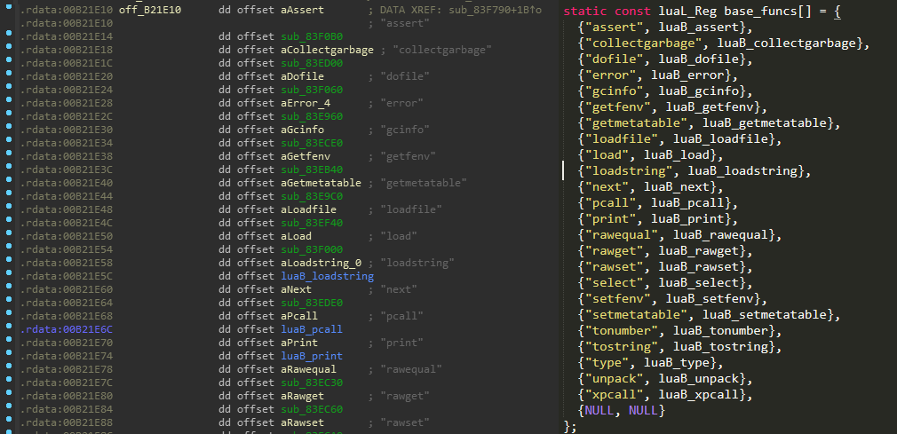
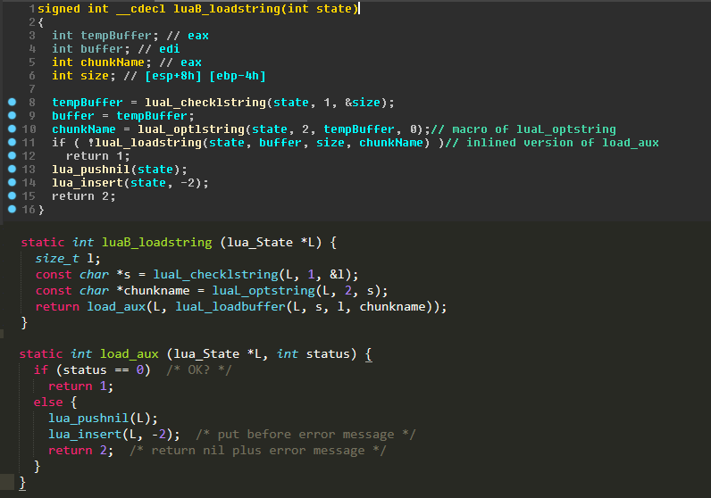
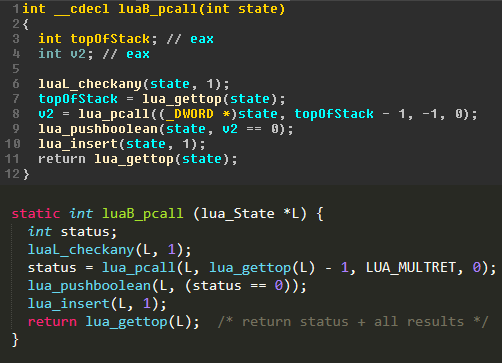
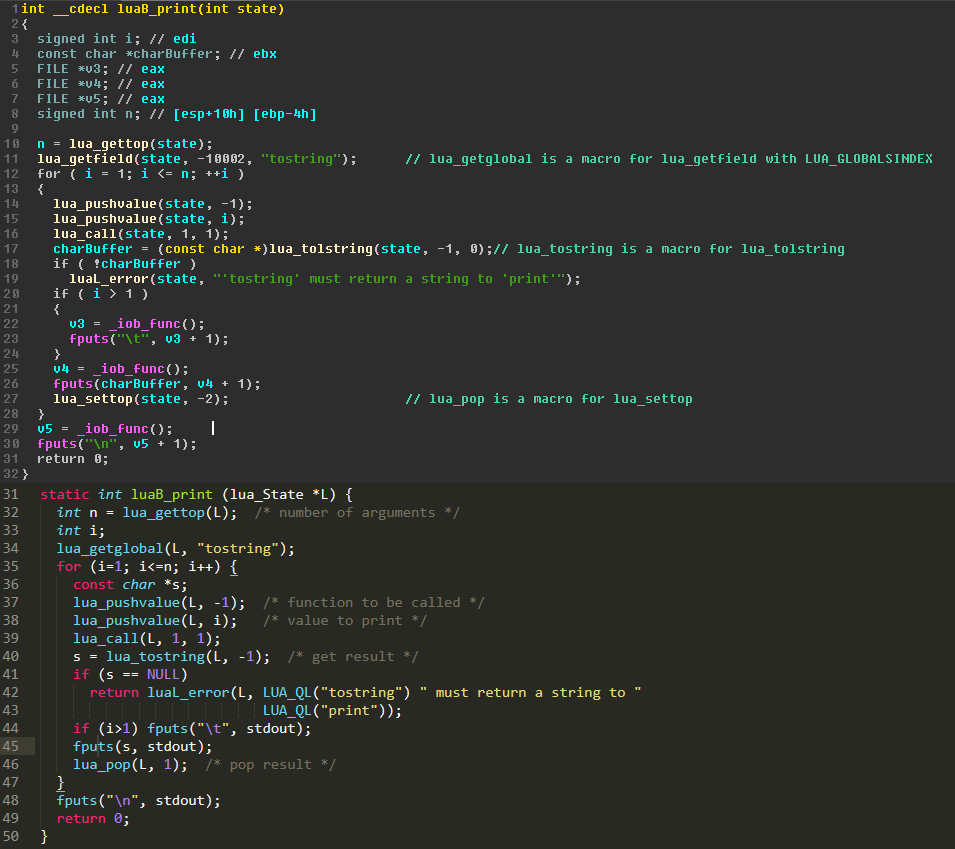
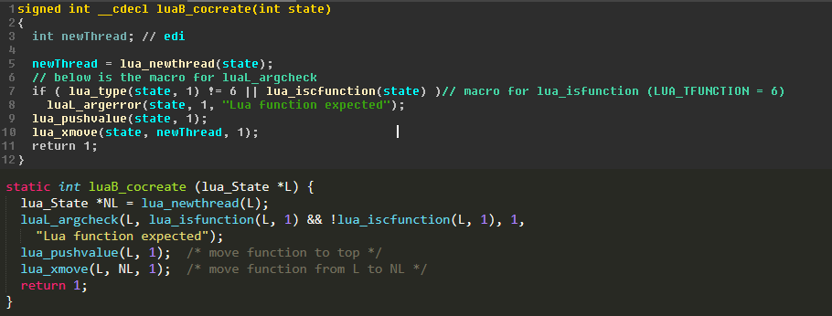

> NOTE: 2022 Dec 1st -- Roblox has changed a LOT even since I wrote this article. For example they've completely rewritten their [lua implementation](https://github.com/Roblox/luau), not to mention I haven't touched the current client in a while. Take the info in this with a grain of salt.

Many games today rely on scripting languages and an internal API to interface with the game engine itself. One of the popular scripting languages used is the Lua language. The reason so many games use Lua as their internal scripting engine is because it is extremely extensible, It's also extremely lightweight and uses little resources. Today we're going to be focusing on one game in particular, you might've heard of it... ROBLOX. ROBLOX, like many other games, uses an internal Lua VM to execute scripts. Their current client uses a massively modified Lua VM, from encrypting opcodes, checking return addresses on subroutines, and even stripping the compiler from the client completely and compiling on the server and sending the bytecode. Their older clients used a barely, if at all, modified VM. This gives us a great chance to dabble with some old ROBLOX clients, easily messing with the Lua VM, If you're interested in possibly doing this same thing with another game, there's a list of many, many games that use a Lua VM [here](https://sites.google.com/site/marbux/home/where-lua-is-used#Dj8w97RHixgjHdycMbhinw)

ROBLOX uses the Lua 5.1 source, which in later versions they heavily modified, however since we're using an old client we should be fine. In this post I'll be talking about how you can manipulate that Lua VM in the ROBLOX 2012 client, which you can download [here](ROBLOX2012.zip). Luckily, Lua 5.1 is open source, so figuring out the internals is as easy as just reading the source, [here](https://www.lua.org/source/5.1/). This post will be about the dirty-work of finding the actual subroutines and what we need. No actual messing with the Lua VM yet :(

Here’s some basic pseudocode to show you how easy it is to run Lua Scripts from C/C++:
```c
lua_State* state = luaL_newstate();
luaL_loadstring(state, "print(\"lua vm is okay ig lol\")");
if (lua_pcall(state, 1, 0, 0) != 0) {
    std::cout << "err: " << lua_tostring(state, -1) << std::endl;
}
```

Here’s a basic rundown of what the above pseudocode does.
>**luaL_newstate();** - 
> This just creates a new lua state with a vanilla environment.

> **luaL_loadstring(state, script);** -
> This creates a lua chunk and parses the script into bytecode, ready to be executed by the VM. If you look at the source, this is basically just a simple wrapper for luaL_loadbuffer.

```c
LUALIB_API int luaL_loadstring(lua_State *L, const char *s) {
    return luaL_loadbuffer(L, s, strlen(s), s);
}
```

Well, thats all fine and cool, but what do we actually need to achieve our own execution on the client? Well, first we need to actually find the Lua C API in the client. This can be done with any disassembler, however I'll be using IDA Pro. If you don't have IDA Pro, [Ghidra](https://ghidra-sre.org/) is a really cool alternative and while it isn't the best at types and method syntax, it's a pretty solid option if you don't want to pay $1.4k for a pro license just to poke fun at ROBLOX.

## What will we actually need though?

Here's a list of C API we'll need to find:
- **luaL_loadbuffer**: To easily compile lua scripts and put their function on the stack to call (This was removed from the ROBLOX client along with lua_load in later revisions around 2015(?)ish)
- **lua_pcall**: Safely call our generated lua functions after calling luaL_loadbuffer.
- **lua_tolstring**: This'll make getting error strings easy
- **lua_newthread**: I haven't talked about this yet, but we'll need this to create a new state with a shared environment of whatever state we grab. This'll also keep our environment from being garbage-collected.
- **lua_settop**: I also haven't mentioned this, but this'll help us pop the thread off the old lua state. If we don't we could mess up that state and cause a crash lol.

## But where are they?

Since we already have the source for Lua, this should be trivial. I decided to start with finding the luaB_ functions, since they include most of what we'll need. After opening up our client in IDA and waiting for the auto-analysis to complete, I was able to search for 'print' and find some familiar-looking stuff.


> IDA Pro on the left, Lua source on the right

I started with luaB_loadstring, as it'll have our luaL_loadbuffer subroutine that we'll need. I went ahead and took the liberty of labeling everything so you can easily read it,


> load_aux was inlined, so the result of luaL_loadbuffer (which i typo'd as loadstring but was too lazy to retake the screenshot) replaces status. You can also see how the compiler optimized the program flow

IDA's decompiler is really cool, and the pseudocode it generates is usually fairly accurate. Now I can go ahead and get lua_pcall. Luckily lua provides a luaB_ equivalent of that as well!


> This is pretty straight forward; LUA_MULTRET is defined as -1, and allows multiple returns from a lua_function or lua_cfunction

Now, luaB_print has a lot of useful methods, mainly it has our all-important lua_tolstring. We could have also used the luaB_ equivalent of that, but documenting and renaming subroutines is so much fun I decided to use luaB_print. (not really, I just forgot that a luaB_ equivalent of lua_tostring exists and I already have the screenshot so shut up.)


> There's a lot going on here, but basically, they use the internal luaB_tostring to convert lua's types to lua strings and then back to c strings. I infer they did this to prevent the garbage collector from accidentally cleaning up the strings behind their back.

In luaB_print they have a LOT of useful API. If we really wanted too, we could have just used lua_call, but any errors in our *user-supplied* lua script would crash our client :(. But hey, if you're about being a complete chad and not taking two seconds to use lua_pcall instead, i'm not stopping you. Anyways, luaB_print also has another important function, lua_pop, or lua_settop. Since our next important function (lua_newthread) throws a useless thread onto the stack, we'll need to pop it to keep the stack clean. This should be our final subroutine we'll need to find. Luckily coroutines exist, and behind the scenes they just create a new thread with whatever function you gave at the top of it's stack. This makes our job super easy and of course, luaB_ comes to save us.



As you can see, luaB_cocreate moves the thread that is place onto the stack from the current state to the new one. The environment is preserved when creating a new thread, which is why it interests us so much. We're able to keep the ROBLOX environment intact and have our own state to mess with without worrying about creating collisions with a running and active state.

Here are the static addresses for the subroutines I found!
- **luaL_loadstring**: 0x0081C070
- **lua_pcall**: 0x0081B220
- **lua_tolstring**: 0x0081A8A0
- **lua_newthread**: 0x0081B790
- **lua_settop**: 0x0081A4B0

In the next post I'll talk about how I was able to catch a lua state and how I wrote a minimal library that anyone can use for their own purposes!

**[>> Next post](/pages/manipulating-lua-vms-2/)**
