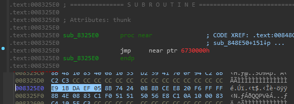
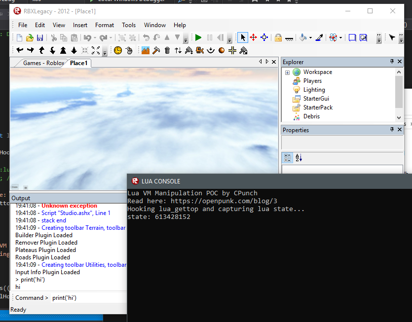
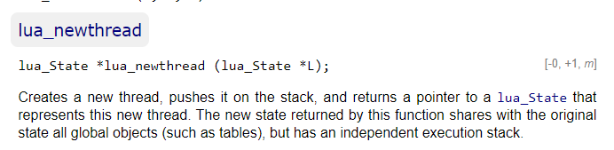

Last post we talked about why games use the Lua VM and how to find some key functions. The Lua VM runs everything based on a state. This state is basically the key to the kingdom, without a valid state with their custom API and environment on it, we really can’t do anything. Well that's great and all, but how exactly are we going to get a valid Lua State??? How convenient of a question! Over the years there have been many many ways to grab a valid state, to name a few:
- Grabbing the global state from the script context object. (which we would have to find the instantiated script context object first.) This is also really only specific to the ROBLOX game engine.
- Making ROBLOX create a new state for us (Again, only specific to the ROBLOX game engine)
- Hooking standard Lua C API and stealing the state from that.

The last one is my favorite, because it isn’t specific to the ROBLOX game engine. Luckily I wrote a small library to hook subroutines and capture arguments back when I was figuring all of this out called QuickHook. You can checkout that library in [this repository](https://github.com/CPunch/QuickHook). Just simply include the QHook.h header in your code and you'll be able to quickly create hooks and detour subroutines! (See what I did there?) Horrible puns aside, I've actually found that library very useful in other projects so I hope you find use for it as well!

Now if you are unfamiliar with the concept of hooking, there are different types of hooking, but the one we’re going to be using is called a detour.

It does exactly what you think it does. Whenever the subroutine is called, execution is detoured somewhere else. Now to understand how this is actually accomplished, you are going to need to know some basic assembly. Don't worry, it's not going to get very complicated or anything. Basically, there is an instruction in the x86 instruction set to jump execution to someplace else. It looks something like this:



So, when something calls the subroutine at 0x008325e0, it'll run that first instruction, which we've replaced with a jump! That will jump to our code where we can capture the arguments, put the original bytes back, and call the original function. The program is none-the-wiser and continues with normal execution.


0xE9 is the instruction for a JMP. The bytes following that is the offset you want to jump too. So the address it would be jumping to is [OFFSET + IP]. The way the offset is written is completely dependent on whether the binary is little-endian or big-endian, Windows uses little-endian, so we won't have to worry about supporting both types!


So, what we want to do is to write a JMP instruction over the start of our target subroutine pointing to our code, where we can capture the state. Luckily for you I already wrote all the dirty work for x86. If your target process is x86_64, feel free to fork my repo and modify it. Basically you would move the address to a register, then jmp using the register. Anyways, I provided some super simple example code in the README.md, which I'll edit to our purposes:

```cpp
C_Hook hook_gettop;

typedef int T_gettop(int state);
T_gettop* lua_gettop = (T_gettop*)0x0081A4A0; // we got this address from our last post

int hooked_gettop(int lua_S) {
    std::cout << "state: " << lua_S << std::endl;
	hook_gettop.removeHook(); // remove hook
	int i = lua_gettop(lua_S); // call original sub
	hook_gettop.installHook(); // install detour
    return i;
}

hook_gettop.setSubs((void *)lua_gettop, (void *)hooked_gettop);
hook_gettop.installHook();
```

There's a whole lot happening in this pseudo-code, let's break this down so we can better understand what's going on.

```cpp
C_Hook hook_gettop;

typedef int T_gettop(int state);
T_gettop* lua_gettop = (T_gettop*)0x0081A4A0; // we got this address from our last post
```

This helps setup important stuff. C_Hook is our hook class from Hooks.h. This is our library to make hooking super simple for us. Next, we have a function typedef and a pointer to a function. This lets us call subroutines from a memory address. We got the address of lua_gettop in our last post, which I picked because this is a super simple function with a return and only 1 argument, which is our all important Lua State. Our client has ASLR disabled so we don't have to do anything to convert from a static to it's equivalent dynamic address. However, if you're doing this on anything else, I would assume the client has ASLR enabled, which you could check, but getting the dynamic address is super simple. Basically, just get the base module address of the executable and subtract the static base from the static address, and add that to the dynamic base.


That looks something like:

```cpp
(address - 0x00400000) + (DWORD)GetModuleHandle(NULL)
```

GetModuleHandle(NULL) gets the base address of the executable. 0x00400000 is the static address in our executable, which is common for most x86 Windows Executables. Anyways, continuing on....

```cpp
int hooked_gettop(int lua_S) {
    std::cout << "state: " << lua_S << std::endl;
	hook_gettop.removeHook(); // remove hook
	int i = lua_gettop(lua_S); // call original sub
	hook_gettop.installHook(); // install detour
    return i;
}
```

This function will be the code that any call to lua_gettop is detoured to. lua_gettop is called a whole lot so this shouldn't be a problem. We first print our state to the console, which in our full "exploit" we'll copy the state and put it in a global variable to use in other parts. Next we remove the hook with hook_settop.removeHook(). When the hook was originally installed, the original bytes (first 5) were copied into a buffer, then overwritten with our JMP instruction. removeHook copies the original bytes and page permissions back to the subroutine. This lets us call lua_gettop normally without the JMP back to our code. We call lua_gettop with the arguments that were passed to us, basically making our function a wrapper. After calling that, we install our detour back using hook_settop.installHook(), letting us log more states. In our full "exploit" we'll only need one state, so there won't be a need to install the hook back.

```cpp
hook_gettop.setSubs((void *)lua_gettop, (void *)hooked_gettop);
hook_gettop.installHook();
```

Finally, our last part which is in charge of setting up our hook. hook_settop.setSubs sets our target subroutine and our destination subroutine. While most detour libraries require a typecast of some sort, I hate the look of that and having to deal with it, so as long as your destination subroutine has the same function signature as your source subroutine, the stacks will match and you won't have to worry about anything! hook_settop.installHook copies the original bytes to a buffer and writes our JMP instruction to our source subroutine.

We still have one problem.... how exactly are we going to run our code in the ROBLOX client? Windows by defualt allows most user-land programs to poke and prob at eachother as much as they please, the method we're going to be using is DLL injection. This allows us to develop everything in a really user-friendly way. There are many ways to inject DLLs but I'll keep it simple and briefly go over how the most common method is done.
- OpenProcess is called with target process
- Get address of LoadLibraryA from ntapi.dll, this is always mapped to the same address across processes of the same architecture to preserve compatibility. Even with ASLR enabled lol.
- CreateRemoteThread on target process with the thread start address the address of LoadLibraryA and a full path to our injectable DLL.

For now, just grab some random dll injector haha. We can also get a nice debug console after injecting by using AllocConsole(), and setting our stdout and stdin through that.

```cpp
AllocConsole();
FILE* cons;
freopen_s(&cons, "conin$", "r", stdin);
freopen_s(&cons, "conout$", "w", stdout);
SetConsoleTitle(L"LUA CONSOLE");
```

Here's what our hooking looks like so far:


> In the output window you can see I just ran a lua script, "print('hi')", and in the debug console you can see the lua state it captured.

Once I ran a script, "print('hi')" lua_gettop was called, which in turn called our hook, which logged the state to the console. This means we're super close to having full script execution! Of course at the end of this series I will post my POC and the source to my repo, and in a later post I will be showing how you can improve it, but for now this is great progress.

Now there's one final touch I want to talk about. I mentioned last post that I would be using lua_newthread to get environment so we can have our own state to play with and not worry about messing up a running script or even garbage collection. We have to remember however, that lua_newthread pushes that thread onto our original state, as per our documentation says:



So, luckily we know how to pop that off of our original state, using lua_pop AKA lua_settop. This'll let us keep the stack clean and not throw random stuff onto the stack that could break whatever script is running.

This is how we'll accomplish that:

```cpp
int lua_gettop_hook(int l) {
	hook_gettop.removeHook();

	lua_state = Lua::lua_newthread(l); // cache state
	Lua::lua_pop(l, 1); // clean stack

	std::cout << "captured state : " << lua_state << std::endl;
	return Lua::lua_gettop(l);
}
```

So we'll remove our gettop hook, replacing the original bytes back, then create a new thread on that state (basically a coroutine). Then pop that thread off the stack, call the original function, and return that. This makes our very own state and preserves the stack of the one we captured.

**[>> Next post](/pages/manipulating-lua-vms-3/)**