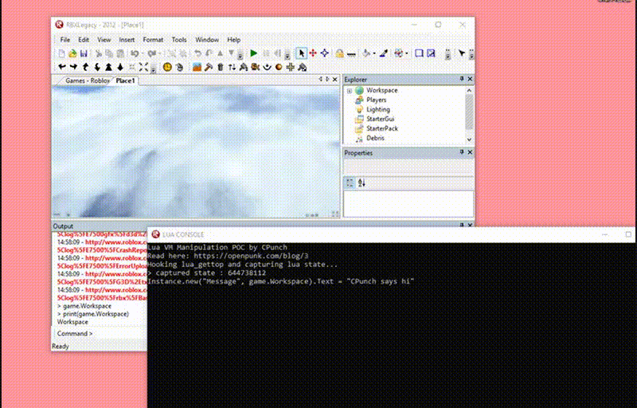

Now that we know how to find addresses of the lua C API in our client and how to capture a valid lua state, we can write our "exploit". Let's start with recapping what our end-goal is: We want to be able to run scripts that weren't originally in our game. To do this, we've found where the Lua VM C API is, and even hooked lua_gettop to capture a valid lua state.

We'll first need to define our addresses and some macros, so we can keep as much readability as possible. ([in the repo](https://github.com/CPunch/LUA_VM_EXAMPLE/blob/master/LUA_VM_EXAMPLE/Lua.h))

```cpp
#define ADDR_LOADBUFFER 0x0081C070
#define ADDR_PCALL 0x0081B220
#define ADDR_GETTOP 0x0081A4A0
#define ADDR_SETTOP 0x0081A4B0
#define ADDR_NEWTHREAD 0x0081B790
#define ADDR_TOLSTRING 0x0081A8A0
#define BASE(ADDR) (ADDR - 0x00400000) + (DWORD)GetModuleHandle(NULL)


// MACROS
#define lua_tostring(l, i) lua_tolstring(l, i, NULL)
#define lua_pop(l, i) lua_settop(l, -(i)-1)
#define luaL_loadstring(L, s) luaL_loadbuffer(L, s, strlen(s), s)
```

Our BASE macro allows us to use our static addresses, by getting the offset from the static base (which is 0x00400000) and apply that same offset to our current module's base. This is more of a problem in more current programs where ASLR is enabled, however it's good practice to use it.

Now we'll need to define some typedefs for our functions so we can declare the addresses as callable functions

```cpp
typedef int(__cdecl *TluaL_loadbuffer)(int lua_state, char* buffer, size_t size, char* chunkname);
typedef int(__cdecl *Tlua_pcall)(int lua_state, int a, int b, int c);
typedef int(__cdecl *Tlua_gettop)(int lua_state);
typedef int(__cdecl *Tlua_settop)(int lua_state, int a);
typedef int(__cdecl *Tlua_newthread)(int lua_state);
typedef char*(__cdecl *Tlua_tolstring)(int lua_state, int a, size_t* b);

namespace Lua {
	extern TluaL_loadbuffer luaL_loadbuffer;
	extern Tlua_pcall lua_pcall;
	extern Tlua_gettop lua_gettop;
	extern Tlua_settop lua_settop;
	extern Tlua_newthread lua_newthread;
	extern Tlua_tolstring lua_tolstring;
}
```

And of course, we'll need to define our callable functions. ([in the repo](https://github.com/CPunch/LUA_VM_EXAMPLE/blob/master/LUA_VM_EXAMPLE/Lua.cpp))

```cpp
TluaL_loadbuffer Lua::luaL_loadbuffer = (TluaL_loadbuffer)(BASE(ADDR_LOADBUFFER));
Tlua_pcall Lua::lua_pcall = (Tlua_pcall)(BASE(ADDR_PCALL));
Tlua_gettop Lua::lua_gettop = (Tlua_gettop)(BASE(ADDR_GETTOP));
Tlua_settop Lua::lua_settop = (Tlua_settop)(BASE(ADDR_SETTOP));
Tlua_newthread Lua::lua_newthread = (Tlua_newthread)(BASE(ADDR_NEWTHREAD));
Tlua_tolstring Lua::lua_tolstring = (Tlua_tolstring)(BASE(ADDR_TOLSTRING));
```

Now that we can finally call our embedded Lua C API, let's outline our "exploit".
- Hook lua_gettop
    - Call lua_newthread to get our own state
    - Call lua_pop (our macro) to remove the thread off of the capture lua state's stack to preserve it.
- Get User input for a one-line script. (Eg. print("hi"))
    - Check and make sure we have a valid lua state
    - Call luaL_loadbuffer with our one-line script to load a lua function of our script onto the stack
    - Call lua_pcall to safely run the lua function and catch errors
        - If there's an error, grab the error string from the stack with lua_tolstring, and print to console
    - Create a new thread with lua_newthread with the current state to allow our next script to be run in it's own thread
        - Don't worry, lua's garbage collector will clean up our unused states

Here's what that code looks like: ([also in the repository](https://github.com/CPunch/LUA_VM_EXAMPLE/blob/master/LUA_VM_EXAMPLE/LUA_VM_EXAMPLE.cpp))

```cpp
C_Hook hook_gettop;
int lua_state = NULL;

int lua_gettop_hook(int l) {
	hook_gettop.removeHook();

	lua_state = Lua::lua_newthread(l); // cache state
	Lua::lua_pop(l, 1); // clean stack

	std::cout << "captured state : " << lua_state << std::endl;
	return Lua::lua_gettop(l);
}

void _start() {
	std::string input;
	hook_gettop.setSubs((void*)Lua::lua_gettop, (void*)lua_gettop_hook);
	hook_gettop.installHook();

	while (true) {
		// Get input
		std::cout << "> ";
		std::getline(std::cin, input);

		if (lua_state != NULL) {
			char* buffer = (char*)input.c_str();
			Lua::luaL_loadstring(lua_state, buffer);
			if (Lua::lua_pcall(lua_state, 0, 0, 0) != 0) {
				std::cout << "ERROR: " << Lua::lua_tostring(lua_state, -1) << std::endl;
			}
			lua_state = Lua::lua_newthread(lua_state);
		}
	}
}
```

Now if we compile, inject and run a simple print command in the command bar, we'll capture our lua state, then we can run whatever we want! (In the normal ROBLOX player, it would almost instantly capture a lua state because there is always a script running.)


> Here you can see my script creating a Message object and setting the text.

Now there are still LOADS of improvements, I invite the reader to explore more into this topic, maybe mess with another game's Lua VM? There are a lot of really cool tricks people have come up with to help prevent people from messing with the Lua VM, from stripping the compiler, to custom bytecode formats and even some checks that check the return address for foreign callers in the C API. I'd love to go over some of them in the future, but for now have fun exploring!