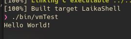

Recently I've been working on a small passion project I've been wanting to do for a while. [Laika](https://git.openpunk.com/CPunch/Laika) is a malware written in modern C. I recently added some cool obfuscation features to the LaikaBot target. Let's take a look at how it works.

## Rough Idea

I'm sure you've seen this before, malware authors love to obfuscate strings using various techniques, among those are the classic xor obfuscation. I hesitate to call it 'encryption' given it's numerous pitfalls, however it's extremely simple to implement so I'll be focusing on this one technique. The rough implementation is to [xor a string](https://md5decrypt.net/en/Xor/), and deobfuscate it during runtime. This looks something like:

```C

uint8_t data = {0x96, 0xBB, 0xB2, 0xB2, 0xB1, 0xFE, 0x89, 0xB1, 0xAC, 0xB2, 0xBA, 0xFF, 0xDE};
char out[sizeof(data)];

for (int i = 0; i < sizeof(data); i++) {
    out[i] = data[i] ^ 0xDE; // 0xDE is our key
}

printf("%s\n", out);

```
> Hello World!

While this works for obfuscating the strings from static dumping using something like `strings`, any RE who sees this will immediately understand what it's doing and dump the string quickly and without much thought. What if there was a more challenging way to obfuscate that for loop?

## Mini VM

What if, we had a mini VM interpreter inlined into the function? This would become a mess in the pseudo-code of disassemblers like IDA or Ghidra. Thats exactly what Laika does! Checkout the tiny turing-complete vm [here](https://git.openpunk.com/CPunch/Laika/src/branch/main/lib/include/lvm.h). TLDR: We can implement tiny programs for the mini-vm to run, including our xor deobfuscation!

The program blob looks something like:

```C
/* BOX_SKID decodes null-terminated strings using a provided xor _key. aptly named lol */
#define LAIKA_BOX_SKID(_key) { \
    .unlockedData = {0}, /* reserved */ \
    .code = { /* stack layout: \
            [0] - unlockedData (ptr) \
            [1] - data (ptr) \
            [2] - key (uint8_t) \
            [3] - working data (uint8_t) \
        */ \
        LAIKA_MAKE_VM_IAB(OP_LOADCONST, 0, LAIKA_BOX_UNLOCKED_INDX), \
        LAIKA_MAKE_VM_IAB(OP_LOADCONST, 1, LAIKA_BOX_DATA_INDX), \
        LAIKA_MAKE_VM_IAB(OP_PUSHLIT, 2, _key), \
        /* LOOP_START */ \
        LAIKA_MAKE_VM_IAB(OP_READ, 3, 1), /* load data into working data */ \
        LAIKA_MAKE_VM_IABC(OP_XOR, 3, 3, 2), /* xor data with key */ \
        LAIKA_MAKE_VM_IAB(OP_WRITE, 0, 3), /* write data to unlockedData */ \
        LAIKA_MAKE_VM_IA(OP_INCPTR, 0), \
        LAIKA_MAKE_VM_IA(OP_INCPTR, 1), \
        LAIKA_MAKE_VM_IAB(OP_TESTJMP, 3, -17), /* exit loop on null terminator */ \
        OP_EXIT \
    } \
}
```
> This is also [here](https://git.openpunk.com/CPunch/Laika/src/branch/main/lib/include/lbox.h) in the repository

The program is a lot simpler than it looks, lets take it apart.

```C
LAIKA_MAKE_VM_IAB(OP_LOADCONST, 0, LAIKA_BOX_UNLOCKED_INDX), \
LAIKA_MAKE_VM_IAB(OP_LOADCONST, 1, LAIKA_BOX_DATA_INDX), \
LAIKA_MAKE_VM_IAB(OP_PUSHLIT, 2, _key), \
```

This bit just loads constants onto the virtual machine stack. LAIKA_BOX_UNLOCKED_INDEX & LAIKA_BOX_DATA_INDX are just reserved constant indexes for storing the input & output pointers. This lets our tiny program read/write to arbitrary memory. The `OP_PUSHLIT` instruction pushes a byte to the stack from the code, this one pushes our passed `_key` byte to the stack from our macro.

```C
/* LOOP_START */ \
LAIKA_MAKE_VM_IAB(OP_READ, 3, 1), /* load data into working data */ \
LAIKA_MAKE_VM_IABC(OP_XOR, 3, 3, 2), /* xor data with key */ \
LAIKA_MAKE_VM_IAB(OP_WRITE, 0, 3), /* write data to unlockedData */ \
```

This is where our 'for loop' starts. `OP_READ` loads our first byte in our obfuscated string into the 3rd stack index, `OP_XOR` deobfuscates the byte in-place with our key, and `OP_WRITE` writes it to our output buffer.

```C
LAIKA_MAKE_VM_IA(OP_INCPTR, 0), \
LAIKA_MAKE_VM_IA(OP_INCPTR, 1), \
LAIKA_MAKE_VM_IAB(OP_TESTJMP, 3, -17), /* exit loop on null terminator */ \
OP_EXIT \
```

We then increment both pointers, our in & out buffers, and test if the character we just deobfuscated was a NULL terminator. If it wasn't a NULL terminator we jump all the way back to LOOP_START, if it was we exit out of our vm.

## Generating the blobs

Now what if we want to change the strings? That's a lot of manual labor in regenerating our data blob. Luckily for us, Laika also has a solution for that! The [VMBoxGen](https://git.openpunk.com/CPunch/Laika/src/branch/main/tools/vmboxgen/src/main.c) target reads our configured strings and generates a header file for our data-blobs *before* everything is compiled.

The strings the `VMBoxGen` target uses are from our `lconfig.h` file, which in turn is generated before compilation using cmake:

```CMake
message(STATUS "Building config file...")
configure_file(${CMAKE_SOURCE_DIR}/lib/include/lconfig.h.in ${CMAKE_SOURCE_DIR}/lib/include/lconfig.h)
```

After our `VMBoxGen` target is built, it generates our `lboxconfig.h` header with all of our data blobs and keys.

```CMake
# generate the VMBOXCONFIG file
if(LAIKA_OBFUSCATE)
    add_custom_command(TARGET VMBoxGen POST_BUILD
        COMMAND VMBoxGen ${LAIKA_VMBOXCONFIG}
        COMMENT "Generating VMBox data & keys.."
    )
endif ()
```

So our library will always have access to both the obfuscated and deobfuscated raw strings. Hooray for CMake!

## In practice

Let's re-write our program to take advantage of our SKID_BOX and mini-vm interpreter.

```C
#include <stdio.h>
#include <string.h>

#include "lvm.h"
#include "lbox.h"

/* VM BOX Demo:
    A secret message has been xor'd, the BOX_SKID is used to decode the message.
*/ 

#define VMTEST_STR_DATA { \
        0x96, 0xBB, 0xB2, 0xB2, 0xB1, 0xFE, 0x89, 0xB1, \
        0xAC, 0xB2, 0xBA, 0xFF, 0xDE, 0x20, 0xEA, 0xBA, /* you can see the key here, 0xDE ^ 0xDE is the NULL terminator lol */ \
        0xCE, 0xEA, 0xFC, 0x01, 0x9C, 0x23, 0x4D, 0xEE \
    };

int main(int argv, char **argc) {
    LAIKA_BOX_STARTVAR(char*, str, LAIKA_BOX_SKID(0xDE), VMTEST_STR_DATA)
    printf("%s\n", str);
    LAIKA_BOX_ENDVAR(str)
    return 0;
}
```

The `LAIKA_BOX_STARTVAR` & `LAIKA_BOX_ENDVAR` are again, implemented in [`lbox.h`](https://git.openpunk.com/CPunch/Laika/src/branch/main/lib/include/lbox.h) like:

```C
#define LAIKA_BOX_STARTVAR(type, ident, box, data) \
    uint8_t __data##ident[LAIKA_VM_CODESIZE] = data; \
    type ident; \
    struct sLaikaB_box __box##ident = box; \
    laikaB_unlock(&__box##ident, __data##ident); \
    ident = (type)__box##ident.unlockedData;

#define LAIKA_BOX_ENDVAR(ident) \
    laikaB_lock(&__box##ident);
```

We create our box and pass all of that to our VM handling functions (laikaB_unlock is just a wrapper to populate our default constants and execute the VM). After running we again, get our expected output.



## Configurable obfuscation

We can also make some simple macros for enabling/disabling obfuscation.

```C
#ifdef LAIKA_OBFUSCATE
# define LAIKA_BOX_SKID_START(type, ident, strmacro) \
    LAIKA_BOX_STARTVAR(type, ident, LAIKA_BOX_SKID(KEY_##strmacro), DATA_##strmacro)
# define LAIKA_BOX_SKID_END(ident) \
    LAIKA_BOX_ENDVAR(ident)
#else /* disable obfuscations */
# define LAIKA_BOX_SKID_START(type, ident, strmacro) \
    type ident = strmacro;
# define LAIKA_BOX_SKID_END(ident) ((void)0) /* no-op */
#endif
```

In action, we use it like so:

```C
/* mark that laika is currently running */
void laikaB_markRunning() {
    LAIKA_BOX_SKID_START(char*, filePath, LAIKA_LIN_LOCK_FILE);

    /* create lock file */
    if ((laikaB_lockFile = open(filePath, O_RDWR | O_CREAT, 0666)) == -1)
        LAIKA_ERROR("Couldn't open file lock '%s'! Another LaikaBot is probably running.\n", filePath);

    /* create lock */
    if (flock(laikaB_lockFile, LOCK_EX | LOCK_NB) != 0)
        LAIKA_ERROR("Failed to create file lock!\n");

    LAIKA_DEBUG("file lock created!\n");
    LAIKA_BOX_SKID_END(filePath);
}
```

This function just marks a file lock for laika to know if another instance of laika is running. Opening this function up in IDA with `-DLAIKA_OBFUSCATE=Off` looks like:



The compiler of course optimized away the actual `filePath` variable, and changed it to a constant. Now lets compare this function with `-DLAIKA_OBFUSCATE=On` enabled:



You can see the whole vm was inlined into the function, this has become a mess. Of course you could always run the executable under gdb and set a breakpoint but it would definitely require more effort!

## Conclusion

Obviously I left massive sections of code out to keep this brief, but of course if you're curious about any of the code, checkout the full repo for Laika [here](https://git.openpunk.com/CPunch/Laika).