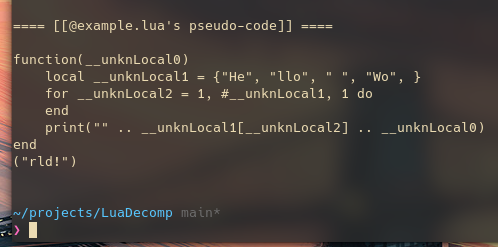
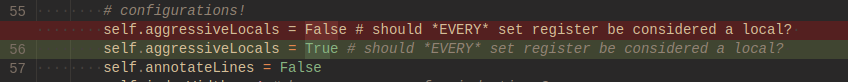
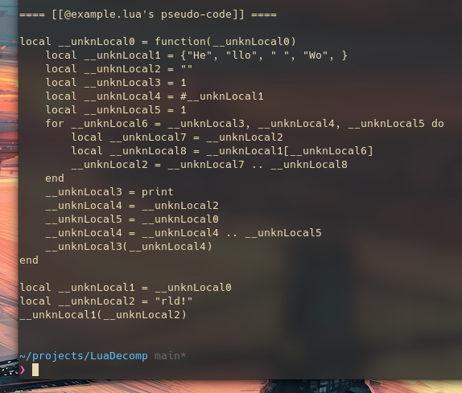

In my [last blog post](/pages/luadecompy) I talked about a simple Lua decompiler I made using my updated [Lua 5.1 (de)serializer](https://github.com/CPunch/LuaPytecode). I recently added support to re-serialize chunks back into Lua dumps (the equivalent of [ldump.c](https://www.lua.org/source/5.1/ldump.c.html)). Using this, I wrote a tiny python script to strip debugging info from Lua 5.1 dumps automagically.

It looks like:
```python
#!/usr/bin/env python3
'''
    usage: lstrip [-h] -i FILE [-o FILE]

    Strips local and debugging information from Lua 5.1 dump files

    options:
    -h, --help           show this help message and exit
    -i FILE, --in FILE   specify the input Lua dump to be stripped
    -o FILE, --out FILE  specify the output dump location

    Depends on lundump.py (https://github.com/CPunch/LuaDecompy/blob/main/lundump.py)
'''

from argparse import ArgumentParser
from lundump import Chunk, LuaUndump, LuaDump

class LuaStrip:
    def __init__(self, root: Chunk) -> None:
        self.root = root

    # recursively strips debugging information from proto
    @staticmethod
    def __stripChunk(chunk: Chunk) -> Chunk:
        chunk.locals.clear()
        chunk.lineNums.clear()
        chunk.upvalues.clear()

        # recursively strip child protos
        for i in range(len(chunk.protos)):
            chunk.protos[i] = LuaStrip.__stripChunk(chunk.protos[i])

        return chunk

    def genBytecode(self) -> bytearray:
        obfChunk = LuaStrip.__stripChunk(self.root)
        dump = LuaDump(obfChunk)
        return dump.dump()

if __name__ == "__main__":
    parser = ArgumentParser(
        prog='lstrip', 
        description='Strips local and debugging information from Lua 5.1 dump files'
    )

    # arguments
    parser.add_argument('-i', '--in',
        required=True,
        dest='inFile',
        metavar='FILE',
        help='specify the input Lua dump to be stripped',
        type=str
    )
    parser.add_argument('-o', '--out',
        dest='outFile',
        metavar='FILE',
        default='out.luac',
        help='specify the output dump location',
        type=str
    )

    args = parser.parse_args()

    # load input dump
    try:
        obf = LuaStrip(LuaUndump().loadFile(args.inFile))
        with open(args.outFile, "wb") as file:
            bc = obf.genBytecode()

            # disassemble new bytecode
            LuaUndump().decode_rawbytecode(bc).print()

            # dump to file
            file.write(bc)
            file.close()
    except Exception as e:
        print("ERR: %s " % e)
```
> Since I have support for dumping the chunks, it came out a whole lot simpler than I thought.

## Usage

Simply compile your target script:
```sh
$ cat example.lua && luac5.1 -o example.luac example.lua
local printMsg = function(append)
    local tbl = {"He", "llo", " ", "Wo"}
    local str = ""

    for i = 1, #tbl do
        str = str .. tbl[i]
    end

    print(str .. append)
end

printMsg("rld!")
```

Then pass the luac dump to `lstrip`:
```sh
$ lstrip -i example.luac -o out.luac
```

The luavm doesn't care about the missing debugging data!
```sh
$ lua5.1 out.luac
Hello World!
```

## Does it trip up decompilers though?
***Yes.*** As you can see, passing it to my own decompiler breaks it lol



In fact, to get anything reliable from the decompiler, I have to switch to an aggressive localization mode which makes the output pseudo-code extremely verbose.


> located in [lparser.py](https://github.com/CPunch/LuaDecompy/blob/main/lparser.py), in the `__init__` for LuaDecomp

And only then, it's impossible to recover what used to be a local and what was a temporary expression register (without using some better parsing techniques)



Looking at a more mature decompiler, [luadec](https://github.com/viruscamp/luadec) has similar issues.
```lua
-- params : ...
-- function num : 0
local l_0_0 = function(l_1_0, ...)
  -- function num : 0_0
  local l_1_1 = {}
  -- DECOMPILER ERROR at PC5: No list found for R1 , SetList fails

  -- DECOMPILER ERROR at PC6: Overwrote pending register: R2 in 'AssignReg'

  local l_1_2 = "He"
  -- DECOMPILER ERROR at PC7: Overwrote pending register: R3 in 'AssignReg'

  -- DECOMPILER ERROR at PC8: Overwrote pending register: R4 in 'AssignReg'

  -- DECOMPILER ERROR at PC9: Overwrote pending register: R5 in 'AssignReg'

  for l_1_6 = "llo", " ", "Wo" do
    l_1_2 = l_1_2 .. l_1_1[l_1_6]
  end
  print(l_1_2 .. l_1_0)
end

l_0_0("rld!")
```

Who knew that such a simple stripping of debugging information is enough to trip up decompiliers in the lord's year of '22.