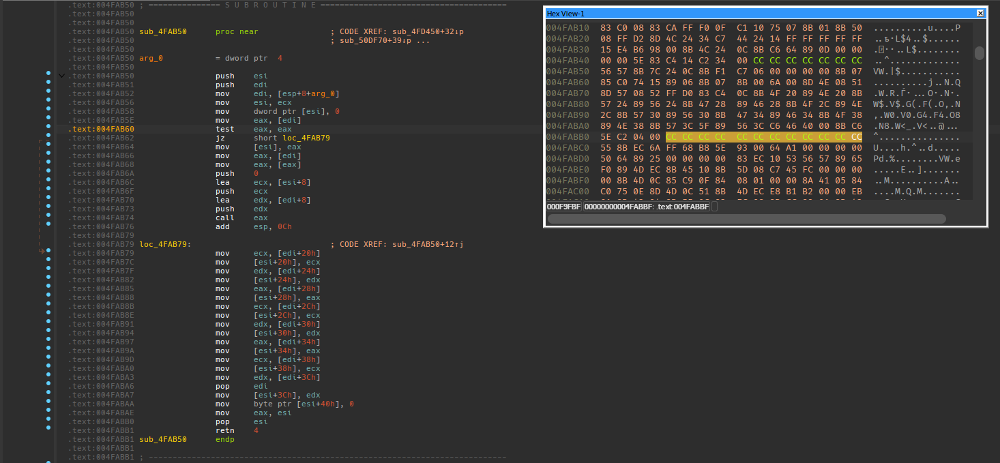
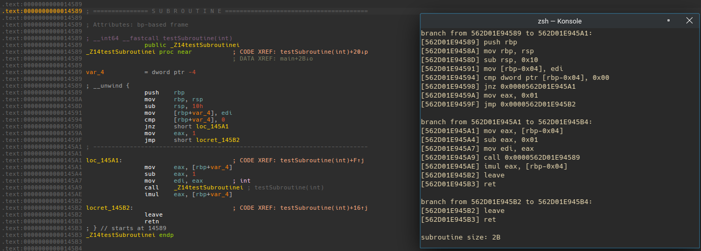

If you've ever been involved in cheat development or reverse engineering you may have come across the problem of calculating the size of a subroutine dynamically; that is: while inside the target process's address space, can we calculate the size of a given subroutine at address X? This is a problem that has plagued me for years and I've never been able to find a good solution to it, until now :D

We'll be using [Zydis](https://github.com/zyantific/zydis) to do our disassembly. Zydis is a fantastic library that I highly recommend for any disassembly needs. It's very easy to use and has a very clean API.

## A Poor Man's Solution

My first solution to the problem was quite simple. If you take a look at any MSVC compiled application for x86/x86_64 you'll notice a pattern that MSVC uses to pad subroutines. MSVC uses the `INT3` instruction to pad subroutines that don't quite end on a 16 byte boundary. If you're unfamiliar, a very basic x86 optimization is to pad subroutines to end on a 16-byte boundary; many compilers follow this pattern (albeit with differing opinions on which instructions to use to pad).


> Those `0xCC` bytes are `INT3` instructions. You can see they perfectly end on a 16-byte boundary.

We can use this information to make an informative guess of where the end of a subroutine is. A quick and dirty implementation of this would look something like this:
```C++
size_t GetSubroutineSize(const void* subroutine, bool is64Bit)
{
    ZydisDisassembledInstruction instruction;
    ZyanU64 startAddress = static_cast<ZyanU64>(subroutine);
    ZyanUSize roughSize = 0xFF; // this is just to make sure we don't read memory out of bounds
    ZyanUSize offset = 0;

    while (ZYAN_SUCCESS(ZydisDisassembleIntel(
        is64Bit ? ZYDIS_MACHINE_MODE_LONG_64 : ZYDIS_MACHINE_MODE_LEGACY_32,
        startAddress + offset,
        reinterpret_cast<const void*>(startAddress + offset),
        roughSize - offset,
        &instruction))) {
        offset += instruction.info.length;

        // if we hit an INT3 instruction we can assume we've reached the end of the subroutine
        if (instruction.info.mnemonic == ZYDIS_MNEMONIC_INT3) {
            break;
        }
    }

    return offset;
}
```
> An equivalent implementation that targets GCC or Clang for Linux would instead search for a `NOP` instruction as they use `NOP` instructions to pad subroutines instead of `INT3` instructions; again, different compilers have differing opinions on which instructions to use to pad subroutines.

Now there's several unhandled edgecases with this solution:
- What if the subroutine perfectly ends on a 16-byte boundary? There would be no padding to search for, thus including the next subroutine in the size calculation.
- What if the subroutine uses `INT3` instructions? This would cause the size calculation to be incorrect and possibly end prematurely.

## A Rich Man's Solution

Without some more complex branch analysis, we really don't have much to work with. So let's do some basic branch analysis! Don't worry, we'll be doing some very minimal analysis, nothing too crazy. Our new solution will follow this basic algorithm:

- We'll have a unique set of 'Branch'es which will contain each branch we run into while disassembling.
- Our first 'Branch' will start at the subroutine's entry point.
- If we hit a branch instruction, create a new Branch and add it to our set of branches.
- If we hit a return or unconditional jump instruction, we've reached the end of the current branch.
- After all branches are 'dead', we can calculate the size of the subroutine by taking the difference between the last branch's end address and the subroutine's entry point.

Let's take a look at what this looks like in code:
```C++
class Disassembler {
public:
    class Branch {
    public:
        enum class Type {
            Start,
            Unconditional,
            Conditional,
            End,
        };

        Type m_Type;
        uint64_t m_Offset = 0;
        uint64_t m_Target;
        uint64_t m_RoughSize;

        Branch(Type type, uint64_t target, uint64_t roughSize)
            : m_Type(type)
            , m_Target(target)
            , m_RoughSize(roughSize)
        {
        }

        uint64_t GetEnd() const
        {
            return m_Target + m_Offset;
        }

        // for our ordered set
        bool operator<(const Branch& other) const
        {
            return m_Target < other.m_Target;
        }

        // returns <branch, isEndOfCurrentBranch>
        std::pair<Branch, bool> Disassemble(bool is64Bit) {
            ZydisDisassembledInstruction instruction;
            ZyanU64 startAddress = static_cast<ZyanU64>(m_Target);
            ZyanUSize size = m_RoughSize;
            int64_t branchOffset;
            Branch::Type branchType;

            while (ZYAN_SUCCESS(ZydisDisassembleIntel(
                is64Bit ? ZYDIS_MACHINE_MODE_LONG_64 : ZYDIS_MACHINE_MODE_LEGACY_32,
                startAddress + m_Offset,
                reinterpret_cast<const void*>(startAddress + m_Offset),
                size - m_Offset,
                &instruction))) {
                m_Offset += instruction.info.length;

                // add branches
                switch (instruction.info.meta.category) {
                case ZYDIS_CATEGORY_UNCOND_BR:
                    branchType = Branch::Type::Unconditional;
                    break;
                case ZYDIS_CATEGORY_COND_BR:
                    branchType = Branch::Type::Conditional;
                    break;
                case ZYDIS_CATEGORY_RET:
                    // return marks the end of a branch
                    return std::make_pair(Branch(Branch::Type::End, 0, 0), true);
                default:
                    continue;
                }

                switch (instruction.operands[0].type) {
                case ZYDIS_OPERAND_TYPE_IMMEDIATE:
                    branchOffset = instruction.operands[0].imm.value.s;
                    break;
                default:
                    throw std::runtime_error("Unhandled branch operand type");
                }

                // if we've reached an unconditional branch, we can stop disassembling
                size_t roughRemainingSize = m_RoughSize - m_Offset - branchOffset;
                return std::make_pair(Branch(branchType, startAddress + m_Offset + branchOffset, roughRemainingSize), branchType == Branch::Type::Unconditional);
            }

            return std::make_pair(Branch(Branch::Type::End, 0, 0), true);
        }

        void Print(bool is64Bit) const
        {
            ZydisDisassembledInstruction instruction;
            ZyanU64 IP = static_cast<ZyanU64>(m_Target);
            ZyanUSize size = m_Offset;

            while (ZYAN_SUCCESS(ZydisDisassembleIntel(
                    is64Bit ? ZYDIS_MACHINE_MODE_LONG_64 : ZYDIS_MACHINE_MODE_LEGACY_32,
                    IP,
                    reinterpret_cast<const void*>(IP),
                    size,
                    &instruction))
                && IP < m_Target + m_Offset) {
                fmt::print("[{:X}] {}\n", IP, instruction.text);
                IP += instruction.info.length;
            }
        }
    };

    // <addrStart> of subroutine to disassemble, <roughSize> of the subroutine
    // note that <roughSize> doesn't have to be exact, it's just used make sure we dont
    // read out-of-bounds
    Disassembler(const void* addrStart, size_t roughSize, bool is64Bit = true)
        : m_AddrStart(addrStart)
        , m_RoughSize(roughSize)
        , m_Is64Bit(is64Bit)
    {
        Branch current = Branch(Branch::Type::Start, reinterpret_cast<uint64_t>(addrStart), roughSize);
        std::set<Branch> queue = {current};

        while (!queue.empty()) {
            auto it = queue.begin();
            current = *it;
            queue.erase(it);

            auto [branch, isEndOfCurrentBranch] = current.Disassemble(is64Bit);
            if (isEndOfCurrentBranch) {
                m_Branches.insert(current);
            } else {
                queue.insert(current);
            }

            if (branch.m_Type != Branch::Type::End && branch.m_Target != current.m_Target) {
                queue.insert(branch);
            }
        }
    }

    void PrintBranches() const
    {
        for (auto& branch : m_Branches) {
            fmt::print("\nbranch from {:X} to {:X}:\n", branch.m_Target, branch.GetEnd());
            branch.Print(m_Is64Bit);
        }
    }

    // returns the size of the subroutine
    size_t GetSize() const
    {
        if (m_Branches.empty()) {
            return 0;
        }

        // the last branch in the set should be the last branch in the subroutine
        return m_Branches.rbegin()->GetEnd() - reinterpret_cast<uint64_t>(m_AddrStart);
    }

private:
    std::set<Branch> m_Branches;
    const void* m_AddrStart = nullptr;
    size_t m_RoughSize = 0;
    bool m_Is64Bit;
};
```
> I'm also using [fmt](https://github.com/fmtlib/fmt) for printing, but you can obviously strip that out if you don't want to use it.

Running the following example shows us that we can now calculate the size of this example subroutine regardless of how it's padded or which compiler was used:
```C++
// factorial demo
int testSubroutine(int i)
{
    if (i == 0) {
        return 1;
    }

    return i * testSubroutine(i - 1);
}

int main(int argc, char* argv[])
{
    auto subroutineDisassm = Disassembler(reinterpret_cast<void*>(testSubroutine), 0xFF);
    subroutineDisassm.PrintBranches();

    fmt::print("\nsubroutine size: {:X}\n", subroutineDisassm.GetSize());
    return 0;
}
```
> Note that we're passing `0xFF` as the rough size of the subroutine. This is just to make sure we don't read out-of-bounds.

The output of the above example looks like:


> Wow! It's like magic!

**HOWEVER** there are still some edgecases that this solution doesn't handle:
- What if the subroutine has a jump table? Think: `JMP [RAX]`, we currently ignore all jumps that aren't immediate, and figuring out the size of a jump table is a whole other problem, typically consisting of some form of [data flow analysis](https://en.wikipedia.org/wiki/Data-flow_analysis).
- This solution also assumes that the subroutine is contiguous in memory. If the subroutine is split up into multiple sections, this solution will not work.

While this solution might work for small and simple subroutines, it's not perfect. A related field, binary rewriting is famously very hard to get right with a static approach like this. If you're interested in learning more about binary rewriting, I was recently recommended [this paper](https://personal.utdallas.edu/~hamlen/bauman18ndss.pdf) which I found very interesting