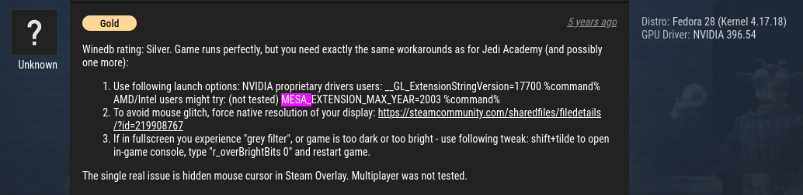
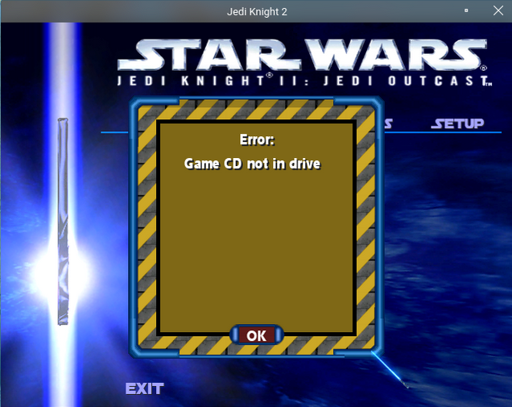
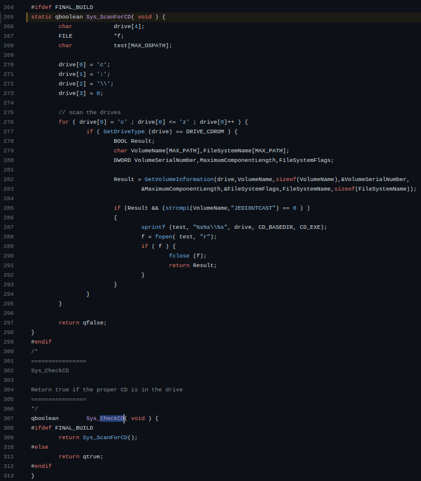
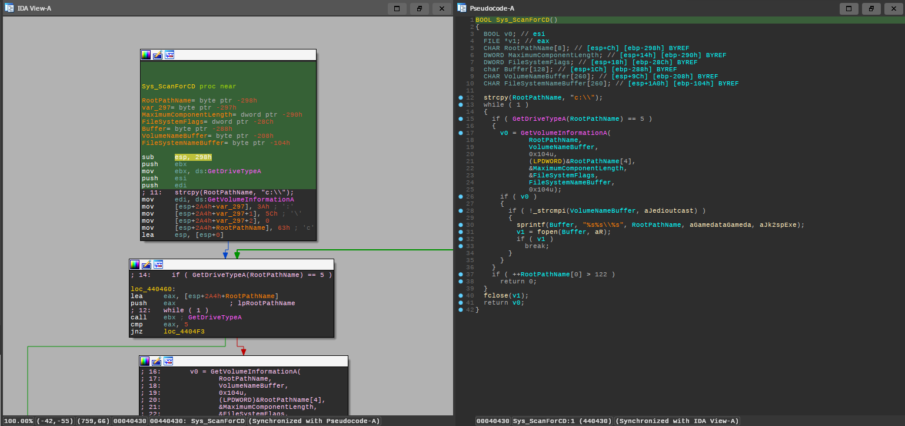
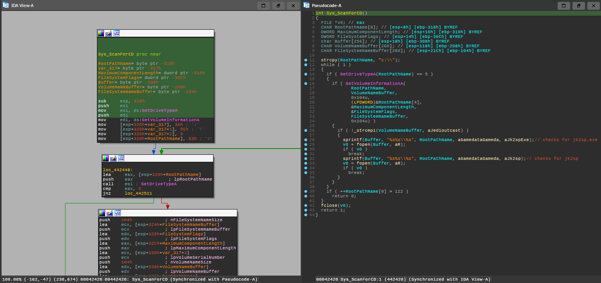
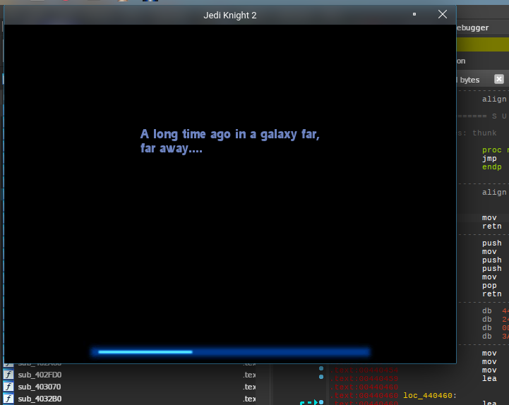
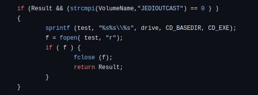
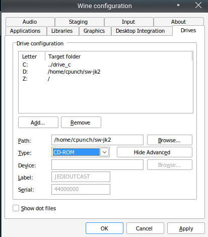

Recently a friend of mine, ***dongresource***, was struggling to get [Star Wars Jedi Knight II: Jedi Outcast](https://en.wikipedia.org/wiki/Star_Wars_Jedi_Knight_II:_Jedi_Outcast) (this [specific version](https://archive.org/details/jedioutcast_201912)) working over Wine/Linux. While chatting about this, we ended up collaboratively exploring all the different ways of getting the game to run that we could think of, for fun. Now I thought it'd be cool to document the resources we used and the (approximate) workflow we went through to have multiple different approaches to get the game working over Wine. The game worked perfectly on Windows, but when first attempting to launch the game normally using Wine, we encountered this error:

```
Unhandled exception: page fault on read access to 0x20726568 in 32-bit code (0x20726568).
```

Dong went straight to the [ProtonDB comments](https://www.protondb.com/app/6030) and found comments saying that setting the `MESA_EXTENSION_MAX_YEAR` environment variable to 2003 would resolve this.



So, after setting this variable things seem to work!

```sh
$ MESA_EXTENSION_MAX_YEAR=2003 wine jk2sp.exe
```
> `jk2sp.exe` is located at `gamedata/gamedata` in the ISO

That is, until he tried actually starting a playthrough...



## CDCheck strikes again!

My first step to getting past this was just to search for that "Game CD not in drive" string, however after spending less than 5 seconds looking for it using my l33t h4xor tools all seemed hopeless

```sh
$ strings -f jk2sp.exe | grep "Game CD"
$ strings -f jk2mp.exe | grep "Game CD"
$ strings -f jk2gamex86.dll | grep "Game CD"
```
> That error string is probably located in one of the `.pk3` files, oh well

Although unlike my [patch for PAIT](pages/cracking-22-yr-old-drm/), we actually had a [copy of the source](https://github.com/grayj/Jedi-Outcast) available to dig through. Quickly digging through the source we found what seemed like a [CDCheck](https://github.com/grayj/Jedi-Outcast/blob/85f58467344d3ccbc6e2501a9af573ff4488a898/code/win32/win_main.cpp#L265), and was even called from a function named `Sys_CheckCD()`.



This function loops through available CD drives, checks the Volume Name and verifies that a file exists at `X:\gamedata\gamedata\jk2sp.exe`, where `X` is every possible drive letter. It returns true if the CD was found, and false if it wasn't. Simple enough :)

## Approach 1: Patching the original binaries

After this, my first plan had been formed. Patch `Sys_ScanForCD()` to always return true. We even lucked out with an identifiable call to `GetVolumeInformation()` and a nicely identifiable string `"JEDIOUTCAST"`. This function is located in the `jk2sp` and `jk2mp` binaries.

Finding this in IDA and renaming a few things gives us:


> Version for `jk2sp.exe`


> Version for `jk2mp.exe`

You'll notice that the version `jk2mp.exe` uses has 1 additional check checking for `jk2sp` on the disk. To make this function always return true we could just ignore everything and set the EAX register to 1, and return. The resulting patched subroutine looks like this afterwards:

```assembly
.text:00440430 Sys_ScanForCD:
.text:00440430    mov     eax, 1
.text:00440435    retn
```

If you're wondering why we're moving 1 into EAX, that's because the EAX register is reserved for the return value for functions using the [cdecl calling convention for x86](https://en.wikipedia.org/wiki/X86_calling_conventions#cdecl). Anyways after applying the patch, we're greeted with this:



The resulting xdelta patch can be generated by just comparing the differences between the original and the patched binary:

```sh
$ xdelta3 -e -s jk2sp.exe.bak jk2sp.exe jk2sp_cdcheck_patch.xdelta
```

Which you can download here:
- [jk2sp_cdcheck_patch.xdelta](jk2sp_cdcheck_patch.xdelta)
- [jk2mp_cdcheck_patch.xdelta](jk2mp_cdcheck_patch.xdelta)

and apply it by using:

```sh
$ xdelta3 -fd -s jk2sp.exe jk2sp_cdcheck_patch.xdelta jk2sp.exe
$ xdelta3 -fd -s jk2mp.exe jk2mp_cdcheck_patch.xdelta jk2mp.exe
```
> Additionally, if you're more of a fan of using GUI tools, [this seems like a fairly decent tool](https://www.romhacking.net/utilities/704/)? Although keep in mind I have never used it before so take this recommendation with a grain of salt.

## Approach 2: Wine virtual drives

If you were paying attention to that `Sys_ScanForCD()` function, you'll notice that both the drive label and the file `gamedata/gamedata/jk2sp.exe` are verified from the drive.



If you weren't aware, you can specify any directory as a drive in Wine and expose it to Wine's filesystem. We can just create the expected file & directories, create a new drive pointing to our crafted directory and set the expected drive label in `winecfg`. Dong actually figured this out as I was completing the patch. First step is to create the 'root' of our fake drive, then create the expected directory structure and file. The actual contents of the file aren't checked, so as long as the file exists it should 'just werk.'

```sh
$ mkdir ~/sw-jk2
$ mkdir ~/sw-jk2/gamedata
$ mkdir ~/sw-jk2/gamedata/gamedata
$ touch ~/sw-jk2/gamedata/gamedata/jk2sp.exe
$ touch ~/sw-jk2/gamedata/gamedata/jk2sp
```

Next, open up `winecfg`, go to drives and create a new drive by clicking 'Add...'. Set the path to the absolute path of your newly created directory. For me this was `/home/cpunch/sw-jk2`. Under 'Advanced options' you'll need to set the drive type to 'Autodetect' before setting the drive label to 'JEDIOUTCAST'. Then switch the type back to CD-ROM and click apply. This weird dance with changing the drive type is necessary because `winecfg` grays out the Label and Serial fields for the CD-ROM type, even though it does save and correctly utilize the values that happen to be in those fields when you apply the changes. This is likely just an oversight in the `winecfg` GUI.



If everything worked properly, we should be able to just launch `jk2sp.exe` normally using:

```sh
$ MESA_EXTENSION_MAX_YEAR=2003 wine jk2sp.exe
```

Additionally for a more general approach to CDChecks in the future, you could always just extract the contents of the ISO to a directory, adding that to wine as a drive and check if that gets around the CDCheck. For example, doing that would've gotten past the CDCheck for [PAIT](pages/cracking-22-yr-old-drm/) since the volume label wasn't checked in that game.

## Approach 3: Using a modern source port like OpenJK

And finally, the last approach was to just use the [OpenJK](https://github.com/JACoders/OpenJK) engine to run the game on. It's based on the game's sequel, [Star Wars Jedi Knight: Jedi Academy](https://archive.org/download/StarWarsJediKnightJediAcademyUSA), with added support for Outcast, since the engine versions are basically the same. They've removed the CDCheck from this fork, so there's no need to worry about that. I won't be covering steps to set it up here since they already have a fairly comprehensive tutorial on that. Although there are some current drawbacks:

- Jedi Outcast seems to be treated as a second-class citizen for the project, with only the single player being 'mostly' supported.
- Because the Jedi Outcast build target is not fully supported, its resulting binaries are not shipped with the release builds, so you'll have to compile the source port yourself.
- Forget about Jedi Outcast multiplayer, as that is specifically mentioned as *not* supported currently.

OpenJK and its derivatives are actually the main way the Jedi Academy community plays that game in the present day, and it's probably your best bet if you want to try that game out as well.

There even appears to be a multiplayer-focused source port of Jedi Outcast called [jk2mv](https://github.com/mvdevs/jk2mv/), which has also removed the CDCheck. We did know getting into this that these games were open source and already had modern source ports, but we nevertheless wanted to test our skills getting the unaltered executables to run under Wine, and we had a lot of fun doing it.